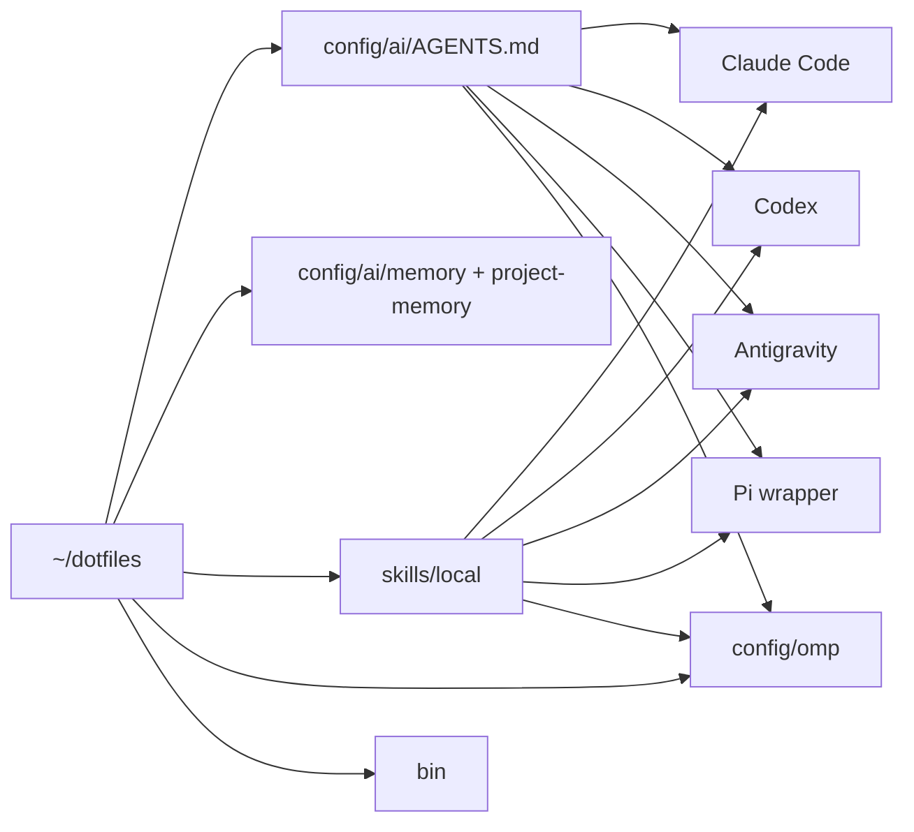
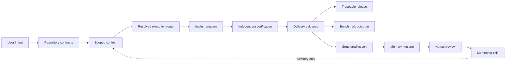

<div align="center">

```text
█▀▄ █▀█ ▀█▀ █▀▀ █ █   █▀▀ █▀▀
█▄▀ █▄█  █  █▀  █ █▄▄ ██▄ ▄▄█
```

# Ongki's Dotfiles

**A private, terminal-first development environment and shared AI engineering kernel for Linux and macOS.**

[](https://github.com/ongkipro/dotfiles/actions/workflows/core-runtime.yml)
[](docs/linux-install-step-by-step.md)
[](docs/macos-install-step-by-step.md)
[](https://www.gnu.org/software/bash/)

</div>

> [!IMPORTANT]
> Keep this repository private. Credentials are deliberately excluded, but the
> repository contains personal workflows, project references, device inventory,
> and operational policy.

## What this repository owns

This repository is the tracked source of truth for:

- shell, terminal, editor, Git, and toolchain configuration;
- shared policy for Claude Code, Codex, Pi, Antigravity, and OMP;
- durable cross-project memory and reviewed project-reference memory;
- reusable local AI skills with runtime-specific discovery links;
- OMP model routing, specialist directives, fallbacks, and overlays;
- deterministic health, security, policy, routing, and fixture checks;
- Linux and macOS bootstrap and recovery documentation.

Live disk and executable behavior win when documentation or memory disagrees.
Current project requirements, decisions, and build status belong in each project
repository—not in this repository's project-reference memory.

## Architecture



The shared kernel stays runtime-neutral. OMP adds orchestration and model
routing, while standalone CLIs consume the same policy and owned skills.

### Canonical operating lifecycle



Repository contracts are `AGENTS.md`, `PRD.md`, `TASKS.md`, `STATUS.md`,
`BUILD-LOG.md`, `ARCHITECTURE.md`, `DECISIONS.md`, `OBSERVABILITY.md`, and
`RELEASE.md`. The resolved execution route records job, risk, capability, worker,
model, provider, reasoning effort, and verification. AI output and memory remain
advisory; repository state and executable evidence are authoritative.

### Cross-CLI policy paths

| Runtime | Live policy path or mechanism |
|---|---|
| Claude Code | `~/.claude/CLAUDE.md` |
| Codex | `~/.codex/AGENTS.md` |
| Antigravity | `~/.antigravity/AGENTS.md` |
| Antigravity compatibility | `~/.gemini/GEMINI.md` |
| OMP | `~/.omp/agent/AGENTS.md` |
| Pi | `pi()` wrapper appends the canonical policy |

The `.gemini` path belongs to Antigravity compatibility on this setup; this
repository does not install or support the standalone Google Gemini CLI.

## OMP routing

[`config/omp/ROUTING.md`](config/omp/ROUTING.md) owns routing policy;
[`config/omp/config.yml`](config/omp/config.yml) owns executable selectors.
Provider metadata is in [`config/omp/models.yml`](config/omp/models.yml), and
[`config/omp/STATUS.md`](config/omp/STATUS.md) records verified routing evidence.
Selectors are operational configuration and can change independently of this
README. Run `omp-routing-test` after any routing or model change; do not copy
selector details into skills or general documentation.

## Memory and learning

`config/ai/AGENTS.md` is always loaded. Larger memory files are read on demand:

```text
config/ai/
├── AGENTS.md          # compact policy shared by every supported CLI
├── memory/            # durable cross-project facts
├── project-memory/    # durable references and gotchas, never current status
└── project-memory-kelola/ # compatibility namespace, routed by the same controls
```

There are two intended learning lanes. Direct capture is the smaller path for a
reviewed reusable lesson:

```bash
ai-learn capture \
  --title "Preserve full-replace fields" \
  --symptom "Saving metadata erased an existing body" \
  --root-cause "The read model omitted a field written by the form" \
  --invariant "A full-replace form must load every field it writes" \
  --fix "Return the field and initialize the form from persisted data" \
  --check "Edit metadata and assert the body remains byte-identical" \
  --scope project --project example --repo ~/Projects/example

ai-learn list
ai-learn show CANDIDATE.md
ai-learn promote CANDIDATE.md --target project:example --yes
```

Capture is device-local. Promotion validates the candidate and updates an
existing tracked memory file, but never stages, commits, or pushes. Raw session
logs, secrets, customer data, changing status, and speculative diagnoses do not
belong in memory. See [`docs/ai-memory-sync.md`](docs/ai-memory-sync.md).

Evidence-backed delivery learning adds immutable run provenance:

```text
delivery-ledger
  -> delivery-learning
  -> ai-memory-harvest
  -> ai-memory-hygiene
  -> reviewed ai-learn promotion
```

[`skills/local/continuous-learning/SKILL.md`](skills/local/continuous-learning/SKILL.md)
owns that methodology. Routing, lifecycle, skill attribution, and skill-evolution
reports remain advisory; repository contracts and executable evidence own
current truth.

The command manifest at `config/ai/runtime-commands.txt` is shared by the Linux
and macOS installers. Installer completeness and the hygiene contract have
dedicated regression fixtures. The current implementation review and remaining
remote-CI caveat are recorded in the
[repository audit](docs/DOTFILES_REPOSITORY_AUDIT_2026-08-15.md).

## Delivery and release evidence

New project contracts include `STATUS.md`, `RELEASE.md`, `OBSERVABILITY.md`, and
an append-only `.delivery/` evidence ledger. The intended release sequence is:

```text
project-check -> delivery-ledger verification -> migration/rollback checks
  -> production-gate -> explicit deploy approval -> release-check
```

These gates do not grant deployment authority. Production and destructive
actions still require explicit approval, and `STATUS.md` remains the workflow
state authority.

`delivery-ledger` binds task, requirement, route, verification, result, and
provenance. `delivery-benchmark` aggregates accepted outcomes, model/worker,
risk, duration, tokens, cost, repairs, and verification failures. Its routing
recommendations are evidence summaries—not automatic policy changes.

## Repository map

```text
dotfiles/
├── bin/                  # health, safety, sync, routing, and project tools
├── config/
│   ├── ai/               # shared policy and durable memory
│   ├── omp/              # OMP routing, agent directives, and provider metadata
│   ├── pi/               # non-secret Pi configuration
│   ├── templates/        # repository-local engineering document templates
│   └── ...               # shell, editor, tmux, Git, and tool configuration
├── devices/              # generated device inventory
├── docs/                 # setup, architecture, audit, and maintenance records
├── home/                 # reference snapshots; not all are live-linked
├── skills/
│   ├── agents-bin/       # skill management commands
│   └── local/            # canonical owned skills
├── install.sh            # Linux bootstrap
└── install-macos.sh      # macOS bootstrap
```

## Installation

Follow the fresh-device runbook before executing an installer:

- [Linux installation](docs/linux-install-step-by-step.md)
- [macOS installation](docs/macos-install-step-by-step.md)

The bootstrap entry points are:

```bash
git clone https://github.com/ongkipro/dotfiles.git ~/dotfiles
cd ~/dotfiles
bash install.sh          # Linux
# bash install-macos.sh  # macOS
```

Installers preserve replaced regular files as timestamped backups. They also
link tracked sources into the live runtime paths. Review the installer first;
some setup steps install tools or alter shell startup files.

Both installers consume the same fail-closed runtime command manifest, so the
delivery and continuous-learning commands cannot silently drift between Linux
and macOS.

After installation:

```bash
source ~/.bashrc         # Linux/bash
# source ~/.zshrc        # macOS/zsh
ai-doctor
ai-doctor --self-test
```

## Daily operation

```bash
ai-doctor                # read-only device and wiring health
ai-doctor --self-test    # authoritative repository regression suite
ai-memory-check          # Markdown links and wikilinks
ai-policy-lint           # policy, routing, skills, and templates
omp-routing-test         # selectors, fallbacks, overlays, and model catalog
security-check           # obvious secret patterns in the repository
skill-update             # reconcile owned skills into installed runtimes
dotsync status           # read-only cross-device Git status
```

Installed workflow groups:

```text
Delivery: project-init, project-check, delivery-ledger, production-gate,
          release-check
Learning: ai-memory-access, ai-memory-hygiene, ai-memory-lifecycle,
          delivery-learning, ai-memory-harvest, delivery-skill-usage,
          ai-skill-evolution
```

Use the broad `dotsync commit`, `dotsync sync`, and `dotpush` helpers only when
the entire working tree is intentionally in scope. On a mixed tree, inspect with
Git or Lazygit and stage explicit paths.

## Safety boundaries

- Never track `.env` files, tokens, credentials, authentication state, private
  keys, customer data, or provider session files.
- Broad shell permissions are not approval. Production, destructive,
  system-wide, secret-reading, and scope-expanding actions require explicit
  approval.
- `git-guard.sh` mechanically covers selected Git commands in Claude Code; the
  shared behavioral policy remains required in every runtime.
- `security-check` is a guardrail, not proof that a diff contains no sensitive
  information. Review staged content before committing.
- Git synchronization is explicit. Background sync, if introduced, must remain
  pull-only.

## Validation and CI

The authoritative local gate is:

```bash
bin/ai-doctor --self-test
```

It validates canonical memory, all Markdown references, secret scanning,
cross-runtime policy, discovered fixture tests, OMP routing, and the Git guard.
GitHub Actions is configured to run the core suite on Linux and macOS, while the
development specification skill has an additional Python-version matrix. The
full local fixture suite passes in the reviewed working tree. GitHub jobs for the
base commit were blocked before execution by the account payment/spending-limit
state, so cross-platform evidence still requires a successful run after these
changes are committed.

## Documentation authority

| Document | Purpose |
|---|---|
| [`config/ai/AGENTS.md`](config/ai/AGENTS.md) | Always-loaded cross-CLI operating policy |
| [`config/templates/AGENTS.md`](config/templates/AGENTS.md) | Repository-local authority and delivery contract map |
| [`config/templates/STATUS.md`](config/templates/STATUS.md) | Workflow state and review contract |
| [`config/templates/DECISIONS.md`](config/templates/DECISIONS.md) | Accepted decision register and supersession trail |
| [`config/templates/RELEASE.md`](config/templates/RELEASE.md) | Release boundary, declared risk, rollback, and backup evidence |
| [`config/templates/OBSERVABILITY.md`](config/templates/OBSERVABILITY.md) | Post-deploy probe contract |
| [`skills/local/continuous-learning/SKILL.md`](skills/local/continuous-learning/SKILL.md) | Evidence-backed learning and promotion methodology |
| [`config/omp/ROUTING.md`](config/omp/ROUTING.md) | Canonical OMP routing policy |
| [`config/omp/STATUS.md`](config/omp/STATUS.md) | Current OMP verification state |
| [`config/omp/BUILD-LOG.md`](config/omp/BUILD-LOG.md) | Durable routing changes and evidence |
| [`docs/linux-dev-setup.md`](docs/linux-dev-setup.md) | Linux authority map and recovery runbook |
| [`docs/ai-memory-sync.md`](docs/ai-memory-sync.md) | Memory capture, promotion, and synchronization |
| [`docs/project-init.md`](docs/project-init.md) | Stack-aware project bootstrap: generators, contract rendering, and evidence |
| [`devices/README.md`](devices/README.md) | Generated device registry |
| [`docs/DOTFILES_AI_ENGINEERING_CONTROL_PLANE.md`](docs/DOTFILES_AI_ENGINEERING_CONTROL_PLANE.md) | Architecture and roadmap baseline; verify implementation claims against disk |
| [`docs/DOTFILES_AI_ENGINEERING_MASTER_BLUEPRINT.md`](docs/DOTFILES_AI_ENGINEERING_MASTER_BLUEPRINT.md) | Condensed architecture summary; verify implementation claims against disk |
| [`docs/DOTFILES_AI_ENGINEERING_AUDIT_2026-08-14.md`](docs/DOTFILES_AI_ENGINEERING_AUDIT_2026-08-14.md) | Historical audit baseline, not current runtime truth |
| [`docs/DOTFILES_REPOSITORY_AUDIT_2026-08-15.md`](docs/DOTFILES_REPOSITORY_AUDIT_2026-08-15.md) | Newest audit; per-finding resolved/open status is the living remediation record |

## Change workflow

1. Inspect disk and trace every affected caller.
2. Make the smallest change that preserves safety and portability.
3. Run the narrowest relevant test, then `ai-doctor --self-test` for control-plane changes.
4. Review `git diff` and `security-check` before staging.
5. Stage only intended paths. Commit and push only when explicitly requested.

---

Maintained by [Ongki Pro](https://ongki.pro). Tools are meant to disappear; only
the work remains.
