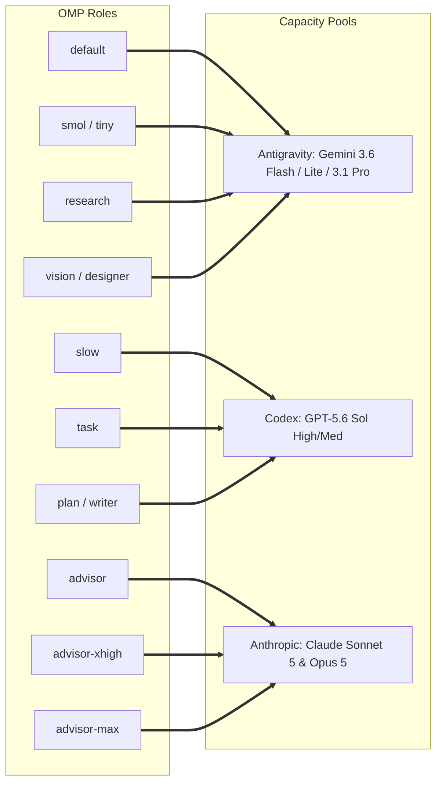
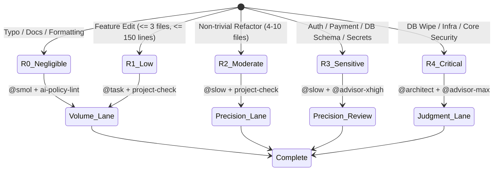
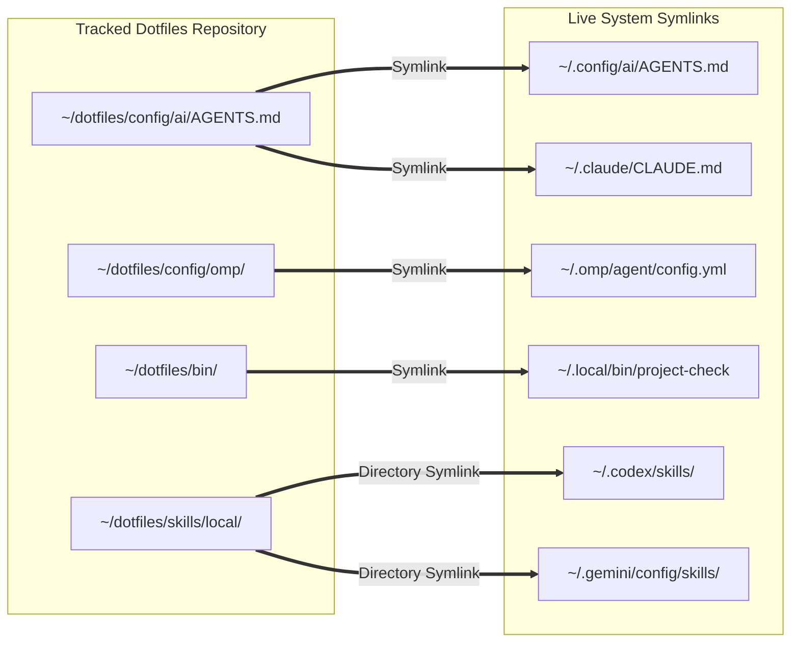

<div align="center">

```text
█▀▄ █▀█ ▀█▀ █▀▀ █ █   █▀▀ █▀▀
█▄▀ █▄█  █  █▀  █ █▄▄ ██▄ ▄▄█
```

# Ongki's Dotfiles — AI Engineering Operating System

**A terminal-first, cross-device development environment with shared AI memory, deterministic tooling, and risk-aware model routing.**

[](docs/linux-install-step-by-step.md)
[](docs/macos-install-step-by-step.md)
[](https://www.gnu.org/software/bash/)
[](https://helix-editor.com/)
[](https://mise.jdx.dev/)
[](docs/linux-maintenance-log.md)
[](https://github.com/ongkipro/dotfiles)

Maintained by [Ongki Pro](https://ongki.pro)

</div>

---

## 1. System Version & Release Specifications

### Current Version: `v17.3.4-r3`
- **Release Baseline:** 2026-08-15
- **Core OMP Engine Version:** `17.3.4`
- **Engineering Architecture Revision:** `r3` (AI Control Plane + Risk-Aware R0–R4 Routing + Deterministic Verification Suite)

```text
Dotfiles Release Scheme: v[OMP_VERSION]-r[ENGINEERING_REVISION]
                      └─ v17.3.4       └─ r3 (Control Plane & Deterministic Tools)
```

#### Component Version Breakdown:

| System Component | Version / Specification | Role & Capabilities |
|---|---|---|
| **OMP Core Engine** | `v17.3.4` | Primary session owner, multi-agent dispatch, and model router |
| **Bundled Specialists** | 11 Agents (`designer`, `scout`, `task`, `architect`, `slow`, etc.) | Fully synchronized role-routed subagents |
| **Verification Suite** | `project-check` v1.0 | Native, runtime-neutral test runner (Node, Go, Python, Rust, PHP) |
| **Risk Classifier** | `diff-risk` v1.0 | Deterministic git diff classifier & path risk detector (R0–R4) |
| **Policy Linter** | `ai-policy-lint` v1.0 | Semantic linter for policy, routing, skill, & agent frontmatter |
| **Shared AI Policy** | `config/ai/AGENTS.md` | Single canonical instruction source across OMP, Claude, Codex, Gemini, & Pi |
| **OS Compatibility** | Ubuntu 24.04 LTS & macOS 14+ | 100% feature & symlink parity across Linux and macOS |

---

## 2. Overview & Architecture Topology

This private repository is the source of truth for Ongki's terminal-first development environment across Linux and macOS. It manages shell configurations, shared AI policy/memory, reusable capabilities, OMP routing rules, device documentation, and bootstrap scripts in one Git history.

> [!IMPORTANT]
> This repository must remain **PRIVATE**. It intentionally excludes credentials, but contains personal workflows, device inventory, project context, and operational details. Never change GitHub visibility to public.

### System Architecture & Control Plane Flow:

```mermaid
flowchart TD
    subgraph Developer Workspace
        Dev[User / Main OMP Session]
    end

    subgraph Deterministic Control Plane
        Classifier[bin/diff-risk Classifier]
        Linter[bin/ai-policy-lint]
        Contract[Task Contract: TASKS.md]
    end

    subgraph Three Capacity Pools
        subgraph Volume Pool
            GFlash[Antigravity: Gemini 3.6 Flash / Lite]
            AgentsVol[sonic, scout, librarian, designer]
        end
        subgraph Precision Pool
            GPT56[Codex: GPT-5.6 Sol]
            AgentsPrec[task, complex-developer, writer]
        end
        subgraph Judgment Pool
            Opus5[Anthropic: Claude Opus 5 / Sonnet 5]
            AgentsJudg[reviewer, debugger, security, architect]
        end
    end

    subgraph Deterministic Verification Engine
        Runner[bin/project-check Engine]
        GitGuard[git-guard PreToolUse Hook]
    end

    Dev --> Contract
    Contract --> Classifier
    Classifier -->|Risk R0-R1| Volume Pool
    Classifier -->|Risk R2-R3| Precision Pool
    Classifier -->|Risk R4| Judgment Pool
    
    Volume Pool --> Runner
    Precision Pool --> Runner
    Judgment Pool --> Runner
    
    Runner -->|Pass: Exit Code 0| GitGuard
    GitGuard -->|Approved| Commit[Git Commit & Push]
```

### Core Architecture Axiom:
> **"Intelligence in contracts, tools, evidence, and routing — not in every token."**

1. **60–75% Token Allocation:** Volume/cheap worker models (`@smol`, `@task` via Antigravity Gemini 3.6 Flash / Flash Lite).
2. **20–30% Token Allocation:** Precision coding models (`@slow`, `@plan` via Codex GPT-5.6 Sol).
3. **5–10% Token Allocation:** Frontier judgment models (`@advisor-max`, `@architect` via Claude Opus 5).

---

## 3. OMP Control Plane & Capacity Pools

OMP is the primary development control plane. Semantic routing is owned by [`config/omp/ROUTING.md`](config/omp/ROUTING.md) and executed via [`config/omp/config.yml`](config/omp/config.yml).

### Subagent & Model Routing Topology:



### Capacity Pool Allocations:

| Capacity Pool | OMP Role | Current Model Selector | Target Workload |
|---|---|---|---|
| **Volume Pool** | `default` | Gemini 3.6 Flash (Medium) | Sesi utama, development harian, context ownership |
| | `smol` / `tiny` | Gemini 3.1 Flash Lite (Medium/Minimal) | Tugas mekanis murni, formatting, data collection ringan |
| | `research` | Gemini 3.6 Flash (High) | `scout` (repo search) & `librarian` (external API docs) |
| | `vision` / `designer` | Gemini 3.1 Pro (High) | Visual UI/UX, layout, responsive QA, component review |
| **Precision Pool** | `slow` | Codex GPT-5.6 Sol (High) | Complex logic, auth, payments, concurrency, refactoring |
| | `task` | Codex GPT-5.6 Sol (Medium) | Repetitive bounded code transformations & multi-file edits |
| | `plan` / `writer` | Codex GPT-5.6 Sol (High) | PRD synthesis, spec writing, architecture-sensitive plans |
| **Judgment Pool** | `advisor` | Claude Sonnet 5 (High) | Architecture consultation & bounded code review |
| | `advisor-xhigh` | Claude Opus 5 (XHigh) | Deep root-cause debugging (`debugger`) & security review |
| | `advisor-max` | Claude Opus 5 (Max) | High-impact architecture decisions (`architect`) |

---

## 4. Risk-Aware Classification Matrix (R0–R4)

Tasks are classified by risk to enforce execution lanes and verification requirements:



| Risk Level | Description & Target Work | Recommended Lane | Verification Standard |
|---|---|---|---|
| **`R0`** | Documentation (`*.md`), typos, static assets, formatting | Volume (`@smol`) | `ai-policy-lint` |
| **`R1`** | Low-risk feature edit (<= 3 files, <= 150 lines changed) | Volume (`@task`) | `project-check` + `diff-risk` |
| **`R2`** | Moderate feature or non-trivial refactor (4–10 files) | Precision (`@slow`) | `project-check` + `diff-risk` |
| **`R3`** | Correctness-sensitive: auth, payment, DB schema/migrations, secrets | Precision + Review (`@slow` + `@advisor-xhigh`) | `project-check` + `diff-risk` |
| **`R4`** | Critical/Architectural: DB wiping, infra topology, core security | Judgment (`@architect` + `@advisor-max`) | Specialist Review + `project-check` |

---

## 5. Deterministic Engineering Tooling (`bin/`)

The repository includes custom CLI tools in `bin/` (linked to `~/.local/bin/`):

1. **`project-check`**: Automatically detects Node (`npm`/`pnpm`/`bun`), Go (`go test`/`go vet`), Python (`pytest`/`ruff`), Rust (`cargo check`), or PHP (`phpunit`) and executes native verification scripts.
2. **`diff-risk`**: Inspects Git diffs (staged/unstaged), flags sensitive paths (auth, payment, DB, secrets, lockfiles), and outputs risk level (R0–R4) with recommended model roles.
3. **`ai-policy-lint`**: Verifies consistency across `AGENTS.md`, `ROUTING.md`, `config.yml`, skills, and agent frontmatter definitions.

---

## 6. Live Symlink Architecture & System Directory Map

### Cross-Platform Symlink Mapping (Linux & macOS Parity):



### Repository Directory Map:

```text
dotfiles/
├── bin/                         # Executable CLI tools & maintenance scripts
│   ├── ai-doctor                # Read-only AI runtime health check
│   ├── ai-memory-check          # Markdown link & wikilink validator
│   ├── ai-policy-lint           # Semantic linter for AI policy & routing
│   ├── diff-risk                # Git diff risk classifier (R0–R4)
│   ├── project-check            # Runtime-neutral build/test runner
│   └── project-init             # Repository-local development contract initializer
├── config/
│   ├── ai/                      # Canonical cross-runtime policy (AGENTS.md) & shared memory
│   ├── omp/                     # OMP routing policies, roles, overlays, & config.yml
│   ├── templates/               # Repository templates (TASKS.md contract, PRD, STATUS)
│   ├── helix/                   # Helix editor & LSP configuration
│   ├── mise-config.toml         # Shared terminal toolchain declarations
│   ├── tmux.conf                # Terminal multiplexer configuration
│   └── shell-tools.sh           # Cross-shell PATH, aliases, & wrappers
├── devices/                     # Machine inventory & symlink health reports
├── docs/                        # Architecture specs, master blueprint, & runbooks
│   ├── DOTFILES_AI_ENGINEERING_MASTER_BLUEPRINT.md  # Master Architecture Spec
│   ├── DOTFILES_AI_ENGINEERING_CONTROL_PLANE.md     # Control plane spec
│   ├── DOTFILES_AI_ENGINEERING_AUDIT_2026-08-14.md  # Historical audit findings
│   └── linux-maintenance-log.md                     # Operational maintenance log
├── skills/
│   ├── agents-bin/              # Skill management CLI binaries
│   └── local/                   # Canonical owned capabilities (48 skills)
├── install.sh                   # Linux bootstrap script
└── install-macos.sh             # macOS bootstrap script
```

---

## 7. Installation & Setup

### Linux:
```bash
git clone https://github.com/ongkipro/dotfiles.git ~/dotfiles
cd ~/dotfiles
bash install.sh
```

### macOS:
```bash
git clone https://github.com/ongkipro/dotfiles.git ~/dotfiles
cd ~/dotfiles
bash install-macos.sh
```

### Post-Install Verification:
```bash
source ~/.bashrc   # atau source ~/.zshrc di macOS
ai-doctor
ai-doctor --self-test
```

---

## 8. Documentation Index

| Document | Purpose |
|---|---|
| [Master AI Blueprint](docs/DOTFILES_AI_ENGINEERING_MASTER_BLUEPRINT.md) | **Definitive unified master architecture specification & audit** |
| [AI Control Plane](docs/DOTFILES_AI_ENGINEERING_CONTROL_PLANE.md) | Architecture blueprint for deterministic AI engineering control plane |
| [AI Engineering Audit](docs/DOTFILES_AI_ENGINEERING_AUDIT_2026-08-14.md) | Historical audit findings, risk model (R0–R4), and telemetry |
| [Linux installation](docs/linux-install-step-by-step.md) | Fresh Linux machine setup and verification |
| [macOS installation](docs/macos-install-step-by-step.md) | Fresh macOS machine setup and verification |
| [Linux dev runbook](docs/linux-dev-setup.md) | Full Linux toolchain and recovery details |
| [Maintenance Log](docs/linux-maintenance-log.md) | Operational maintenance history and version release log |

---

## 9. Maintenance Rules

- Keep `config/ai/AGENTS.md` small because every supported AI CLI loads it.
- Put durable facts in memory and reusable procedures in skills.
- Run `ai-doctor --self-test` before pushing major system edits.
- Never commit credentials, private keys, or `.env` files.

---

<div align="center">

**[ongki.pro](https://ongki.pro)** · **[@ongkipro](https://github.com/ongkipro)**

*Tools are meant to disappear. Only the work remains.*

</div>
