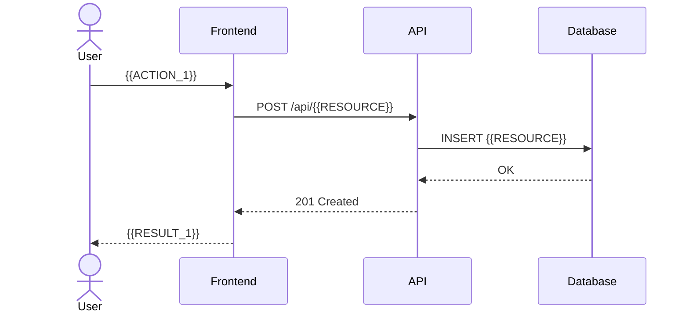

# User & System Flows — {{PROJECT_NAME}}

> **Updated:** {{DATE}}

## User Journey Map

```
Awareness → Consideration → Conversion → Retention → Advocacy
     │            │              │            │            │
     ▼            ▼              ▼            ▼            ▼
  {{STEP1}}   {{STEP2}}     {{STEP3}}    {{STEP4}}    {{STEP5}}
```

## Core Flows

### Flow 1: {{FLOW_1_NAME}}



### Flow 2: {{FLOW_2_NAME}}

```mermaid
flowchart TD
    A[Start] --> B{{CONDITION}}
    B -->|Yes| C[{{ACTION_YES}}]
    B -->|No| D[{{ACTION_NO}}]
    C --> E[End]
    D --> E
```

## Error Handling

| Scenario | Error Code | User Message | Recovery |
|----------|-----------|--------------|----------|
| {{ERROR_1}} | {{CODE_1}} | {{MSG_1}} | {{RECOVERY_1}} |
| {{ERROR_2}} | {{CODE_2}} | {{MSG_2}} | {{RECOVERY_2}} |

## State Machine

```
                  ┌──────────┐
         ┌───────▶│  {{STATE_1}} │────────┐
         │        └──────────┘        │
         │                            ▼
  ┌──────────┐                 ┌──────────┐
  │  {{STATE_3}} │◀────────────────│  {{STATE_2}} │
  └──────────┘                 └──────────┘
         │                            │
         ▼                            ▼
  ┌──────────┐                 ┌──────────┐
  │  {{STATE_4}} │                 │  {{STATE_5}} │
  └──────────┘                 └──────────┘
```

## Integration Points

| External System | Direction | Data | Protocol |
|-----------------|-----------|------|----------|
| {{SYSTEM_1}} | In/Out | {{DATA_1}} | {{PROTO_1}} |
| {{SYSTEM_2}} | In/Out | {{DATA_2}} | {{PROTO_2}} |
