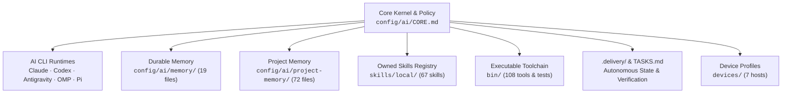

# Dotfiles Sitemap & Engineering Dictionary

> **Universal Page-by-Page Development Map for `ongkipro/dotfiles`**  
> Updated: 2026-09-23 | Scope: Full Repository Topology, AI Control Plane, Memory, Skills, CLI Binaries, Devices, and Templates.

---

## 1. System Topology Overview

The `dotfiles` repository is an AI-native engineering operating system shared across Linux and macOS devices. It coordinates multiple AI CLI runtimes (**Claude Code**, **Codex**, **Antigravity `agy`**, **OMP**, **Pi**) through a deterministic kernel.

---

## 2. Sitemap Directory Index

| Section | Directory / File | Description & Function | Target Audience / Consumer |
|---|---|---|---|
| **Core Kernel** | [`config/ai/CORE.md`](file:///home/ongki/dotfiles/config/ai/CORE.md) | Canonical cross-CLI operating rules, approval gates, coding standards. | All AI CLIs & Developers |
| **CLI Adapters** | [`config/ai/adapters/`](file:///home/ongki/dotfiles/config/ai/adapters) | Runtime-specific context adapters (`claude`, `codex`, `antigravity`, `omp`, `pi`). | AI CLI Runtimes |
| **Durable Memory** | [`config/ai/memory/`](file:///home/ongki/dotfiles/config/ai/memory) | Cross-session, durable operational facts (19 files). | `ai-memory-access`, AI sessions |
| **Project Memory** | [`config/ai/project-memory/`](file:///home/ongki/dotfiles/config/ai/project-memory) | Knowledge base for 70+ client systems, repositories, and domain gotchas. | On-demand context retrieval |
| **Kelola Memory** | [`config/ai/project-memory-kelola/`](file:///home/ongki/dotfiles/config/ai/project-memory-kelola) | Specialized knowledge pack for Kelola HRIS infrastructure. | Kelola deployment & maintenance |
| **Skills Registry** | [`skills/local/`](file:///home/ongki/dotfiles/skills/local) | 67 owned skills categorized into 11 engineering domains. | AI CLI tool calling & workflows |
| **Skill Management**| [`skills/agents-bin/`](file:///home/ongki/dotfiles/skills/agents-bin) | CLI tools for managing, checking, updating, and removing skills. | Developers & AI toolchain |
| **Executable CLI**  | [`bin/`](file:///home/ongki/dotfiles/bin) | 108 standalone shell and Python scripts for linting, testing, sync, gates. | Terminal workflow & CI |
| **OMP Control Plane** | [`config/omp/`](file:///home/ongki/dotfiles/config/omp) | Model routing catalogs, agent taxonomy, fallbacks, and benchmarks. | OMP (Oh My Prompt) runtime |
| **Device Registry** | [`devices/`](file:///home/ongki/dotfiles/devices) | Hardware manifests, OS specs, and per-machine configurations (7 hosts). | `dotsync`, `device-register` |
| **Project Templates** | [`config/templates/`](file:///home/ongki/dotfiles/config/templates) | Contract scaffold for new projects (`PRD`, `TASKS`, `ARCHITECTURE`, etc.). | `project-init` |
| **System Docs**     | [`docs/`](file:///home/ongki/dotfiles/docs) | Architecture blueprints, security policies, install SOPs, audit logs. | Architecture & Governance |
| **Delivery Engine** | [`.delivery/`](file:///home/ongki/dotfiles/.delivery) | Run ledger, verification checkpoints, task boundary states. | `delivery-ledger` |
| **Active Tasks**    | [`TASKS.md`](file:///home/ongki/dotfiles/TASKS.md) | Single executable task queue for dotfiles evolution. | All contributors & AI agents |
| **User Environment**| [`home/`](file:///home/ongki/dotfiles/home), [`config/`](file:///home/ongki/dotfiles/config) | Shell configs (`bash`, `zsh`), Helix editor, mise toolchains. | Terminal-first developer setup |

---

## 3. Core Policy & AI Kernel (`config/ai/`)

Central repository for AI behavior, context distribution, and safety guards.

### 3.1 Policy & Context Files
- [`config/ai/CORE.md`](file:///home/ongki/dotfiles/config/ai/CORE.md) *(formerly `AGENTS.md`)*:  
  **Function:** Canonical system prompt & operating contract for all AI models.  
  **Features:** Operating profile (Paduka Ongki / Paduka Irwan), language rules (Indonesian conversation, English code/docs), approval gates (secrets, destructive actions, production deploys), lazy senior dev ladder, delivery ledger constraints.
- [`config/ai/README.md`](file:///home/ongki/dotfiles/config/ai/README.md):  
  **Function:** Overview of the shared AI context architecture and memory link paths.
- [`config/ai/memory-router.json`](file:///home/ongki/dotfiles/config/ai/memory-router.json):  
  **Function:** Keyword/trigger mapping engine that matches prompts to specific memory files with token budget limits (`maxFiles: 3`, `maxBytes: 12000`).
- [`config/ai/memory-hygiene.json`](file:///home/ongki/dotfiles/config/ai/memory-hygiene.json):  
  **Function:** Rule definitions for memory linting (anti-staleness, dead links, secret detection).
- [`config/ai/claude-hooks.json`](file:///home/ongki/dotfiles/config/ai/claude-hooks.json):  
  **Function:** Claude Code hook declarations (`PreToolUse` git-guard, `UserPromptSubmit` memory-usage).
- [`config/ai/claude-home-memory/MEMORY.md`](file:///home/ongki/dotfiles/config/ai/claude-home-memory/MEMORY.md):  
  **Function:** Read-only bootstrap for Claude sessions started at `$HOME` to prevent accidental auto-memory clutter in dotfiles.

### 3.2 AI Runtimes Adapters (`config/ai/adapters/`)
- [`config/ai/adapters/antigravity.md`](file:///home/ongki/dotfiles/config/ai/adapters/antigravity.md): Adapter for Antigravity (`agy`).
- [`config/ai/adapters/claude.md`](file:///home/ongki/dotfiles/config/ai/adapters/claude.md): Adapter for Claude Code (`~/.claude/CLAUDE.md`).
- [`config/ai/adapters/codex.md`](file:///home/ongki/dotfiles/config/ai/adapters/codex.md): Adapter for OpenAI Codex CLI (`~/.codex/AGENTS.md`).
- [`config/ai/adapters/omp.md`](file:///home/ongki/dotfiles/config/ai/adapters/omp.md): Adapter for OMP user context (`~/.omp/agent/AGENTS.md`).
- [`config/ai/adapters/pi.md`](file:///home/ongki/dotfiles/config/ai/adapters/pi.md): Adapter for Pi CLI via `pi()` shell wrapper.

### 3.3 Security & Telemetry Hooks (`config/ai/hooks/`)
- [`config/ai/hooks/git-guard.sh`](file:///home/ongki/dotfiles/config/ai/hooks/git-guard.sh):  
  **Function:** Intercepts Git commands before execution. Blocks force-push (`--force`, `+refspec`), history rewriting (`commit --amend`), and deletion of remote branches.
- [`config/ai/hooks/memory-usage.sh`](file:///home/ongki/dotfiles/config/ai/hooks/memory-usage.sh):  
  **Function:** `UserPromptSubmit` hook that tracks memory file hit counts and byte sizes without logging sensitive prompts.

---

## 4. Durable Memory Dictionary (`config/ai/memory/`)

Cross-project durable facts loaded selectively on demand by `ai-memory-access`.

| Page / File | Purpose & Main Knowledge Content |
|---|---|
| [`identity.md`](file:///home/ongki/dotfiles/config/ai/memory/identity.md) | Persona, tone, honorifics (Paduka Ongki vs Paduka Irwan on Irwan's devices), Indonesian chat style, English technical output. |
| [`preferences.md`](file:///home/ongki/dotfiles/config/ai/memory/preferences.md) | Terminal-first preferences: Helix (`hx`), Bash, Mise, lazygit, formatting, diff conventions. |
| [`goals.md`](file:///home/ongki/dotfiles/config/ai/memory/goals.md) | High-level engineering roadmap, business objectives, milestones. |
| [`business.md`](file:///home/ongki/dotfiles/config/ai/memory/business.md) | Business landscape: client systems, dropshipping, affiliate platforms, e-commerce stores. |
| [`development.md`](file:///home/ongki/dotfiles/config/ai/memory/development.md) | House stack (Postgres + Drizzle + Better Auth, Astro, Next.js, Cloudflare Workers), lazy developer guidelines. |
| [`workflow.md`](file:///home/ongki/dotfiles/config/ai/memory/workflow.md) | Pre-dev staging contract (`~/Documents/work/prd/<slug>/` -> `~/Projects/<slug>/`), delivery ledger lifecycle. |
| [`decisions.md`](file:///home/ongki/dotfiles/config/ai/memory/decisions.md) | Master log of architectural decisions, stack selections, and structural choices. |
| [`skills.md`](file:///home/ongki/dotfiles/config/ai/memory/skills.md) | Summary of owned skills, external upstream sources, and skill evolution rules. |
| [`shopify.md`](file:///home/ongki/dotfiles/config/ai/memory/shopify.md) | Shopify standards: Dawn baseline, Storefront API, Hydrogen, no CTA in descriptions, brand-generic SEO. |
| [`environment.md`](file:///home/ongki/dotfiles/config/ai/memory/environment.md) | Hardware & software toolchains, installed packages, mise plugins, cross-platform parity. |
| [`environment-ai-runtimes.md`](file:///home/ongki/dotfiles/config/ai/memory/environment-ai-runtimes.md) | AI CLI binaries, versions, model flags, context linking mechanics. |
| [`environment-devices-git.md`](file:///home/ongki/dotfiles/config/ai/memory/environment-devices-git.md) | Git noreply identities, SSH credentials locations, per-machine Git configurations. |
| [`projects.md`](file:///home/ongki/dotfiles/config/ai/memory/projects.md) | Master directory index of active repositories under `~/Projects/`. |
| [`projects-platforms.md`](file:///home/ongki/dotfiles/config/ai/memory/projects-platforms.md) | Deployment infrastructure: Cloudflare, Vultr, Hetzner, Coolify, Vercel, Supabase. |
| [`projects-sites.md`](file:///home/ongki/dotfiles/config/ai/memory/projects-sites.md) | Domain DNS records, public URLs, SSL, hosting provider linkages. |
| [`long-task-system.md`](file:///home/ongki/dotfiles/config/ai/memory/long-task-system.md) | Architecture for multi-hour autonomous tasks, state persistence, error boundaries. |
| [`long-task-efficiency.md`](file:///home/ongki/dotfiles/config/ai/memory/long-task-efficiency.md) | Token economics, context pruning, prompt compaction strategies. |
| [`long-task-security.md`](file:///home/ongki/dotfiles/config/ai/memory/long-task-security.md) | Security constraints during autonomous runs, preventing file creep and accidental leaks. |
| [`long-task-debugging.md`](file:///home/ongki/dotfiles/config/ai/memory/long-task-debugging.md) | Investigation playbooks, isolated reproduction techniques, root cause analysis. |

---

## 5. Project Memory Knowledge Base (`config/ai/project-memory/`)

A repository of over 70 project-specific memories, architecture references, and platform gotchas.

### 5.1 Project & Business Reference Cards
- [`MEMORY.md`](file:///home/ongki/dotfiles/config/ai/project-memory/MEMORY.md): The central index for all project memories.
- **TokoΦ (Commerce SaaS):** [`tokophi.md`](file:///home/ongki/dotfiles/config/ai/project-memory/tokophi.md), [`tokophi-project.md`](file:///home/ongki/dotfiles/config/ai/project-memory/tokophi-project.md), [`tokophi-market-and-hosting.md`](file:///home/ongki/dotfiles/config/ai/project-memory/tokophi-market-and-hosting.md), [`tokophi-deploy-workflow.md`](file:///home/ongki/dotfiles/config/ai/project-memory/tokophi-deploy-workflow.md), [`tokophi-worktree-deploy-gotchas.md`](file:///home/ongki/dotfiles/config/ai/project-memory/tokophi-worktree-deploy-gotchas.md), [`tokophi-domain-status.md`](file:///home/ongki/dotfiles/config/ai/project-memory/tokophi-domain-status.md), [`tokophi-repo-private-ruling.md`](file:///home/ongki/dotfiles/config/ai/project-memory/tokophi-repo-private-ruling.md), [`tokophi-provider-brand-hidden.md`](file:///home/ongki/dotfiles/config/ai/project-memory/tokophi-provider-brand-hidden.md).
- **Logistics & Payment Integrations:** [`kiriminaja-integration.md`](file:///home/ongki/dotfiles/config/ai/project-memory/kiriminaja-integration.md), [`autolaris-payment-integration.md`](file:///home/ongki/dotfiles/config/ai/project-memory/autolaris-payment-integration.md), [`mengantar-documentation.md`](file:///home/ongki/dotfiles/config/ai/project-memory/mengantar-documentation.md), [`mengantar-docs-project.md`](file:///home/ongki/dotfiles/config/ai/project-memory/mengantar-docs-project.md), [`formalinads-malaysia-gateway.md`](file:///home/ongki/dotfiles/config/ai/project-memory/formalinads-malaysia-gateway.md).
- **Shopify & Storefronts:** [`pixsgo-shopify-store.md`](file:///home/ongki/dotfiles/config/ai/project-memory/pixsgo-shopify-store.md), [`pixsgo-rebrand-play-and-go.md`](file:///home/ongki/dotfiles/config/ai/project-memory/pixsgo-rebrand-play-and-go.md), [`pixsgo-categories-from-producttype.md`](file:///home/ongki/dotfiles/config/ai/project-memory/pixsgo-categories-from-producttype.md), [`pixsgo-layout-width.md`](file:///home/ongki/dotfiles/config/ai/project-memory/pixsgo-layout-width.md), [`petcue-shopify-site.md`](file:///home/ongki/dotfiles/config/ai/project-memory/petcue-shopify-site.md), [`petcue-dawn-rebuild.md`](file:///home/ongki/dotfiles/config/ai/project-memory/petcue-dawn-rebuild.md), [`mystore10-furniture-shopify.md`](file:///home/ongki/dotfiles/config/ai/project-memory/mystore10-furniture-shopify.md), [`sf-theme-shopify-store.md`](file:///home/ongki/dotfiles/config/ai/project-memory/sf-theme-shopify-store.md), [`shopify-dev-repo-map.md`](file:///home/ongki/dotfiles/config/ai/project-memory/shopify-dev-repo-map.md), [`hydrogen-theme-project.md`](file:///home/ongki/dotfiles/config/ai/project-memory/hydrogen-theme-project.md).
- **Client & Marketing Sites:** [`dealerhinoofficial.md`](file:///home/ongki/dotfiles/config/ai/project-memory/dealerhinoofficial.md), [`dealerhinoofficial-project.md`](file:///home/ongki/dotfiles/config/ai/project-memory/dealerhinoofficial-project.md), [`dealertrukhino.md`](file:///home/ongki/dotfiles/config/ai/project-memory/dealertrukhino.md), [`aussie-sawit-malaysia.md`](file:///home/ongki/dotfiles/config/ai/project-memory/aussie-sawit-malaysia.md), [`petanisejahtera.md`](file:///home/ongki/dotfiles/config/ai/project-memory/petanisejahtera.md), [`petanisejahtera-project.md`](file:///home/ongki/dotfiles/config/ai/project-memory/petanisejahtera-project.md), [`rtqalhadi-project.md`](file:///home/ongki/dotfiles/config/ai/project-memory/rtqalhadi-project.md), [`panna-coffee-work-project.md`](file:///home/ongki/dotfiles/config/ai/project-memory/panna-coffee-work-project.md), [`ongki-pro-site.md`](file:///home/ongki/dotfiles/config/ai/project-memory/ongki-pro-site.md), [`kamus-project.md`](file:///home/ongki/dotfiles/config/ai/project-memory/kamus-project.md), [`kamus-almanak.md`](file:///home/ongki/dotfiles/config/ai/project-memory/kamus-almanak.md), [`travelos.md`](file:///home/ongki/dotfiles/config/ai/project-memory/travelos.md), [`formalin.md`](file:///home/ongki/dotfiles/config/ai/project-memory/formalin.md), [`formalin-volumx-project.md`](file:///home/ongki/dotfiles/config/ai/project-memory/formalin-volumx-project.md), [`jasawebsite-co-brand.md`](file:///home/ongki/dotfiles/config/ai/project-memory/jasawebsite-co-brand.md).

### 5.2 Engineering Rules & Tooling Gotchas
- [`git-identity-noreply.md`](file:///home/ongki/dotfiles/config/ai/project-memory/git-identity-noreply.md): Enforces noreply GitHub email for commits.
- [`no-ai-commit-trailer.md`](file:///home/ongki/dotfiles/config/ai/project-memory/no-ai-commit-trailer.md): Forbids AI attribution trailers (`Co-Authored-By`).
- [`additive-commits-no-history-rewrite.md`](file:///home/ongki/dotfiles/config/ai/project-memory/additive-commits-no-history-rewrite.md): Prohibition on force-pushes and history mutation.
- [`prefer-git-worktree.md`](file:///home/ongki/dotfiles/config/ai/project-memory/prefer-git-worktree.md): Mandatory use of git worktree for feature isolation.
- [`worktrunk-worktree-tooling.md`](file:///home/ongki/dotfiles/config/ai/project-memory/worktrunk-worktree-tooling.md): Configuration for `worktrunk` (`wt`).
- [`skills-vs-memory-boundary.md`](file:///home/ongki/dotfiles/config/ai/project-memory/skills-vs-memory-boundary.md): Distinction between repository truth, personal memory, and skills.
- [`skill-plumbing.md`](file:///home/ongki/dotfiles/config/ai/project-memory/skill-plumbing.md): Link mechanics for discovery in Claude, Codex, OMP, Antigravity.
- [`dev-toolchain-mise.md`](file:///home/ongki/dotfiles/config/ai/project-memory/dev-toolchain-mise.md): Mise runtime management without sudo.
- [`playwright-browser-setup.md`](file:///home/ongki/dotfiles/config/ai/project-memory/playwright-browser-setup.md): Playwright & headless browser testing guidelines.
- [`cloudflare-pages-direct-upload-lock.md`](file:///home/ongki/dotfiles/config/ai/project-memory/cloudflare-pages-direct-upload-lock.md): Direct Upload vs Git integration rules.
- [`coolify-vps-dev.md`](file:///home/ongki/dotfiles/config/ai/project-memory/coolify-vps-dev.md): Self-hosted Coolify VPS rules, SSH keys, password recovery.
- [`antigravity-cli-agy.md`](file:///home/ongki/dotfiles/config/ai/project-memory/antigravity-cli-agy.md): Rules for `agy` binary and avoiding `@google/gemini-cli`.

### 5.3 Specialized Pack: Kelola HRIS (`config/ai/project-memory-kelola/`)
Comprehensive project memory for the production deployment of `kelolatim.com`:
- [`MEMORY.md`](file:///home/ongki/dotfiles/config/ai/project-memory-kelola/MEMORY.md): Index of Kelola operational files.
- [`reference_deploy.md`](file:///home/ongki/dotfiles/config/ai/project-memory-kelola/reference_deploy.md): Production PM2, Nginx, build pipeline.
- [`feedback_deploy_collision.md`](file:///home/ongki/dotfiles/config/ai/project-memory-kelola/feedback_deploy_collision.md), [`feedback_deploy_nginx_patch.md`](file:///home/ongki/dotfiles/config/ai/project-memory-kelola/feedback_deploy_nginx_patch.md), [`feedback_npm_install_sandbox.md`](file:///home/ongki/dotfiles/config/ai/project-memory-kelola/feedback_npm_install_sandbox.md), [`reference_tatacuan_api.md`](file:///home/ongki/dotfiles/config/ai/project-memory-kelola/reference_tatacuan_api.md), [`reference_telegram_bot_pool.md`](file:///home/ongki/dotfiles/config/ai/project-memory-kelola/reference_telegram_bot_pool.md).

---

## 6. Owned Skills Directory (`skills/local/`)

Dotfiles hosts 67 specialized capabilities grouped into 11 distinct domains. Every runtime accesses these skills via symlinks.

### 6.1 Cloudflare Platform
- [`cloudflare`](file:///home/ongki/dotfiles/skills/local/cloudflare/SKILL.md): Platform entry point (Workers, KV, D1, R2, Vectorize, WAF).
- [`workers-best-practices`](file:///home/ongki/dotfiles/skills/local/workers-best-practices/SKILL.md): Production Worker code patterns and anti-patterns.
- [`wrangler`](file:///home/ongki/dotfiles/skills/local/wrangler/SKILL.md): Cloudflare CLI configuration and bindings.
- [`durable-objects`](file:///home/ongki/dotfiles/skills/local/durable-objects/SKILL.md): Stateful DO coordination, RPC, SQLite storage, alarms.
- [`agents-sdk`](file:///home/ongki/dotfiles/skills/local/agents-sdk/SKILL.md): Stateful AI agents and durable workflows on Cloudflare Workers.
- [`cloudflare-email-service`](file:///home/ongki/dotfiles/skills/local/cloudflare-email-service/SKILL.md): Transactional email sending and routing.
- [`cloudflare-one`](file:///home/ongki/dotfiles/skills/local/cloudflare-one/SKILL.md): Zero Trust, Tunnels, Access, and Gateway policies.
- [`sandbox-next`](file:///home/ongki/dotfiles/skills/local/sandbox-next/SKILL.md): Code execution sandbox on `@cloudflare/sandbox@next`.
- [`sandbox-stable`](file:///home/ongki/dotfiles/skills/local/sandbox-stable/SKILL.md): Stable `@cloudflare/sandbox` execution.

### 6.2 Web Frameworks & Interface
- [`astro-development`](file:///home/ongki/dotfiles/skills/local/astro-development/SKILL.md): Content-focused Astro architecture and hybrid rendering.
- [`nextjs-development`](file:///home/ongki/dotfiles/skills/local/nextjs-development/SKILL.md): App Router architecture, Server Actions, route handlers.
- [`shadcn-ui`](file:///home/ongki/dotfiles/skills/local/shadcn-ui/SKILL.md): React component foundation and accessible primitives.
- [`design-taste`](file:///home/ongki/dotfiles/skills/local/design-taste/SKILL.md): Public frontend design direction, design tokens, typography.
- [`admin-dashboard`](file:///home/ongki/dotfiles/skills/local/admin-dashboard/SKILL.md): Information architecture for data-dense dashboards.
- [`admin-product-ux`](file:///home/ongki/dotfiles/skills/local/admin-product-ux/SKILL.md): Operator workflows, state machines, bulk operations.
- [`ui-validation`](file:///home/ongki/dotfiles/skills/local/ui-validation/SKILL.md): Browser-based verification (Playwright, responsive, dark/light).
- [`web-perf`](file:///home/ongki/dotfiles/skills/local/web-perf/SKILL.md): Core Web Vitals profiling, Lighthouse optimization.

### 6.3 Animation (GSAP)
- [`gsap-core`](file:///home/ongki/dotfiles/skills/local/gsap-core/SKILL.md): Core tweening, easing, matchMedia.
- [`gsap-timeline`](file:///home/ongki/dotfiles/skills/local/gsap-timeline/SKILL.md): Sequencing and complex choreographies.
- [`gsap-scrolltrigger`](file:///home/ongki/dotfiles/skills/local/gsap-scrolltrigger/SKILL.md): Scroll-linked animation and pinning.
- [`gsap-plugins`](file:///home/ongki/dotfiles/skills/local/gsap-plugins/SKILL.md): Plugin integration (Flip, SplitText, Draggable, ScrollTo).
- [`gsap-react`](file:///home/ongki/dotfiles/skills/local/gsap-react/SKILL.md): `useGSAP` hook, cleanup, refs management.
- [`gsap-frameworks`](file:///home/ongki/dotfiles/skills/local/gsap-frameworks/SKILL.md): Vue, Svelte, and non-React animation lifecycles.
- [`gsap-utils`](file:///home/ongki/dotfiles/skills/local/gsap-utils/SKILL.md): Utility helpers (`clamp`, `mapRange`, `pipe`, `snap`).
- [`gsap-performance`](file:///home/ongki/dotfiles/skills/local/gsap-performance/SKILL.md): 60fps optimization, avoiding layout thrashing.

### 6.4 Commerce & Shopify
- [`storefront-development`](file:///home/ongki/dotfiles/skills/local/storefront-development/SKILL.md): Dawn-aligned progressive enhancement storefronts.
- [`storefront-ux`](file:///home/ongki/dotfiles/skills/local/storefront-ux/SKILL.md): Commerce user journey, variant selection, checkout friction analysis.
- [`headless-shopify`](file:///home/ongki/dotfiles/skills/local/headless-shopify/SKILL.md): Storefront API architecture and Customer Account API.
- [`hydrogen-development`](file:///home/ongki/dotfiles/skills/local/hydrogen-development/SKILL.md): Shopify Hydrogen framework and Oxygen runtime.
- [`hydrogen-headless-tracking`](file:///home/ongki/dotfiles/skills/local/hydrogen-headless-tracking/SKILL.md): Consent-aware analytics and Web Pixels.

### 6.5 Payments, Logistics & Anti-Abuse
- [`autolaris-h2h`](file:///home/ongki/dotfiles/skills/local/autolaris-h2h/SKILL.md): Indonesian shipping, payment channels, `/submit` orders.
- [`doku-malaysia-integration`](file:///home/ongki/dotfiles/skills/local/doku-malaysia-integration/SKILL.md): DOKU Global API for Malaysian checkout (FPX, TNG, GrabPay).
- [`mengantar-api`](file:///home/ongki/dotfiles/skills/local/mengantar-api/SKILL.md): Indonesian 3PL courier aggregator (JNE, SiCepat, COD).
- [`stripe-best-practices`](file:///home/ongki/dotfiles/skills/local/stripe-best-practices/SKILL.md): Stripe Checkout, Elements, Subscriptions, Webhooks.
- [`turnstile-spin`](file:///home/ongki/dotfiles/skills/local/turnstile-spin/SKILL.md): Cloudflare Turnstile bot verification implementation.

### 6.6 Data, Auth & API
- [`postgres-drizzle`](file:///home/ongki/dotfiles/skills/local/postgres-drizzle/SKILL.md): PostgreSQL schema modeling, Drizzle ORM migrations, RLS.
- [`supabase-stack`](file:///home/ongki/dotfiles/skills/local/supabase-stack/SKILL.md): Supabase Auth, realtime DB, storage, Edge Functions.
- [`better-auth-security`](file:///home/ongki/dotfiles/skills/local/better-auth-security/SKILL.md): Better Auth hardening, rate limiting, trusted origins.
- [`openapi-spec`](file:///home/ongki/dotfiles/skills/local/openapi-spec/SKILL.md): OpenAPI 3.1 REST specification design and validation.
- [`application-security`](file:///home/ongki/dotfiles/skills/local/application-security/SKILL.md): Threat modeling, tenant isolation, CSRF, XSS, injection prevention.

### 6.7 Advertising Signals
- [`meta-ads-signal-engine`](file:///home/ongki/dotfiles/skills/local/meta-ads-signal-engine/SKILL.md): Meta Pixel + CAPI outbox, deduplication `event_id`.
- [`meta-ads-scout`](file:///home/ongki/dotfiles/skills/local/meta-ads-scout/SKILL.md): Competitor ad intelligence via Meta Ad Library.
- [`google-ads-signal-engine`](file:///home/ongki/dotfiles/skills/local/google-ads-signal-engine/SKILL.md): Google Tag, sGTM, Enhanced Conversions, Consent Mode v2.
- [`tiktok-ads-signal-engine`](file:///home/ongki/dotfiles/skills/local/tiktok-ads-signal-engine/SKILL.md): TikTok Pixel + Events API v2, Advanced Matching.

### 6.8 SEO, Content & Traffic
- [`seo-website-builder`](file:///home/ongki/dotfiles/skills/local/seo-website-builder/SKILL.md): Technical SEO, schema/JSON-LD, canonicals, sitemaps.
- [`ai-traffic-os`](file:///home/ongki/dotfiles/skills/local/ai-traffic-os/SKILL.md): AI answer-engine optimization (AEO/GEO, Perplexity, SearchGPT).
- [`automated-traffic-pipeline`](file:///home/ongki/dotfiles/skills/local/automated-traffic-pipeline/SKILL.md): Programmatic SEO (pSEO), indexing automation, RSS syndication.
- [`content`](file:///home/ongki/dotfiles/skills/local/content/SKILL.md): Multi-asset editorial workflows, batching calendars, quality gates.
- [`copywriting`](file:///home/ongki/dotfiles/skills/local/copywriting/SKILL.md): Conversion copywriting templates, headline formulas, character limits.
- [`volumx-writer`](file:///home/ongki/dotfiles/skills/local/volumx-writer/SKILL.md): Tone humanization, terminal dialogue improvements.

### 6.9 Planning & Specification
- [`prd-taskbreaker`](file:///home/ongki/dotfiles/skills/local/prd-taskbreaker/SKILL.md): Transforms features into numbered PRDs and runnable task queues.
- [`development-spec-suite`](file:///home/ongki/dotfiles/skills/local/development-spec-suite/SKILL.md): Multi-domain enterprise specification packs.
- [`development-kit`](file:///home/ongki/dotfiles/skills/local/development-kit/SKILL.md): Router mapping tasks to specialized skills and lifecycles.
- [`adr-record`](file:///home/ongki/dotfiles/skills/local/adr-record/SKILL.md): Architectural Decision Record generation.
- [`mermaid-diagram`](file:///home/ongki/dotfiles/skills/local/mermaid-diagram/SKILL.md): Flowcharts, ERDs, sequence diagrams, and architecture graphs.
- [`product-intelligence`](file:///home/ongki/dotfiles/skills/local/product-intelligence/SKILL.md): Market viability, pricing analysis, and product scope research.

### 6.10 Delivery Practice
- [`full-stack-development`](file:///home/ongki/dotfiles/skills/local/full-stack-development/SKILL.md): Cross-layer end-to-end feature delivery orchestration.
- [`testing-engineering`](file:///home/ongki/dotfiles/skills/local/testing-engineering/SKILL.md): Unit, integration, and contract test design.
- [`observability-engineering`](file:///home/ongki/dotfiles/skills/local/observability-engineering/SKILL.md): Telemetry, OpenTelemetry metrics, structured logging.
- [`github-actions`](file:///home/ongki/dotfiles/skills/local/github-actions/SKILL.md): CI/CD pipeline automation and security hardening.
- [`lean-code-review`](file:///home/ongki/dotfiles/skills/local/lean-code-review/SKILL.md): Bloat audit, dead code elimination, YAGNI enforcement.
- [`native-first`](file:///home/ongki/dotfiles/skills/local/native-first/SKILL.md): Platform-native cheatsheets (standard library over dependencies).
- [`continuous-learning`](file:///home/ongki/dotfiles/skills/local/continuous-learning/SKILL.md): Capturing reusable lessons and promoting memory candidates.

### 6.11 Infrastructure & Runtime
- [`vercel`](file:///home/ongki/dotfiles/skills/local/vercel/SKILL.md): Edge deployment, Vercel CLI, environment variable management.
- [`vultr`](file:///home/ongki/dotfiles/skills/local/vultr/SKILL.md): VPS provisioning and Coolify deployment via `vultr-cli`.
- [`kelola-deploy`](file:///home/ongki/dotfiles/skills/local/kelola-deploy/SKILL.md): Production server deployment and recovery for Kelola HRIS.
- [`9router`](file:///home/ongki/dotfiles/skills/local/9router/SKILL.md): Local/remote multi-provider AI gateway management.

---

## 7. Executable Toolchain Dictionary (`bin/`)

Over 50 executable commands and their test suites, providing deterministic automation.

### 7.1 AI, Policy & Memory Management
- [`ai-doctor`](file:///home/ongki/dotfiles/bin/ai-doctor) (+ [`test`](file:///home/ongki/dotfiles/bin/ai-doctor-test)): Comprehensive health check for AI links, tools, hooks, and environment.
- [`ai-policy-lint`](file:///home/ongki/dotfiles/bin/ai-policy-lint) (+ [`test`](file:///home/ongki/dotfiles/bin/ai-policy-lint-test)): Audits dotfiles policy consistency, markdown links, skill maps, and task IDs.
- [`ai-learn`](file:///home/ongki/dotfiles/bin/ai-learn) (+ [`test`](file:///home/ongki/dotfiles/bin/ai-learn-test)): Captures, lists, and promotes verified lessons into durable memory.
- [`ai-memory-access`](file:///home/ongki/dotfiles/bin/ai-memory-access) (+ [`test`](file:///home/ongki/dotfiles/bin/ai-memory-access-test)): Selects minimal relevant memory context based on query triggers.
- [`ai-memory-check`](file:///home/ongki/dotfiles/bin/ai-memory-check) (+ [`test`](file:///home/ongki/dotfiles/bin/ai-memory-check-test)): Verifies markdown links across all memory files.
- [`ai-memory-hygiene`](file:///home/ongki/dotfiles/bin/ai-memory-hygiene) (+ [`test`](file:///home/ongki/dotfiles/bin/ai-memory-hygiene-test)): Detects dead memory, secret leaks, and unrouted files.
- [`ai-memory-lifecycle`](file:///home/ongki/dotfiles/bin/ai-memory-lifecycle) (+ [`test`](file:///home/ongki/dotfiles/bin/ai-memory-lifecycle-test)): Analyzes memory access logs to recommend file retention or pruning.
- [`ai-memory-link`](file:///home/ongki/dotfiles/bin/ai-memory-link) (+ [`test`](file:///home/ongki/dotfiles/bin/ai-memory-link-test)): Symlinks canonical policies to CLI-native config directories.
- [`ai-memory-route`](file:///home/ongki/dotfiles/bin/ai-memory-route) (+ [`test`](file:///home/ongki/dotfiles/bin/ai-memory-route-test)): Tests trigger resolution against `memory-router.json`.
- [`ai-skill-evolution`](file:///home/ongki/dotfiles/bin/ai-skill-evolution) (+ [`test`](file:///home/ongki/dotfiles/bin/ai-skill-evolution-test)): Evaluates promotion of repeated memory patterns into full skills.
- [`ai-hooks-install`](file:///home/ongki/dotfiles/bin/ai-hooks-install) (+ [`test`](file:///home/ongki/dotfiles/bin/ai-hooks-install-test)): Installs and checks Claude Code execution safety hooks.

### 7.2 Delivery Ledger, Safety Gates & Testing
- [`delivery-ledger`](file:///home/ongki/dotfiles/bin/delivery-ledger) (+ [`test`](file:///home/ongki/dotfiles/bin/delivery-ledger-test)): State machine enforcing contract boundaries, risks, and task runs.
- [`project-check`](file:///home/ongki/dotfiles/bin/project-check) (+ [`test`](file:///home/ongki/dotfiles/bin/project-check-test)): Universal zero-config test runner (detects npm, pnpm, bun, pytest, cargo, go).
- [`diff-risk`](file:///home/ongki/dotfiles/bin/diff-risk) (+ [`test`](file:///home/ongki/dotfiles/bin/diff-risk-test)): Classifies code diffs into risk tiers (R0 to R4).
- [`mutation-sweep`](file:///home/ongki/dotfiles/bin/mutation-sweep) (+ [`test`](file:///home/ongki/dotfiles/bin/mutation-sweep-test)): AST mutation tester testing test efficacy across Python and Bash scripts.
- [`project-init`](file:///home/ongki/dotfiles/bin/project-init) (+ [`test`](file:///home/ongki/dotfiles/bin/project-init-test)): Initializes new projects with standard engineering contracts without overwriting.
- [`production-gate`](file:///home/ongki/dotfiles/bin/production-gate) (+ [`test`](file:///home/ongki/dotfiles/bin/production-gate-test)): Enforces safety verification before production deployments.
- [`release-check`](file:///home/ongki/dotfiles/bin/release-check) (+ [`test`](file:///home/ongki/dotfiles/bin/release-check-test)): Validates version bump, changelog, and clean git status.
- [`release-manifest`](file:///home/ongki/dotfiles/bin/release-manifest) (+ [`test`](file:///home/ongki/dotfiles/bin/release-manifest-test)): Generates release manifest artifacts.
- [`rollback-check`](file:///home/ongki/dotfiles/bin/rollback-check) (+ [`test`](file:///home/ongki/dotfiles/bin/rollback-check-test)): Verifies safety of rollbacks and rollback scripts.
- [`migration-risk`](file:///home/ongki/dotfiles/bin/migration-risk) (+ [`test`](file:///home/ongki/dotfiles/bin/migration-risk-test)): Audits database migration scripts for destructive operations.
- [`resume-brief`](file:///home/ongki/dotfiles/bin/resume-brief) (+ [`test`](file:///home/ongki/dotfiles/bin/resume-brief-test)): Generates quick context summaries when resuming work on a repository.

### 7.3 Multi-Device Sync & Credentials
- [`dotsync`](file:///home/ongki/dotfiles/bin/dotsync) (+ [`test`](file:///home/ongki/dotfiles/bin/dotsync-test)): Pulls, merges, and reconciles dotfiles cross-device.
- [`dotpush`](file:///home/ongki/dotfiles/bin/dotpush) (+ [`test`](file:///home/ongki/dotfiles/bin/dotpush-test)): Safely stages, commits, and pushes dotfiles changes after linting.
- [`device-register`](file:///home/ongki/dotfiles/bin/device-register) (+ [`test`](file:///home/ongki/dotfiles/bin/device-register-test)): Registers current machine specs into `devices/`.
- [`device-verify`](file:///home/ongki/dotfiles/bin/device-verify) (+ [`test`](file:///home/ongki/dotfiles/bin/device-verify-test)): Asserts hardware and package consistency for registered devices.
- [`dev-ready`](file:///home/ongki/dotfiles/bin/dev-ready) (+ [`test`](file:///home/ongki/dotfiles/bin/dev-ready-test)): Checks whether the machine has all dependencies ready for coding.
- [`secrets-env`](file:///home/ongki/dotfiles/bin/secrets-env) (+ [`test`](file:///home/ongki/dotfiles/bin/secrets-env-test)): Safely inspects and injects credentials from `~/.config/ai-local/secrets.env`.
- [`security-check`](file:///home/ongki/dotfiles/bin/security-check) (+ [`test`](file:///home/ongki/dotfiles/bin/security-check-test)): Audits repositories for staged credentials and secret leaks.

### 7.4 Skill & Runtime Plumbing
- [`skill-map`](file:///home/ongki/dotfiles/bin/skill-map) (+ [`test`](file:///home/ongki/dotfiles/bin/skill-map-test)): Compiles the domain map in `skills/local/README.md`.
- [`skill-surface-check`](file:///home/ongki/dotfiles/bin/skill-surface-check) (+ [`test`](file:///home/ongki/dotfiles/bin/skill-surface-check-test)): Audits descriptions and character budgets.
- [`omp-runtime-report`](file:///home/ongki/dotfiles/bin/omp-runtime-report) (+ [`test`](file:///home/ongki/dotfiles/bin/omp-runtime-report-test)): Reports OMP model status and token usage metrics.
- [`9router-credential-migrate`](file:///home/ongki/dotfiles/bin/9router-credential-migrate) (+ [`test`](file:///home/ongki/dotfiles/bin/9router-credential-migrate-test)): Migrates 9Router API keys securely.
- [`pi-update-safe`](file:///home/ongki/dotfiles/bin/pi-update-safe) (+ [`test`](file:///home/ongki/dotfiles/bin/pi-update-safe-test)): Safe updates for Pi CLI preserving configurations.
- [`tmux-setup`](file:///home/ongki/dotfiles/bin/tmux-setup), [`tmux-clip`](file:///home/ongki/dotfiles/bin/tmux-clip), [`tmux-battery`](file:///home/ongki/dotfiles/bin/tmux-battery): Terminal session management and status bar tooling.
- [`vps-pgdump`](file:///home/ongki/dotfiles/bin/vps-pgdump) (+ [`test`](file:///home/ongki/dotfiles/bin/vps-pgdump-test)): Dumps remote PostgreSQL databases over SSH.
- [`shopify-content-helper`](file:///home/ongki/dotfiles/bin/shopify-content-helper) (+ [`test`](file:///home/ongki/dotfiles/bin/shopify-content-helper-test)): Assists in formatting and uploading Shopify blog/product copy.

---

## 8. Multi-Device Hardware Registry (`devices/`)

Managed by `bin/device-register`, documenting exact hardware and OS specs:

| Host Profile | Device Hardware | Operating System | Primary Purpose |
|---|---|---|---|
| [`rich.md`](file:///home/ongki/dotfiles/devices/rich.md) | Dell OptiPlex 7050 (i7-7700T, 32GB RAM) | Ubuntu 24.04 LTS | Heavy workstation, local test runner, long background tasks |
| [`Fantastico.md`](file:///home/ongki/dotfiles/devices/Fantastico.md) | Lenovo ThinkPad X280 (i7-8650U, 16GB RAM) | Ubuntu 26.04 LTS | Portable Linux dev machine |
| [`cuan.md`](file:///home/ongki/dotfiles/devices/cuan.md) | Lenovo ThinkPad T480 (i7-8650U, 16GB RAM) | Ubuntu 26.04 LTS | Secondary Linux workstation |
| [`ongkis-MacBook-Air.md`](file:///home/ongki/dotfiles/devices/ongkis-MacBook-Air.md) | Apple MacBook Air (M1, 8GB RAM) | macOS 26.5 | Paduka Ongki's primary macOS laptop |
| [`irwansyahs-MacBook-Air.md`](file:///home/ongki/dotfiles/devices/irwansyahs-MacBook-Air.md) | Apple MacBook Air (M4, 16GB RAM) | macOS 26.5 | Paduka Irwan's primary machine |
| [`feris-MacBook-Air.md`](file:///home/ongki/dotfiles/devices/feris-MacBook-Air.md) | Apple MacBook Air (M1, 8GB RAM) | macOS 26.5 | Secondary macOS workstation |
| [`Olans-MacBook-Pro.md`](file:///home/ongki/dotfiles/devices/Olans-MacBook-Pro.md) | Apple MacBook Pro (M2, 8GB RAM) | macOS 26.5 | Secondary macOS workstation |

---

## 9. Architecture & Governance Docs (`docs/`)

- [`DOTFILES_AI_ENGINEERING_CONTROL_PLANE.md`](file:///home/ongki/dotfiles/docs/DOTFILES_AI_ENGINEERING_CONTROL_PLANE.md): Architecture blueprint for multi-provider routing and token economics.
- [`DOTFILES_AI_ENGINEERING_MASTER_BLUEPRINT.md`](file:///home/ongki/dotfiles/docs/DOTFILES_AI_ENGINEERING_MASTER_BLUEPRINT.md): Unified audit specification and operational roadmap.
- [`task-change-boundary.md`](file:///home/ongki/dotfiles/docs/task-change-boundary.md): Rules governing task scope, file modifications, and risk boundaries.
- [`ai-memory-sync.md`](file:///home/ongki/dotfiles/docs/ai-memory-sync.md): Multi-device memory synchronization protocol.
- [`project-init.md`](file:///home/ongki/dotfiles/docs/project-init.md): Standard repository initialization contract.
- [`repo-visibility.md`](file:///home/ongki/dotfiles/docs/repo-visibility.md): Public vs private repository security protocol.
- [`shopify-ai-development-repos.md`](file:///home/ongki/dotfiles/docs/shopify-ai-development-repos.md): Mapping of Shopify open-source repositories and theme tools.
- [`linux-dev-setup.md`](file:///home/ongki/dotfiles/docs/linux-dev-setup.md) & [`macos-install-step-by-step.md`](file:///home/ongki/dotfiles/docs/macos-install-step-by-step.md): Clean-install guides for new workstations.

---

## 10. Project Scaffolding Templates (`config/templates/`)

Standardized contract files copied to the root of every new project by `project-init`:
- [`AGENTS.md`](file:///home/ongki/dotfiles/config/templates/AGENTS.md): Project-level AI operating guidelines.
- [`PRD.md`](file:///home/ongki/dotfiles/config/templates/PRD.md): Product requirements template with EARS-style requirements.
- [`TASKS.md`](file:///home/ongki/dotfiles/config/templates/TASKS.md): Executable task queue structure.
- [`STATUS.md`](file:///home/ongki/dotfiles/config/templates/STATUS.md): Current build, test, and release state.
- [`ARCHITECTURE.md`](file:///home/ongki/dotfiles/config/templates/ARCHITECTURE.md): As-built architecture log.
- [`DECISIONS.md`](file:///home/ongki/dotfiles/config/templates/DECISIONS.md): Architectural decision records.
- [`OBSERVABILITY.md`](file:///home/ongki/dotfiles/config/templates/OBSERVABILITY.md): Logging and metrics contract.
- [`RELEASE.md`](file:///home/ongki/dotfiles/config/templates/RELEASE.md): Deployment and release log.
