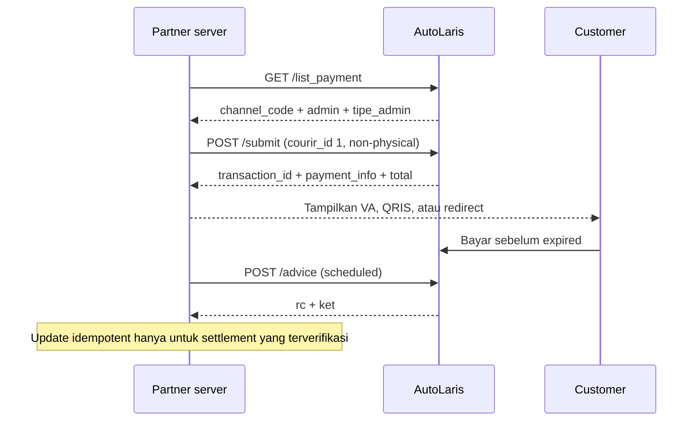

# AutoLaris H2H — Payment Gateway

Dokumen ini membahas empat endpoint yang berkaitan dengan payment:

| Endpoint | Kegunaan |
|---|---|
| `GET /api/h2h/list_payment` | Channel aktif dan konfigurasi fee akun |
| `POST /api/h2h/create_payment` | Tagihan payment tanpa pengiriman |
| `POST /api/h2h/submit` | Order, pengiriman, dan payment terpadu |
| `POST /api/h2h/advice` | Pemeriksaan status berdasarkan provider `transaction_id` |

Snapshot koleksi Postman `latest` diperiksa pada 2026-09-03. Contoh implementasi lintas framework: [integration guide](./integration.md).

## Profil payment-only yang direkomendasikan untuk integrasi ini

ZvaraShop menggunakan **Create Order `/submit`** sebagai payment gateway
non-fisik. Transaksi dicatat di AutoLaris sebagai produk digital, subscription,
atau pembayaran non-produk-fisik; pengiriman barang tidak dibawa ke AutoLaris.

- `courir_id: 1` adalah klasifikasi non-fisik yang disepakati pada akun;
- field alamat dan dimensi hanya memenuhi schema `/submit`;
- tidak ada AWB, pickup, courier booking, atau dispatch;
- `cod_value: "0"` untuk QRIS/VA;
- simpan `transaction_id`, lalu periksa melalui `/advice` pada cron;
- jangan panggil `/create_payment` setelah `/submit` untuk checkout yang sama.

Konvensi `courir_id: 1` bukan kontrak global Postman. Integrator akun lain wajib
mengonfirmasikannya kepada AutoLaris.

## 1. Authentication

Base URL:

```text
https://api-h2h.autolaris.com
```

Header:

```http
Authorization: Bearer <API_KEY>
Content-Type: application/json
```

API Key diperoleh dari [dashboard seller](https://seller.autolaris.com). Akses production membutuhkan whitelist maksimal 5 IP. Simpan key sebagai server secret; jangan gunakan `NEXT_PUBLIC_`, `PUBLIC_`, `VITE_`, atau variabel lain yang masuk browser bundle.

## 2. Flow payment



Untuk produk fisik, ambil `courir_id` dari `/ongkir`; jangan memakai klasifikasi
non-fisik `1`. Flow fisik tetap mengikuti kontrak Postman.

## 3. List Payment Channel

`GET /api/h2h/list_payment`

Endpoint ini menggantikan daftar channel hardcoded. Response mengikuti konfigurasi akun yang memakai API Key.

```bash
curl --fail-with-body \
  -H "Authorization: Bearer $AUTOLARIS_API_KEY" \
  "https://api-h2h.autolaris.com/api/h2h/list_payment"
```

### Response contoh

```json
{
  "rc": "00",
  "ket": "Sukses",
  "data": [
    {
      "channel_code": "COD",
      "name": "COD",
      "admin": "0.0",
      "tipe_admin": "fix"
    },
    {
      "channel_code": "QRIS",
      "name": "QRIS",
      "admin": "0.7",
      "tipe_admin": "persen"
    },
    {
      "channel_code": "VABNI",
      "name": "Bank BNI",
      "admin": "3000.0",
      "tipe_admin": "fix"
    },
    {
      "channel_code": "OVO",
      "name": "OVO",
      "admin": "3.0",
      "tipe_admin": "persen"
    }
  ]
}
```

Stored response terbaru vendor memuat:

- `COD`
- `QRIS`
- `VABNI`
- `VAPERMATA`
- `VABCA`
- `VAMANDIRI`
- `VABRI`
- `OVO`

Daftar itu hanya sample satu akun/waktu. Versi dokumentasi lama menyebut BSI, DANA, CIMB, dan Danamon, tetapi channel tersebut tidak ada pada sample `list_payment` terbaru. Jangan menghapus dukungan hanya berdasarkan sample; render dan validasi dari response runtime.

### Fee

| `tipe_admin` | Arti |
|---|---|
| `fix` | `admin` nominal tetap. |
| `persen` | `admin` persentase. |

Gunakan `admin` dan `total` dari response transaksi sebagai nilai final. Tabel channel membantu preview, bukan menggantikan nominal authoritative dari Create Payment/Create Order.

## 4. Create Payment

`POST /api/h2h/create_payment`

### Request

```json
{
  "reff_id": "PAY-20260818-001",
  "channel_code": "VAMANDIRI",
  "customer_id": "31857118",
  "customer_name": "Budi Santoso",
  "customer_phone": "081234567890",
  "customer_email": "budi@example.com",
  "expired": "20260818235959",
  "amount": "11000",
  "callback_url": "https://partner.example/autolaris/payment"
}
```

| Field | Tipe pada contoh | Catatan |
|---|---|---|
| `reff_id` | string | ID transaksi partner. Gunakan unik dan simpan sebelum request. |
| `channel_code` | string | Pilih dari `list_payment`. |
| `customer_id` | string | ID customer di partner. |
| `customer_name` | string | Nama customer. |
| `customer_phone` | string | Nomor telepon. |
| `customer_email` | string | Email. |
| `expired` | string | `YYYYMMDDHHMMSS`; timezone resmi belum dipublikasikan. |
| `amount` | string | Nominal pokok sebelum fee. |
| `callback_url` | string | HTTPS endpoint partner. Kontrak callback belum dipublikasikan. |

### Response sukses

```json
{
  "rc": "00",
  "ket": "Sukses",
  "data": {
    "trx_id": "671647",
    "virtual_account": "8779611150001393",
    "qr": "",
    "payment_code": "",
    "url": "",
    "amount": 11000,
    "admin": 3000,
    "total": 14000
  }
}
```

| Field | Penggunaan |
|---|---|
| `trx_id` | Simpan untuk rekonsiliasi dan callback. |
| `virtual_account` | Instruksi Virtual Account jika terisi. |
| `qr` | Payload EMVCo QRIS jika terisi; render menjadi QR. |
| `payment_code` | Kode payment jika channel menggunakannya. |
| `url` | Redirect/deep link jika channel menggunakannya. |
| `amount` | Nominal pokok. |
| `admin` | Fee transaksi. |
| `total` | Nominal final yang ditagihkan. |

Client harus memilih field instruksi yang non-empty, bukan menebak berdasarkan prefix channel saja.

### QRIS

Catatan live yang sudah ada di riwayat repository (2026-07-19) mencatat:

- request QRIS `amount: 10000` menghasilkan `admin: 70` dan `total: 10070`;
- `qr` berisi payload EMVCo;
- merchant name berasal dari merchant terdaftar pada akun AutoLaris dan payload memiliki CRC.

Jangan mengubah string QRIS untuk mengganti merchant name; modifikasi payload dapat membuat CRC tidak valid. Konfigurasi nama merchant dilakukan melalui onboarding AutoLaris.

## 5. Create Order

`POST /api/h2h/submit`

Endpoint ini membuat order sekaligus instruksi payment. Pada kontrak Postman,
endpoint membawa pengiriman. Pada profil payment-only yang disepakati, gunakan
`courir_id: 1` agar order dicatat sebagai digital/non-fisik tanpa dispatch.

Input tambahan dibanding Create Payment:

- `courir_id` dari Cek Ongkir;
- origin, destination, berat, dan dimensi;
- data shipper/receiver;
- `grand_total`, `cod_value`, dan `order_details`.

Response menyertakan:

- `transaction_id` dan `reff_id`;
- `biaya_kirim`, `biaya_cod`, `biaya_admin`, `biaya_asuransi`, `diskon`, `total`;
- `pickup_info` dan `buyer_info`;
- `payment_info.expired`, `payment_info.va`, `payment_info.qr`, `payment_info.url`.

Payload lengkap: [Create Order pada referensi H2H](../reference/h2h-api.md#7-create-order).

Jangan memanggil Create Payment lagi untuk `reff_id` yang sudah berhasil diproses oleh Create Order tanpa rekonsiliasi; itu berisiko membuat tagihan kedua.

## 6. Advice dan cron payment

`POST /api/h2h/advice`

```json
{
  "transaction_id": "986770"
}
```

Cron membaca transaksi lokal `pending`/`expired` yang memiliki provider
`transaction_id`, lalu memanggil Advice secara bounded dan idempotent.

- `02/PENDING` tetap pending;
- `SUCCESS`/`BERHASIL` terlalu generik dan `DELIVERED` adalah status pengiriman;
  ketiganya tidak boleh ditafsirkan sebagai lunas;
- hanya status settlement eksplisit yang telah dikonfirmasi provider boleh
  menandai transaksi dan order sebagai paid;
- kegagalan satu transaksi tidak menghentikan transaksi lain;
- perubahan paid tidak otomatis membuat shipment.

Daftar status final belum dipublikasikan lengkap. Manual reconciliation tetap
fallback untuk status yang belum terbukti.

## 7. Response code dan error handling

| Kondisi | Deteksi | Tindakan |
|---|---|---|
| Sukses | HTTP 2xx dan `rc === "00"` | Simpan ID dan proses `data`. |
| Logical failure | HTTP 2xx dan `rc !== "00"` | Jangan proses `data`; catat `rc`/`ket`. |
| Unauthorized | HTTP 401/403 | Cek key dan IP whitelist. Jangan retry cepat. |
| Invalid request | HTTP 400 atau `rc: "01"` | Perbaiki payload. |
| Channel inactive | `rc: "07"` pada Create Payment | Refresh `list_payment` dan cek onboarding. |
| Timeout / 5xx | Tidak ada response atau server failure | Rekonsiliasi sebelum retry. Pertahankan `reff_id`. |

`00`, `01`, dan `07` pernah diverifikasi live pada 2026-07-19. Ini bukan daftar error lengkap.

### Idempotensi partner

1. Buat `reff_id` unik dan simpan state lokal `creating`.
2. Kirim request dengan `reff_id` tersebut.
3. Pada sukses, simpan `trx_id` atau `transaction_id` secara atomik.
4. Pada timeout, jangan mengganti `reff_id` dan jangan langsung membuat tagihan baru.
5. Gunakan `/advice` terhadap provider transaction ID sebelum retry yang dapat membuat transaksi baru.

Create Resi mendokumentasikan `reff_id` maksimal 30 digit dan tidak boleh sama pada hari yang sama. Koleksi belum menyatakan aturan persis untuk Create Payment atau Create Order.

## 8. Callback: kontrak belum cukup untuk handler production

Koleksi publik menyebut `callback_url`, tetapi belum mendefinisikan:

- payload dan Content-Type;
- nama/nilai status;
- signature atau HMAC;
- source IP;
- retry schedule dan timeout;
- response body yang diharapkan;
- event ordering;
- identifier idempotensi.

Karena itu, repository ini **tidak** menyediakan contoh yang langsung menandai order `PAID` dari payload asumsi.

### Discovery handler yang aman

Saat onboarding, endpoint sementara boleh:

1. menerima HTTPS POST;
2. menyimpan timestamp, raw body, Content-Type, dan request ID;
3. meredaksi authorization, cookie, data personal, dan payment credential;
4. tidak mengubah status order;
5. mengembalikan response yang disepakati dengan AutoLaris;
6. dibandingkan dengan transaksi uji di dashboard.

Setelah kontrak nyata diterima, implementasikan:

- signature/network verification;
- schema validation;
- idempotency constraint pada event atau transaction ID;
- monotonic state transition agar event terlambat tidak menurunkan status final;
- audit log tanpa secret/data sensitif;
- response cepat, lalu proses lanjutan secara asynchronous bila perlu.

## 9. Pertanyaan wajib sebelum go-live

| # | Pertanyaan ke AutoLaris |
|---|---|
| 1 | Apa payload callback lengkap beserta sample nyata? |
| 2 | Apa daftar status dan mana yang final? |
| 3 | Bagaimana verifikasi signature/HMAC atau source IP? |
| 4 | Apa retry policy, timeout, ordering, dan response acknowledgement? |
| 5 | Apa timezone untuk `expired` dan timestamp callback? |
| 6 | Apa mapping lengkap code/status Advice, dan kombinasi mana yang final paid? |
| 7 | Apa aturan duplicate `reff_id` pada Create Payment dan Create Order? |
| 8 | Apa minimum/maksimum amount dan rate limit? |
| 9 | Bagaimana memperoleh `awb` setelah Create Order `/submit`? |
| 10 | Channel mana yang aktif di production merchant ini? |

## 10. Checklist go-live

- [ ] API Key production berada di secret manager/server environment.
- [ ] IP egress production sudah di-whitelist.
- [ ] UI mengambil channel dari `list_payment`, bukan daftar hardcoded.
- [ ] UI menampilkan `total` dari response transaksi.
- [ ] `reff_id`, `trx_id`, dan `transaction_id` tersimpan dan dapat direkonsiliasi.
- [ ] Timeout tidak membuat tagihan kedua secara otomatis.
- [ ] Cron Advice telah diuji dan `DELIVERED` tidak mengubah payment menjadi paid.
- [ ] Callback contract, signature, status, dan retry sudah dikonfirmasi.
- [ ] Callback handler idempotent dan menolak state regression.
- [ ] QRIS/VA/e-wallet diuji per channel yang aktif.
- [ ] API Key tidak muncul pada browser, log, atau error response.

## Sumber

- [Koleksi Postman AutoLaris H2H](https://documenter.getpostman.com/view/25938923/2sB2iwFuwz)
- [Referensi seluruh endpoint](../reference/h2h-api.md)
- [Panduan lintas stack](./integration.md)
- [OpenAPI snapshot](../../openapi/autolaris-h2h.openapi.json)
