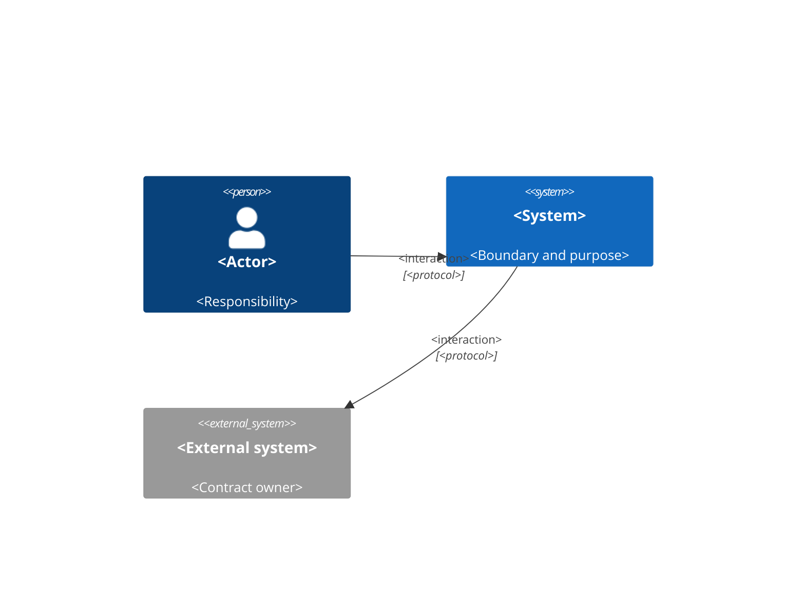
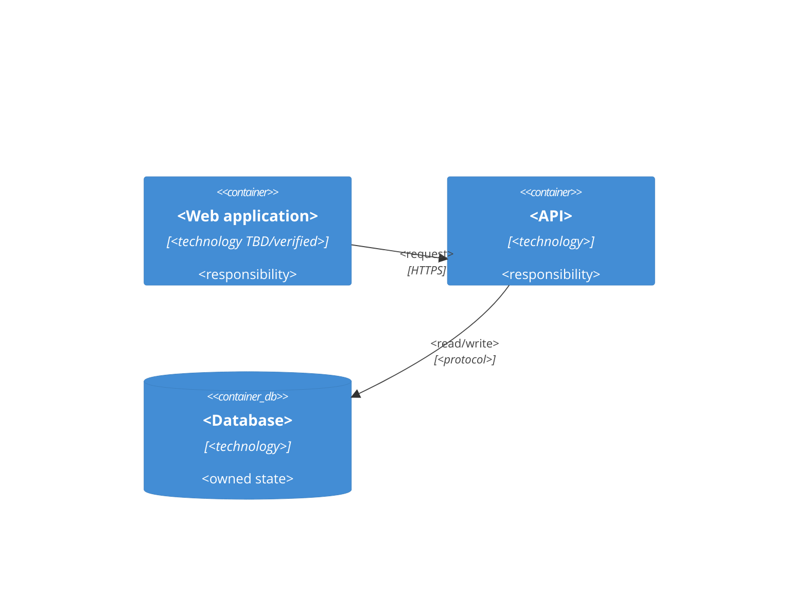
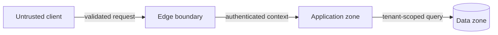

# System Architecture and Infrastructure

> Template instruction: model verified or explicitly proposed boundaries. Label every diagram `Current`, `Target`, or `Transitional`; never mix them without a legend.

## Document Control

| Field | Value |
|---|---|
| Purpose | Define system context, containers, ownership, trust boundaries, deployment topology, external dependencies, and architectural constraints. |
| Required when | Product/platform depth, multiple deployable components, external integrations, high-availability/cross-border constraints, or a material trust/runtime boundary change. |
| Accountable owner | `<architecture/engineering owner>` |
| Responsible author | `<architect/technical lead>` |
| Reviewers | `<engineering, security, platform, data, operations>` |
| Status / version / updated | `<status> / <version> / <date>` |

**Inputs:** `PR-*`, `NFR-*`, accepted `TD-*`/`ADR-*`, runtime/infrastructure evidence, provider constraints.
**Outputs:** stable `ARCH-*` component/boundary contracts, C4 views, trust zones, topology, dependency and failure ownership.
**Primary ID namespace:** `ARCH-<number>`.

## 1. Scope and Architecture Drivers

- System boundary: `<included/excluded systems>`
- Current/target horizon: `<state and date>`
- Key drivers: `<PR-*, NFR-*, SEC-*, SLO-*>`
- Constraints: `<runtime, region, provider, budget, compatibility>`
- Assumptions requiring validation: `<owner/date/evidence>`

## 2. System Context (C4 Level 1)

| ID | Element | Owner | Data exchanged | Trust level | Contract/SLA |
|---|---|---|---|---|---|
| `ARCH-1` | `<system/actor>` | `<team/org>` | `<data classes>` | `<zone>` | `<API/SLO/vendor>` |

## 3. Container View (C4 Level 2)

| ID | Container | Single responsibility | Deployable owner | Scaling unit | State ownership | Interfaces |
|---|---|---|---|---|---|---|
| `ARCH-2` | `<container>` | `<responsibility>` | `<team>` | `<unit>` | `<DATA-* or stateless>` | `<OpenAPI/event/job>` |

## 4. Runtime and Deployment Topology

For regional or cross-border systems, show compute, storage, replication, backup, logs, analytics, model/integration providers, support/admin access, failover, and egress by location. Link each material flow to `CTX-*`, `JUR-*`, or `XFER-*`; do not infer residency from the primary deployment region alone.

| Environment/region | Component | Runtime/network zone | Replicas/scaling | Persistent dependency | Ingress/egress | Evidence |
|---|---|---|---|---|---|---|
| `<environment>` | `<ARCH-*>` | `<zone>` | `<policy/TBD>` | `<service>` | `<path/policy>` | `<config/link>` |

Identify regions, data residency, load balancing, DNS, TLS termination, private/public boundaries, queues, caches, object storage, scheduled jobs, and administrative paths where applicable.

## 5. Trust Boundaries and Data Flows

| Flow ID | Source → destination | Data class | Protocol/auth | Boundary crossed | Validation/control refs | Logging/redaction |
|---|---|---|---|---|---|---|
| `ARCH-3` | `<source → target>` | `<class>` | `<protocol/IAM-*>` | `<zone>` | `<SEC-*/TEN-*>` | `<OBS-*>` |

## 6. External Dependencies

| Dependency | Purpose | Contract owner | Criticality | Timeout/retry | Failure/degraded mode | Data/residency | Exit plan |
|---|---|---|---|---|---|---|---|
| `<provider/system>` | `<purpose>` | `<owner>` | `<tier>` | `<policy>` | `<behavior>` | `<classification/location>` | `<migration/export>` |

Do not assert provider capabilities without current official evidence.

## 7. Architectural Decisions and Boundaries

| ID | Decision/boundary | Rationale | Enforced by | Consumers | ADR | Validation |
|---|---|---|---|---|---|---|
| `ARCH-4` | `<contract>` | `<driver>` | `<network/code/platform>` | `<components>` | `<ADR-*>` | `<check>` |

## 8. Availability, Scalability, and Failure Domains

| Component/dependency | Failure mode | Blast radius | Detection | Automatic response | Manual recovery | Target refs |
|---|---|---|---|---|---|---|
| `<ARCH-*>` | `<failure>` | `<tenant/region/global>` | `<SLI-*/OBS-*>` | `<retry/failover/shed>` | `<runbook>` | `<SLO-*/DR-*>` |

State capacity assumptions, workload dimensions, bottlenecks, backpressure, quotas, and noisy-neighbor boundaries. Unsupported high-availability claims are prohibited.

## 9. Security Architecture Handoff

- Internet and administrative ingress: `<ARCH-* flows>`
- Identity and service-to-service trust: `<IAM-* references>`
- Tenant boundary: `<TEN-* references>`
- Secrets/key boundary: `<SEC-* references>`
- Sensitive data stores/flows: `<DATA-*/PRIV-* references>`
- Egress and third-party exposure: `<allowlist/control refs>`

## 10. Operability and Lifecycle

| Concern | Owner | Architecture mechanism | Policy/runbook refs | Validation |
|---|---|---|---|---|
| Deploy/rollback | `<role>` | `<artifact/topology>` | `<DEL-*>` | `<check>` |
| Migration | `<role>` | `<compatibility boundary>` | `<MIG-*>` | `<rehearsal>` |
| Observability | `<role>` | `<telemetry path>` | `<OBS-*>` | `<dashboard/alert test>` |
| Recovery | `<role>` | `<backup/failover>` | `<DR-*>` | `<exercise>` |

## 11. Cross-Document Contract

- `03-TECHNICAL-DESIGN.md` owns component behavior; this document owns system/container boundaries and topology.
- `05-DATA-MODEL.md` owns table/constraint details; `06-TENANT-ISOLATION.md` owns tenant enforcement.
- `07-IAM-RBAC-ABAC.md` owns identity/policy; `08-DOMAIN-ROUTING.md` owns host resolution and TLS lifecycle.
- Security owns control requirements; Delivery owns environment/promotion mechanics; SLA/DRP owns commitments and recovery targets.
- Diagrams reference stable IDs and are regenerated/updated when their owning contracts change.

## 12. Validation and Approval Checklist

- [ ] Scope, state (`Current/Target/Transitional`), date, and evidence are explicit.
- [ ] Context, container, trust-boundary, data-flow, and deployment views agree.
- [ ] Every runtime component has one owner, responsibility, interface, scaling unit, and state declaration.
- [ ] External dependencies define contracts, failure modes, data exposure, and exit plans.
- [ ] Public/private, tenant, administrative, region, and provider trust boundaries are visible.
- [ ] Failure domains, blast radius, degraded behavior, capacity assumptions, and recovery ownership are defined.
- [ ] `ARCH-*` IDs are unique and referenced instead of duplicated downstream.
- [ ] No unverified provider, topology, availability, or scalability claim remains.
- [ ] Architecture, security, platform, data, and operations reviewers approved or recorded exceptions.
