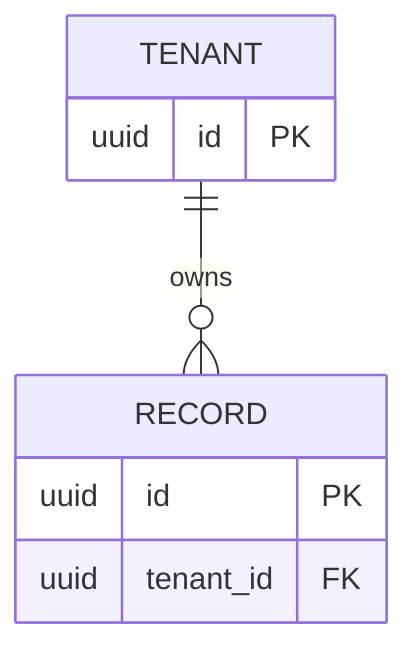

# Database Schema and Data Model

> Template instruction: represent persistent truth, not speculative entities. Validate names, types, constraints, and existing migrations against the selected database before approval.

## Document Control

| Field | Value |
|---|---|
| Purpose | Define entities, ownership, keys, constraints, relationships, indexing, lifecycle, consistency, and migration contracts. |
| Required when | Persistent state exists with two or more related entities, shared data, regulated data, or schema migration. |
| Accountable owner | `<data/engineering owner>` |
| Responsible author | `<engineer/data architect>` |
| Reviewers | `<application, database, security, privacy, operations>` |
| Status / version / updated | `<status> / <version> / <date>` |
| Database/runtime | `<verified engine/version or TBD>` |

**Inputs:** `PR-*`, `TD-*`, `ARCH-*`, `TEN-*`, `IAM-*`, `PRIV-*`, actual schema/migrations.
**Outputs:** stable `DATA-*` contracts, ERD, column/constraint/index definitions, ownership, retention/deletion, migration and integrity validation.
**Primary ID namespace:** `DATA-<number>`.

## 1. Data Scope and Principles

- Bounded context: `<domain boundary>`
- System of record per concept: `<mapping>`
- Tenant/global ownership rule: `<TEN-* references>`
- Data classification scheme: `<PRIV-*/SEC-* references>`
- Consistency and availability priorities: `<explicit trade-off>`
- Excluded or derived data: `<list and owner>`

## 2. Conceptual Model

| ID | Entity/concept | Definition | Owner | Tenant scope | Source of truth | Lifecycle trigger |
|---|---|---|---|---|---|---|
| `DATA-1` | `<entity>` | `<business meaning>` | `<service/team>` | `<global/tenant/user>` | `<store/system>` | `<create/archive/delete>` |

## 3. Entity Relationship Diagram

Replace example names/types with verified project entities. Label cardinality, optionality, ownership, and tenant keys; never infer business relationships from names alone.

## 4. Logical Schema Dictionary

### Entity: `<table or collection>` (`DATA-*`)

| Field | Type | Null? | Default | Key/reference | Validation/constraint | Classification | Notes |
|---|---|---|---|---|---|---|---|
| `<field>` | `<native type>` | `Yes/No` | `<value/none>` | `<PK/FK/unique>` | `<check/range/format>` | `<public/internal/confidential/restricted>` | `<semantics>` |

Table invariants:

- `<constraint that MUST hold even with concurrent writers>`
- `<tenant ownership and foreign-key invariant>`
- `<state-transition invariant>`

## 5. Keys, Relationships, and Integrity

| ID | Table(s) | Rule | Enforcement | Delete/update behavior | Deferrable? | Test |
|---|---|---|---|---|---|---|
| `DATA-2` | `<tables>` | `<invariant>` | `<PK/FK/unique/check/trigger/application>` | `<restrict/cascade/set null>` | `<yes/no>` | `<concurrency/integrity test>` |

Prefer database constraints for invariants that must survive every writer. Explain any application-only enforcement and its race-condition handling.

## 6. Index and Query Model

| Query/use case | Filters/order | Tenant predicate | Expected cardinality | Index | Trade-off | Evidence |
|---|---|---|---:|---|---|---|
| `<PR-*/API operation>` | `<columns>` | `<tenant_id rule>` | `<estimate>` | `<ordered columns/type>` | `<write/storage cost>` | `<EXPLAIN/load test>` |

Avoid duplicate or speculative indexes. Record engine-specific semantics, partial conditions, collation, and uniqueness scope.

## 7. Transaction and Concurrency Model

| Operation | Tables/state | Atomic boundary | Isolation/locking | Conflict strategy | Idempotency | Failure recovery |
|---|---|---|---|---|---|---|
| `<operation>` | `<entities>` | `<transaction>` | `<level/version/lock>` | `<retry/reject/merge>` | `<key/scope>` | `<compensate/reconcile>` |

## 8. Tenant Isolation and Shared Data

| Entity | Scope | Tenant key | Enforcement layer | Cross-tenant access case | Cache/search/export rule |
|---|---|---|---|---|---|
| `<entity>` | `<tenant/global/shared>` | `<column/partition/schema>` | `<RLS/constraint/query>` | `<none/approved workflow>` | `<TEN-* refs>` |

Tenant isolation policy is owned by `06-TENANT-ISOLATION.md`; this section records schema realization only.

## 9. Data Lifecycle, Retention, and Deletion

| Data class/entity | Creation source | Retention | Archive | Deletion/anonymization | Legal hold | Evidence |
|---|---|---|---|---|---|---|
| `<data>` | `<source>` | `<PRIV-* policy>` | `<location/none>` | `<mechanism/SLA>` | `<behavior>` | `<audit/test>` |

Specify backups, replicas, analytics copies, caches, search indexes, exports, and downstream deletion propagation.

Record storage, processing, backup, replication, analytics, model-provider, and remote administrative/support locations per `DATA-*`. Link cross-border flows to `XFER-*`; a primary database region alone does not establish residency or transfer compliance.

## 10. Encryption, Access, and Audit

| Asset | At rest | In transit | Field-level/tokenization | Access identity | Audit event | Key/control refs |
|---|---|---|---|---|---|---|
| `<store/field>` | `<mechanism>` | `<protocol>` | `<if required>` | `<IAM-*>` | `<event>` | `<SEC-*>` |

## 11. Migration and Compatibility Plan

| MIG/phase | Schema/data change | Old/new reader compatibility | Backfill | Verification | Rollback boundary | Cleanup trigger |
|---|---|---|---|---|---|---|
| `<MIG-*>` | `<change>` | `<contract>` | `<batch/rate/resume>` | `<counts/checksum/invariant>` | `<reversible until>` | `<evidence>` |

Use expand/migrate/contract where zero downtime is required. Define backup, restore, lock duration, failure resume, and irreversible steps.

## 12. Cross-Document Contract

- `02-PRD.md` owns product behavior; `03-TECHNICAL-DESIGN.md` owns application flows.
- `04-SYSTEM-ARCHITECTURE.md` owns storage/component boundaries.
- `06-TENANT-ISOLATION.md` owns isolation policy; this document owns keys, constraints, and schema enforcement.
- `07-IAM-RBAC-ABAC.md` owns who may act; OpenAPI owns external payloads.
- Privacy owns retention/legal obligations; Security owns encryption/key controls; Delivery owns migration gates.

## 13. Validation and Approval Checklist

- [ ] Model matches actual or explicitly proposed schema and selected database semantics.
- [ ] Every entity has one definition, owner, source of truth, tenant scope, and lifecycle.
- [ ] Keys, cardinality, optionality, FK actions, uniqueness scope, and invariants are explicit.
- [ ] Concurrent writes cannot bypass critical business or tenant constraints.
- [ ] Critical queries have tenant predicates, cardinality assumptions, justified indexes, and measured plans where possible.
- [ ] Transaction, isolation, idempotency, and recovery behavior are defined.
- [ ] Retention/deletion covers backups, caches, indexes, analytics, exports, and legal holds.
- [ ] Sensitive data has classification, access, encryption, redaction, and audit requirements.
- [ ] Migration supports compatibility, verification, interruption/resume, rollback/forward fix, and cleanup.
- [ ] `DATA-*` IDs are unique and all external references resolve.
- [ ] Application, database, tenancy, security, privacy, and operations reviewers approved.
