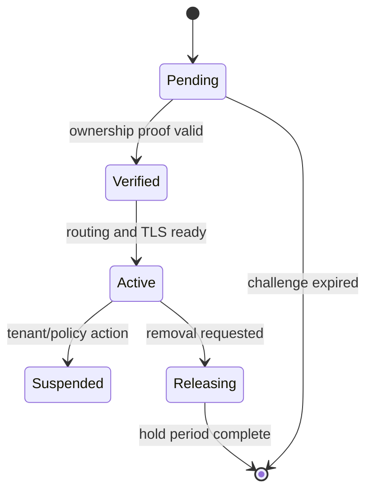

# Subdomain and Custom Domain Routing Specification

> Template instruction: a hostname may resolve a tenant candidate, but it never authenticates or authorizes a user. Define DNS, ownership proof, TLS, routing, cache, lifecycle, and takeover protections end to end.

## Document Control

| Field | Value |
|---|---|
| Purpose | Define platform subdomains and custom-domain onboarding, canonicalization, tenant resolution, DNS/TLS lifecycle, conflicts, routing, caching, redirects, and abuse controls. |
| Required when | Tenant subdomains, custom domains, vanity hosts, or white-label routing are supported. |
| Accountable owner | `<platform/product owner>` |
| Responsible author | `<platform/application engineer>` |
| Reviewers | `<security, tenancy, networking, support, SEO/product>` |
| Status / version / updated | `<status> / <version> / <date>` |

**Inputs:** tenant model (`TEN-*`), identities/policies (`IAM-*`), architecture (`ARCH-*`), product/white-label behavior, DNS/TLS provider evidence.
**Outputs:** stable `DOM-*` rules, domain data/lifecycle, ownership verification, routing/canonicalization contract, TLS and cache behavior, runbook and tests.
**Primary ID namespace:** `DOM-<number>`.

## 1. Scope and Domain Types

| Domain type | Example pattern | Owner | Purpose | Canonical? | Supported environments |
|---|---|---|---|---|---|
| Platform root | `<example.invalid>` | `<platform>` | `<marketing/app>` | `<yes/no>` | `<prod/etc.>` |
| Tenant subdomain | `<slug.example.invalid>` | `<platform>` | `<tenant app>` | `<rule>` | `<environments>` |
| Custom domain | `<customer-owned.invalid>` | `<tenant/customer>` | `<white-label>` | `<rule>` | `<environments>` |

Use reserved example domains in templates. Record wildcard and apex support explicitly; do not assume provider behavior.

| ID | Routing requirement | Rationale/threat | Enforcement | Evidence | Owner |
|---|---|---|---|---|---|
| `DOM-1` | `<The system MUST ...>` | `<reason>` | `<edge/app/provider>` | `<test/log>` | `<role>` |

## 2. Host Normalization and Tenant Resolution

Resolution order:

1. Parse and normalize the request authority using platform/runtime semantics.
2. Reject invalid syntax, disallowed ports, control characters, oversized hosts, and untrusted forwarded-host data.
3. Match exact verified custom domain before platform subdomain, unless an accepted `DOM-*` states otherwise.
4. Resolve active domain mapping to exactly one tenant candidate.
5. Reject absent, pending, suspended, conflicting, or multiple mappings; never fall back to a default tenant.
6. Establish `TEN-*` context, then perform `IAM-*` authorization independently.

| Input/state | Normalization | Lookup | Result | HTTP behavior | Cache rule |
|---|---|---|---|---|---|
| `<host>` | `<lowercase/IDNA/trailing dot/port>` | `<authoritative store>` | `<tenant/none/conflict>` | `<status/redirect>` | `<key/TTL/invalidation>` |

Specify Internationalized Domain Name policy, Unicode display, public-suffix handling, apex/`www`, trailing dots, default ports, IPv4/IPv6 literals, and forwarded headers according to the actual trusted proxy chain.

## 3. Domain Data Contract

| Field | Meaning | Constraint | Classification | Owner document |
|---|---|---|---|---|
| Domain ID | `<stable ID>` | `<unique>` | `<class>` | `DATA-*` |
| Normalized hostname | `<lookup key>` | `<global unique/case rules>` | `<class>` | `DATA-*` |
| Tenant ID | `<owner>` | `<FK/TEN-*>` | `<class>` | `DATA-*` |
| Status | `<pending/verified/active/suspended/releasing>` | `<state machine>` | `<class>` | `DOM-*` |
| Verification challenge | `<method metadata>` | `<expiry/single use>` | `<class>` | `DOM-*/SEC-*` |

Uniqueness and concurrency must prevent two tenants from claiming the same normalized hostname.

## 4. Custom Domain Onboarding and Ownership Verification

| Step | Actor | Preconditions | Action/evidence | Timeout/retry | Failure/rollback |
|---|---|---|---|---|---|
| Claim | `<authorized tenant role>` | `<IAM-*>` | `<reserve normalized host>` | `<policy>` | `<release>` |
| Verify | `<system/operator>` | `<challenge active>` | `<DNS/HTTP proof>` | `<TTL/backoff>` | `<remain pending>` |
| Activate | `<system>` | `<proof + TLS + route>` | `<atomic state change>` | `<policy>` | `<do not serve tenant content>` |

Challenges must be unpredictable, scoped, expiring, replay-resistant, and redacted. Revalidate ownership periodically or on DNS/tenant/security events according to risk.

## 5. DNS Specification

When internationalized domain names are supported, define Unicode input, IDNA/ASCII canonical storage and comparison, display policy, homograph/confusable defense, certificate/provider support, and test cases. Verify public-suffix and registrable-domain behavior from current authoritative data rather than hard-coded country assumptions.

| Domain case | Customer/platform record | Target/value source | Validation | Propagation behavior | Conflict behavior |
|---|---|---|---|---|---|
| Subdomain | `<CNAME/etc.>` | `<provider-generated value>` | `<authoritative query>` | `<pending/TTL>` | `<deny>` |
| Apex | `<ALIAS/ANAME/A/AAAA/etc. if supported>` | `<verified provider guidance>` | `<query>` | `<pending>` | `<deny>` |

Do not hardcode vendor records in this reusable template. Define DNSSEC/CAA requirements, wildcard policy, zone ownership, split-horizon behavior, and stale-record cleanup where applicable.

## 6. TLS Certificate Lifecycle

| Stage | Trigger | Validation | Issuance/renewal owner | Failure behavior | Alert/escalation |
|---|---|---|---|---|---|
| Issue | `<verified mapping>` | `<ownership + DNS>` | `<provider/platform>` | `<no tenant content/plaintext forbidden>` | `<OBS-*>` |
| Renew | `<window>` | `<continued control>` | `<owner>` | `<grace/deactivate>` | `<threshold>` |
| Revoke/remove | `<release/incident>` | `<authorization>` | `<owner>` | `<stop routing>` | `<audit>` |

Specify minimum TLS policy via `SEC-*`, certificate transparency monitoring if required, CAA interaction, and prevention of issuance/routing races.

## 7. Routing, Canonicalization, Redirects, and Errors

| Condition | Route/response | Canonical host | Redirect status | Cache | Security/SEO note |
|---|---|---|---|---|---|
| Active mapping | `<tenant app>` | `<configured host>` | `<none>` | `<policy>` | `<isolation>` |
| Alias/non-canonical | `<redirect>` | `<canonical>` | `<301/308 decision>` | `<policy>` | `<query/path preservation>` |
| Unknown/pending/conflict | `<neutral error>` | `<none>` | `<none>` | `<short/none>` | `<no tenant enumeration>` |
| Suspended/deleted | `<policy page>` | `<none>` | `<decision>` | `<invalidate>` | `<privacy/takeover>` |

Define path/query preservation, HSTS, cookies, origin/CORS/CSRF implications, absolute URL generation, robots/sitemaps, canonical tags, webhook callback hosts, and email-link hosts. Avoid open redirects.

## 8. Cache, CDN, and Invalidation

- Cache key MUST include normalized host and all content-varying dimensions.
- Origin requests MUST carry trusted resolved tenant context, not an unchecked client tenant header.
- Domain create/activate/suspend/transfer/delete MUST invalidate mapping and content caches within `<target>`.
- Unknown-host negative caching: `<TTL and takeover safety>`.
- CDN purge scope: `<single host/tenant/global and authorization>`.

| Cached object | Key | TTL | Invalidation event | Stale behavior | Leak test |
|---|---|---|---|---|---|
| `<mapping/content/cert status>` | `<dimensions>` | `<value>` | `<event>` | `<deny/serve stale rule>` | `<DOM-T*>` |

## 9. Domain Lifecycle, Transfer, and Takeover Prevention

| Transition | Authorization | Hold/quarantine | DNS/TLS/cache action | Tenant data action | Audit/notification |
|---|---|---|---|---|---|
| Rename subdomain | `<IAM-*>` | `<reservation>` | `<redirect/release>` | `<none>` | `<event>` |
| Transfer domain | `<source+target proof>` | `<hold>` | `<atomic remap>` | `<TEN-* rule>` | `<event>` |
| Delete tenant/domain | `<approval>` | `<release delay>` | `<deactivate/purge/revoke>` | `<PRIV-*>` | `<event>` |

Prevent dangling DNS and subdomain takeover: do not reassign released names until the documented quarantine and proof process completes.

## 10. Abuse, Rate, and Failure Handling

| Threat/failure | Prevention | Detection | Response | Recovery/runbook |
|---|---|---|---|---|
| Host-header injection | `<trusted proxy + normalization>` | `<metric/log>` | `<reject>` | `<runbook>` |
| Domain claim race | `<unique constraint/transaction>` | `<conflict>` | `<single winner>` | `<review>` |
| Verification abuse | `<rate/challenge controls>` | `<RATE-*/OBS-*>` | `<throttle>` | `<support>` |
| DNS/TLS outage | `<bounded retry>` | `<probe>` | `<safe pending/degraded state>` | `<runbook>` |

## 11. Domain Test Matrix

| Test ID | Setup | Request/change | Expected route/state | Isolation/security assertion | Evidence |
|---|---|---|---|---|---|
| `DOM-T1` | `<tenant/domain states>` | `<host/tamper/race>` | `<result>` | `<no cross-tenant content/no takeover>` | `<automated test>` |

Cover case/trailing dot/port/IDN, wildcard/apex, unknown and pending hosts, forwarded-header spoofing, concurrent claim, DNS proof replay/expiry, TLS failure/renewal, cache collision/invalidation, transfer/release, cookies/CORS/CSRF, redirects, and deleted tenants.

## 12. Cross-Document Contract

- `06-TENANT-ISOLATION.md` owns authoritative tenant context; domain routing supplies only a candidate mapping.
- `07-IAM-RBAC-ABAC.md` owns who may claim/manage domains and access resolved tenant resources.
- `05-DATA-MODEL.md` owns mapping uniqueness and constraints; `04-SYSTEM-ARCHITECTURE.md` owns edge/proxy topology.
- Security owns TLS/cryptographic and threat controls; Design System owns white-label presentation; Observability owns probes/alerts.
- OpenAPI owns domain-management endpoint payloads; this document owns lifecycle semantics.

## 13. Validation and Approval Checklist

- [ ] Supported domain types, environments, canonical rules, and unsupported cases are explicit.
- [ ] Host normalization and trusted proxy behavior use verified runtime/platform semantics.
- [ ] Every valid host maps to at most one active tenant; absent/conflicting mappings fail closed.
- [ ] Ownership proof is scoped, unpredictable, expiring, replay-resistant, and revalidated as required.
- [ ] DNS and TLS behavior is based on current official provider evidence and includes failures/renewal/removal.
- [ ] Cache keys and invalidation prevent cross-host and cross-tenant content leakage.
- [ ] Redirects, cookies, CORS, CSRF, HSTS, URL generation, and SEO behavior are defined.
- [ ] Rename, transfer, suspension, deletion, quarantine, and dangling-DNS takeover prevention are covered.
- [ ] Automated tests cover spoofing, races, stale cache, lifecycle, TLS, and tenant isolation.
- [ ] `DOM-*` IDs are unique and all `ARCH-*`, `DATA-*`, `TEN-*`, `IAM-*`, `SEC-*`, and `OBS-*` references resolve.
- [ ] Platform, security, tenancy, networking, support, and product owners approved.
