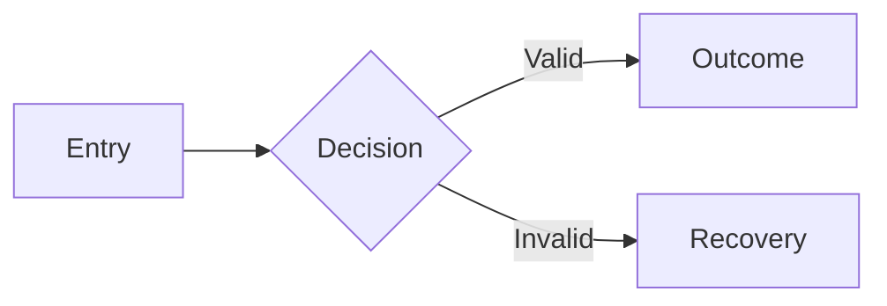

# UX Flows and Screen Contracts

> Template note: define observable user work before visual composition or component selection. Research and diagrams inform decisions; they do not replace accepted product requirements or executable evidence.

## Document Control

| Field | Value |
|---|---|
| Owner | [Product/UX owner] |
| Approvers | [Product, design, engineering, accessibility, operations] |
| Status | Draft / In review / Approved / Superseded |
| Version / updated | [Version] / [YYYY-MM-DD] |
| Applies to | [Actors, journeys, surfaces] |
| Required when | Maintained product UI, multi-screen workflow, role/state-dependent interaction, or material mobile/desktop transformation. |

## Purpose, Inputs, and Outputs

**Purpose:** make user journeys, screen responsibilities, interaction states, permissions, responsive transformations, and recovery behavior explicit before visual implementation.

**Inputs:** `PR-*`, `NFR-*`, domain lifecycle, `IAM-*`, `API-*`, approved research, existing routes/screens, content requirements, and repository evidence.

**Outputs:** `UX-*` requirements, journey and screen inventory, screen contracts, state/permission matrix, responsive behavior, content needs, decision rationale, and browser acceptance scenarios.

## Research and Decision Frame

Research is proportional. For a new surface or material redesign, inspect the
existing product and design system, then study a small relevant set of
professional products and authoritative pattern guidance before choosing a
direction. Include local comparables when language, market, trust, payment, or
operator behavior is local; include mature global comparables for breadth. A
small change inside an accepted system may rely on repository evidence alone.

| Source | Surface/pattern observed | Relevant evidence | Do not copy | Retrieved |
|---|---|---|---|---|
| [Repository, production product, design system, or authoritative guide] | [Pattern] | [Why it fits this job/audience] | [Brand-specific or unsupported behavior] | [Date] |

When direction is materially open, compare two or three distinct candidates. When evidence clearly favors one, record the selected direction without manufacturing alternatives.

| Candidate | User/job fit | Operational fit | Accessibility/responsive fit | Cost/risk | Decision |
|---|---|---|---|---|---|
| [Direction] | [Evidence] | [Evidence] | [Evidence] | [Trade-off] | Selected / Rejected / Open |

**Recommended direction:** [Choice and concise evidence-based rationale].

**Anti-template decision:** [How the selected hierarchy avoids repeated equal
cards, nested frames, excessive containers, uniform large rounding, ornamental
badges, default bento composition, and dashboard widgets that do not serve the
primary job].

## Market, Audience, and Experience Context

Do not invent personas. Separate observed behavior, business segmentation,
design hypothesis, locale, and legal applicability. A country code is not proof
that every user shares one behavior or that one jurisdiction applies.

| Segment/job | Evidence and status | Market model | Locale/language | Device/input context | Trust/content behavior | Design consequence |
|---|---|---|---|---|---|---|
| [Audience/job] | [Observed/Decision/Assumption + source] | Global / localized-global / country-specific | LOC-[N] | [Conditions] | [Evidence] | [Journey/content/layout implication] |

Record market-specific navigation, terminology, address/contact formats,
payments or fulfilment expectations, help behavior, trust signals, reading
direction, text expansion, imagery, and content density only when evidence or an
accepted business decision supports them. Route unresolved demand/persona work
to `product-intelligence` and wording to the relevant content/copy owner.

## Actors, Jobs, and Outcomes

| Actor | Scope/role | Trigger and job | Frequency/volume | Success outcome | Failure cost | Requirement refs |
|---|---|---|---|---|---|---|
| [Actor] | IAM-[N] | [Job] | [Context] | [Observable outcome] | [Impact] | PR-[N] |

## Journey and Exception Map

| Journey | Entry | Happy path | Exceptions/recovery | Completion | Owner |
|---|---|---|---|---|---|
| [Journey] | [Trigger] | [Steps] | [Denied, invalid, conflict, timeout, partial failure, retry, cancel] | [Observable result] | [Role] |

Add a Mermaid activity/flow, state, sequence, or component diagram only when it materially clarifies branching, lifecycle, ownership, or cross-system interaction. Generate it through `mermaid-diagram`, keep the prose/table contract authoritative, and label unverified behavior.

## Information Architecture and Screen Inventory

Derive navigation from jobs and objects, not from fashionable layouts. Do not force every product into sidebar + cards + dashboard.

| Screen/route | Actor/job | Entry points | Information priority | Primary action | Secondary/dangerous actions | Requirement refs |
|---|---|---|---|---|---|---|
| [Screen] | [Actor/job] | [Entry] | [Ordered content] | [Action] | [Actions] | UX-[N] |

## Screen Contracts

Repeat for each material screen or reusable flow.

### [Screen name]

- Purpose and completion: [one job and observable finish].
- Required data and source: [fields/ownership; no secret or PII examples].
- Entry and return behavior: [deep link, back, refresh, saved URL state].
- Primary, secondary, dangerous actions: [preconditions, confirmation, undo/recovery].
- Permissions and scope: [IAM references; hidden controls are not authorization].
- States: [initial, loading, empty, success, validation error, dependency error, denied, disabled, stale/conflict, offline if applicable].
- Persistence and interruption: [draft, autosave, resume, duplicate submission].
- Content: [labels, help, validation, empty/error/recovery copy owner].
- Accessibility outcome: [semantic structure, keyboard, focus, announcements, target size, zoom/reflow].
- Responsive transformation: [narrow/wide hierarchy and interaction change, not only breakpoints].
- Analytics and privacy: [decision-useful events, redaction, consent/collection constraints].
- Acceptance evidence: [browser scenario, viewport, fixture/state, expected observation].

## Requirements

| ID | Observable UX requirement | Source | Verification |
|---|---|---|---|
| UX-1 | [Actor can complete a job through defined states and recovery] | PR-/IAM-[N] | [Browser scenario/test] |
| UX-2 | [Narrow and wide layouts preserve priority and capability] | NFR-/UI-[N] | [Viewport evidence] |

## State and Permission Matrix

| Object/system state | Actor/scope | Visible information | Allowed actions | Disabled/hidden reason | Server enforcement | Recovery/audit |
|---|---|---|---|---|---|---|
| [State] | IAM-[N] | [Information] | [Actions] | [Reason communicated] | [Policy ref] | [Path/event] |

## Responsive and Input Contract

| Region | Narrow transformation | Wide behavior | Touch/keyboard behavior | Reflow/content risk | Evidence |
|---|---|---|---|---|---|
| [Navigation/table/form/chart/detail] | [Drawer, priority fields, cards, stack, etc.] | [Layout] | [Interaction] | [Long text, zoom, locale] | [Check] |

Breakpoints follow content failure points. Specify what changes in hierarchy, navigation, density, tables, charts, forms, dialogs, and sticky actions. Cover pointer, keyboard, and assistive-technology behavior where applicable.

## Visual-System Handoff

Reference `UI-*` decisions in `10-DESIGN-SYSTEM-WHITELABEL.md` for tokens, typography, spacing, density, shape, elevation, icons, themes, shared components, brand assets, and accessibility styling. This document owns what each screen must communicate and permit; the design-system artifact owns the reusable visual language.

## Traceability and Validation

| Requirement | Journey/screen/state | UI/IAM/API constraints | Test/evidence | Task |
|---|---|---|---|---|
| UX-[N] | [Reference] | UI-[N], IAM-[N], API-[N] | TEST-[N] / EVID-[N] | T[N] |

- [ ] Primary jobs, exception paths, permissions, and recovery are explicit.
- [ ] Every material screen has loading, empty, error, denied, success, and conflict behavior where applicable.
- [ ] Research sources and alternatives are recorded without copying unsupported product rules.
- [ ] Local/global references fit the actual audience and job; the result is not
      a collage of competitor branding or fashionable components.
- [ ] Audience and market behavior is evidence-labelled; global versus
      localized-global versus country-specific behavior is explicit.
- [ ] Every card, frame, container, badge, radius, KPI, and chart has a semantic
      purpose; repeated AI-template composition has been removed.
- [ ] Diagrams agree with the prose/table contract and label assumptions.
- [ ] Responsive transformations preserve priority and capability at narrow and wide widths.
- [ ] Content, accessibility, analytics, privacy, and operational needs have owners.
- [ ] Every `UX-*` requirement has observable browser evidence or an owned limitation.

## Cross-Document References

[02-PRD.md](02-PRD.md) · [03-TECHNICAL-DESIGN.md](03-TECHNICAL-DESIGN.md) · [07-IAM-RBAC-ABAC.md](07-IAM-RBAC-ABAC.md) · [09-API-SPECIFICATION.md](09-API-SPECIFICATION.md) · [10-DESIGN-SYSTEM-WHITELABEL.md](10-DESIGN-SYSTEM-WHITELABEL.md) · [12-SECURITY-ARCHITECTURE.md](12-SECURITY-ARCHITECTURE.md)

## Open Questions and Change Log

| Item | Owner | Due | Gate |
|---|---|---|---|
| [TBD] | [Owner] | [Date] | [Decision/implementation gate] |

| Date | Version | Change | Author | Approval |
|---|---|---|---|---|
| [Date] | [Version] | [Summary] | [Name] | [Reference] |
