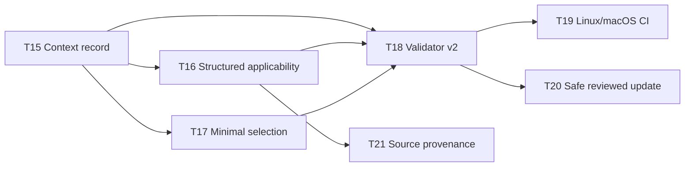

# Implementation Backlog and Release Evidence

Status: P0/P2 implemented locally; cross-platform CI awaiting remote run
Baseline: v1 commit `7c45141` / canonical cherry-pick `722ed15`
Owner: Development Specification Suite maintainers
Purpose: Keep implementation status, runnable evidence, and remaining release gates honest. A checked task means behavior and fixtures exist on disk; it does not prove a remote CI run, legal conclusion, audit result, certification, deployment, or production behavior.

## Priority and Evidence Rules

- `P0`: required before describing the suite as `v2 audit-ready`.
- `P1`: required for repeatable cross-platform maintenance and a `cross-platform validated` claim.
- `P2`: maintenance, ergonomics, or provenance controls.
- Every task has one primary requirement, explicit dependencies, bounded outputs, and a runnable `Done when` check.
- Update this file in the same change that implements or reopens behavior.
- Task state is one of `Implemented`, `Verified locally`, `CI pending`, `Blocked`, or `Open`. Design prose alone cannot close a task.

## Backlog Requirements

### DS-REQ-15 — Context-backed initialization
- Status: Verified locally
- Owner: Development Specification Suite maintainer
- Statement: When a pack is initialized, the suite shall create one non-destructive `CONTEXT-RECORD.md` containing owned context facts and selection decisions.
- Evidence: `scripts/test-suite.py::test_context_record_is_created_once_and_preserved`, `scripts/test-suite.py::test_generated_files_use_repository_safe_permissions`, `scripts/test-suite.py::test_malformed_structured_ids_and_trigger_references_fail_early`

### DS-REQ-16 — Structured applicability inputs
- Status: Verified locally
- Owner: Development Specification Suite maintainer
- Statement: When structured jurisdiction, sector, transfer, or locale inputs are supplied, the suite shall preserve them as independent candidate engineering records without making legal or global-compliance claims.
- Evidence: `scripts/test-suite.py::test_jurisdictions_sectors_transfers_and_source_states`, `scripts/test-suite.py::test_structured_records_without_explicit_triggers_generate_valid_facts`, `scripts/test-suite.py::test_unknown_jurisdiction_and_sector_are_actionable_errors`, `scripts/test-suite.py::test_source_ledger_covers_every_starter_jurisdiction`

### DS-REQ-17 — Minimal artifact selection
- Status: Verified locally
- Owner: Development Specification Suite maintainer
- Statement: When a profile and context facts are resolved, the suite shall select only the baseline and fact-triggered artifacts and report omissions.
- Evidence: `scripts/test-suite.py::test_minimal_profiles_and_fact_driven_selection`, `scripts/test-suite.py::test_every_profile_and_capability_generates_a_valid_pack`, `scripts/test-suite.py::test_full_artifact_pack_and_capability_combinations_validate`

### DS-REQ-18 — Deterministic traceability validation
- Status: Verified locally
- Owner: Development Specification Suite maintainer
- Statement: When a specification pack is checked, the validator shall emit deterministic text or JSON findings for ownership, traceability, context, regional, evidence, and structural failures while ignoring documented placeholders.
- Evidence: `scripts/test-suite.py::test_validator_clean_fixture_text_and_json`, `scripts/test-suite.py::test_validator_failure_classes_are_stable`, `scripts/test-suite.py::test_active_overlay_requires_trigger_fact_and_artifact`, `scripts/test-suite.py::test_validator_ignores_update_and_backup_sidecars`

### DS-REQ-19 — Supported-platform regression evidence
- Status: CI pending
- Owner: Development Specification Suite maintainer
- Statement: On every relevant change, the same dependency-free test suite shall run on supported Python versions on Ubuntu and macOS.
- Evidence: `.github/workflows/development-spec-suite.yml` after a successful remote matrix run

### DS-REQ-20 — Recoverable reviewed updates
- Status: Verified locally
- Owner: Development Specification Suite maintainer
- Statement: When an established pack is updated, the suite shall require a reviewed sidecar manifest, verify source/proposal hashes, preserve recoverable backups, and avoid unreviewed replacement.
- Evidence: `scripts/test-suite.py::test_update_preview_hash_gate_backup_and_interruption`, `scripts/test-suite.py::test_update_manifest_rejects_path_escape`

### DS-REQ-21 — Offline source freshness and provenance
- Status: Verified locally
- Owner: Development Specification Suite maintainer
- Statement: When source provenance is audited, the suite shall distinguish normative authority from workflow inspiration and report incomplete, stale, or superseded records without network credentials or silent requirement changes.
- Evidence: `scripts/test-suite.py::test_source_audit_is_offline_and_flags_stale_records`

## Dependency Graph



## P0 — Confidence and correctness

### [x] T15 — Generate and validate `CONTEXT-RECORD.md`

- State: Verified locally.
- Primary requirement: DS-REQ-15.
- Constraints: non-destructive defaults; no secret or production-data ingestion; unknown remains unknown.
- Dependencies: none.
- Outputs:
  - `scripts/init-doc-suite.py` always generates `CONTEXT-RECORD.md`;
  - facts cover product, entity, market, subjects, processing/access, processors, sector, commerce, AI, locale, accessibility, and contracts;
  - each fact records status, confidence, evidence, owner, and recheck trigger.
- Done when: `python3 scripts/test-suite.py SuiteTests.test_context_record_is_created_once_and_preserved SuiteTests.test_generated_files_use_repository_safe_permissions SuiteTests.test_malformed_structured_ids_and_trigger_references_fail_early` exits `0`, including second-run hash preservation, safe permissions, unique structured IDs, and resolved triggers.

### [x] T16 — Add structured jurisdiction, sector, transfer, and locale inputs

- State: Verified locally.
- Primary requirement: DS-REQ-16.
- Constraints: codes are candidate scopes; official-source review is owned; source states remain distinct; no “global compliance” claim.
- Dependencies: T15.
- Outputs:
  - `--jurisdiction`, `--sector`, and `--context-file` inputs;
  - normalized starter jurisdiction aliases and actionable unknown-code errors;
  - complete `JUR-*`, `XFER-*`, and `LOC-*` record shapes.
- Done when: `python3 scripts/test-suite.py SuiteTests.test_jurisdictions_sectors_transfers_and_source_states SuiteTests.test_structured_records_without_explicit_triggers_generate_valid_facts SuiteTests.test_unknown_jurisdiction_and_sector_are_actionable_errors SuiteTests.test_source_ledger_covers_every_starter_jurisdiction` exits `0`.

### [x] T17 — Make profile selection genuinely minimal

- State: Verified locally.
- Primary requirement: DS-REQ-17.
- Constraints: preserve explicit overrides; report omissions; `saas` remains only a compatibility alias.
- Dependencies: T15.
- Outputs:
  - product profile no longer selects architecture/security/operations contracts by name alone;
  - identity, persistence, API, availability, personal data, commerce, localization, deployment, and other facts select independently;
  - `CONTEXT-RECORD.md` records selected and omitted artifacts with reason/owner/review gate.
- Done when: `python3 scripts/test-suite.py SuiteTests.test_minimal_profiles_and_fact_driven_selection SuiteTests.test_every_profile_and_capability_generates_a_valid_pack SuiteTests.test_full_artifact_pack_and_capability_combinations_validate` exits `0` for exact minimal sets, every supported profile/capability, representative combinations, and the complete 17-file pack.

### [x] T18 — Implement traceability and ownership validator v2

- State: Verified locally.
- Primary requirement: DS-REQ-18.
- Constraints: stable finding codes; deterministic ordering; no dependency; placeholders/examples must not cause unresolved-reference noise.
- Dependencies: T15, T16, T17.
- Outputs:
  - duplicate declaration, unresolved reference, owner/TBD, task-primary, orphan requirement, evidence, supersession, overlay, jurisdiction, transfer, locale, link, fence/table, and credential-like checks;
  - text and machine-readable JSON output.
- Done when: `python3 scripts/test-suite.py SuiteTests.test_validator_clean_fixture_text_and_json SuiteTests.test_validator_failure_classes_are_stable SuiteTests.test_active_overlay_requires_trigger_fact_and_artifact SuiteTests.test_validator_ignores_update_and_backup_sidecars` exits `0`.

## P1 — Repeatability and platform support

### [ ] T19 — Prove portable fixtures on Linux and macOS CI

- State: CI pending; local suite passes on macOS Python 3.9.6.
- Primary requirement: DS-REQ-19.
- Constraints: Python standard library only; no Homebrew, user-specific path, GNU-only flag, or shell extension.
- Dependencies: T18.
- Outputs implemented:
  - portable integration fixtures in `scripts/test-suite.py`;
  - repository workflow matrix for Ubuntu/macOS and Python 3.9/3.12.
- Remaining evidence:
  - a successful GitHub Actions matrix run after the files are committed and pushed by the user.
- Done when: all jobs in `.github/workflows/development-spec-suite.yml` pass on Ubuntu and macOS. Only then change the state to `Verified` and allow the phrase `cross-platform validated`.

### [x] T20 — Make established-pack updates recoverable and reviewable

- State: Verified locally.
- Primary requirement: DS-REQ-20.
- Constraints: `--update` alone never replaces established files; `--force` applies only the reviewed manifest; hash drift aborts.
- Dependencies: T18.
- Outputs:
  - `.spec-update/proposed`, deterministic unified diffs, and manifest hashes;
  - unique UTC microsecond `.spec-backups/<timestamp>` before replacement;
  - manifest paths confined to the output and proposed-sidecar roots;
  - per-file atomic replacement and interruption recovery evidence.
- Done when: `python3 scripts/test-suite.py SuiteTests.test_update_preview_hash_gate_backup_and_interruption SuiteTests.test_update_manifest_rejects_path_escape` exits `0` and asserts unchanged-skip, review-only preview, hash-drift abort, path confinement, unique backup integrity, and simulated-interruption recovery.

## P2 — Maintenance and provenance

### [x] T21 — Add source freshness and community provenance ledger

- State: Verified locally.
- Primary requirement: DS-REQ-21.
- Constraints: offline audit; no network/runtime upstream dependency; normative and inspirational sources remain separate; no automatic requirement mutation.
- Dependencies: T16.
- Outputs:
  - `assets/sources.json` records URL/authority/path/revision/license/status/effective/retrieved/owner/review/local-use fields;
  - `scripts/audit-sources.py` reports missing, stale, superseded, or malformed records;
  - explicit record that no external community pattern is intentionally adapted at present.
- Done when: `python3 scripts/test-suite.py SuiteTests.test_source_audit_is_offline_and_flags_stale_records` exits `0`; `python3 scripts/audit-sources.py --as-of 2026-08-04` passes; and a future as-of date produces `SRC008` without network access.

## Validation Commands

Run from `skills/local/development-spec-suite/`:

```bash
python3 -m py_compile scripts/*.py
python3 scripts/test-suite.py
python3 scripts/audit-sources.py --as-of 2026-08-04
```

For a generated or established pack:

```bash
python3 scripts/check-traceability.py /path/to/docs/spec
python3 scripts/check-traceability.py /path/to/docs/spec --format json
```

## Completion Gate

- `v2 audit-ready`: allowed only while T15–T18 fixtures pass. This describes structural tooling readiness, not readiness for a specific regulated project and not legal/audit compliance.
- `cross-platform validated`: not yet allowed. It requires T19’s successful remote Ubuntu and macOS matrix.
- `recoverable update mode`: allowed while T20’s hash, backup, and interruption fixture passes.
- `offline provenance audit`: allowed while T21’s ledger fixture passes.
- Reopen any task immediately when its fixture fails, its behavior diverges from these requirements, or a supported-platform CI job regresses.
