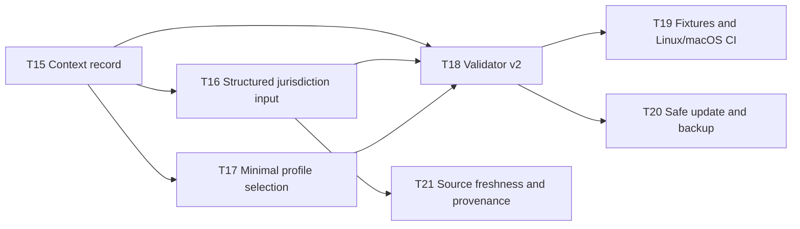

# Implementation Backlog

Status: Open follow-up work after v1 commit `7c45141` / canonical cherry-pick `722ed15`
Owner: Development Specification Suite maintainers
Purpose: Track the gaps identified during the post-commit audit. These are implementation tasks, not claims that the current skill already provides the behavior.

## Priority and Evidence Rules

- `P0`: fix before calling the suite a high-confidence auditor or using it for a high-risk regulated project.
- `P1`: needed for dependable repeated use and cross-platform maintenance.
- `P2`: quality, ergonomics, or provenance improvements that do not block the core workflow.
- Every task has one primary outcome, explicit dependencies, and a runnable `Done when` check.
- Keep this backlog in the skill package; update it in the same change as the behavior it closes. Do not mark a task complete from a design note alone.

## Dependency Graph

## P0 — Confidence and correctness

### T15 — Generate and validate `CONTEXT-RECORD.md`

- Primary outcome: Every initialized pack records the facts that caused its profile and overlays.
- Dependencies: none.
- Work:
  - make the initializer always create a context record without overwriting an existing one;
  - include product surface, entities, markets, data subjects, storage/processing/access regions, processors, sector, commerce, AI, locales, accessibility, and contracts;
  - require owner, confidence, evidence, status, and recheck trigger for unknowns.
- Done when:
  - `init-doc-suite.py --profile product ...` creates exactly one context record plus selected artifacts;
  - a second run reports `SKIP existing` and preserves its hash;
  - `check-traceability.py` rejects an active overlay with no triggering `CTX-*` fact.

### T16 — Add structured jurisdiction, sector, and transfer inputs

- Primary outcome: Jurisdiction selection is executable and auditable rather than a free-form overlay string.
- Dependencies: T15.
- Work:
  - add `--jurisdiction`, `--sector`, and `--context-file` options while retaining explicit overlay overrides;
  - normalize codes (`ID`, `EU`, `US`, `US-CA`, `UK`, `SG`, etc.) without treating codes as legal conclusions;
  - generate `JUR-*`/`XFER-*` records with source authority, status, effective/publication/retrieval dates, owner, decision, and next review;
  - reject unknown codes with an actionable report, not a silent fallback.
- Done when:
  - Indonesia→EU/US, UK transfer, California, Singapore, and unknown-territory fixtures produce independent records;
  - proposed, enacted, in-force, superseded, and unknown source states remain distinct;
  - no generated output claims “global compliance.”

### T17 — Make profile selection genuinely minimal

- Primary outcome: `product` does not create unnecessary architecture/security/operations ceremony when evidence does not trigger it.
- Dependencies: T15.
- Work:
  - make the default selection fact-driven;
  - treat identity, persistence, public API, availability, personal data, commerce, and localization as independent triggers;
  - preserve explicit user overrides and report omitted artifacts with owner/reason/gate.
- Done when:
  - a static library, local CLI, simple web page, authenticated CRUD app, and platform each produce a distinct minimal file set;
  - no selected artifact is empty or selected only because the project was called “SaaS.”

### T18 — Implement traceability and ownership validator v2

- Primary outcome: The validator catches real consistency errors instead of only broken links and task-count mismatches.
- Dependencies: T15, T16, T17.
- Work:
  - detect duplicate declaration headings and unresolved numeric references;
  - validate one owner per canonical fact and one primary requirement per task;
  - validate `[TBD]` owner/due-date format, active overlay coverage, `JUR-*`/`XFER-*` required fields, `LOC-*` regional test coverage, and supersession references;
  - emit stable machine-readable findings alongside human-readable output.
- Done when:
  - negative fixtures fail deterministically for each failure class;
  - a clean fixture exits `0` in both text and JSON output modes;
  - references used only as examples/placeholders do not create false positives.

## P1 — Repeatability and platform support

### T19 — Add portable fixtures and Linux/macOS CI

- Primary outcome: Cross-platform behavior is proven, not inferred from macOS execution.
- Dependencies: T18.
- Work:
  - add fixtures for lean/product/platform, multilingual/RTL, Indonesia, EU, US state, cross-border, AI, and regulated-sector cases;
  - add negative fixtures for duplicate IDs, orphan tasks, missing owners, broken links, and stale sources;
  - run tests on supported Python versions in Ubuntu and macOS CI.
- Done when:
  - CI passes on Ubuntu and macOS;
  - each fixture asserts exact selected artifacts and overlay decisions;
  - no test depends on Homebrew, a macOS path, or a shell-specific extension.

### T20 — Make `--update` recoverable and reviewable

- Primary outcome: Explicit update mode cannot silently destroy an established specification.
- Dependencies: T18.
- Work:
  - add timestamped backup or safe sidecar diff before replacement;
  - add `--force` only for an explicitly approved overwrite after hash comparison;
  - print changed paths and require a reviewable diff in update mode.
- Done when:
  - unchanged files are skipped;
  - changed files create a recoverable backup and a deterministic diff summary;
  - a simulated interrupted update leaves the original file recoverable.

## P2 — Maintenance and provenance

### T21 — Add source freshness and community provenance ledger

- Primary outcome: Dynamic official sources and adapted community ideas remain reviewable over time.
- Dependencies: T16.
- Work:
  - store URL, authority/repository, exact path, immutable revision where applicable, license, status/effective date, retrieved date, owner, and next review trigger;
  - separate normative authorities from workflow inspiration;
  - add a refresh report that flags stale or superseded records without silently changing requirements.
- Done when:
  - the source audit identifies stale records without network credentials;
  - every intentionally adapted community pattern has provenance and local transformation;
  - no upstream repository becomes a runtime dependency.

## Completion Gate

The skill may be described as “v2 audit-ready” only after P0 tasks pass their fixtures. It may be described as “cross-platform validated” only after T19 passes on Ubuntu and macOS. Until then, report the current behavior as v1 and keep these tasks open.
