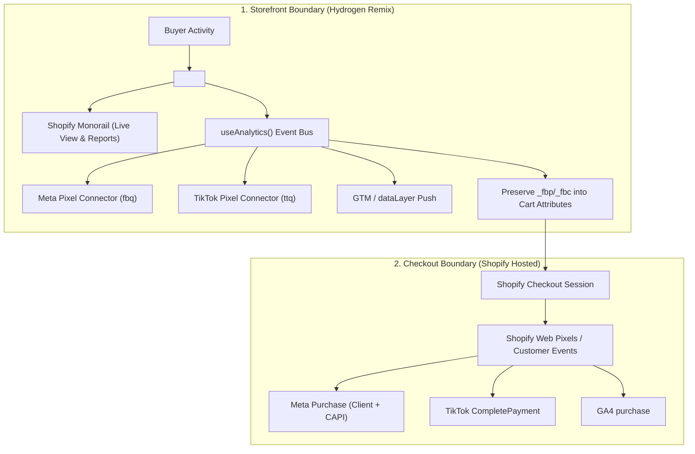

# Hydrogen Headless Tracking & Ads Signal Engine

An engineering guide and reference architecture for implementing, auditing, and troubleshooting advertising pixels and analytics (Meta Pixel & CAPI, TikTok Pixel, Google Analytics 4 / GTM, and native Shopify Analytics) inside Shopify Hydrogen (Remix) storefronts.

---

## The Decoupled Tracking Architecture

In traditional Liquid themes, Shopify Apps automatically inject tracking scripts into the DOM. In **Shopify Hydrogen (Headless)**, tracking is divided into two distinct execution boundaries:

$$\begin{aligned}
\text{\textbf{Storefront (Hydrogen)}} & \longrightarrow \text{Browse, Product Views, Collection Views, Search, Add to Cart, Cart Views} \\
\text{\textbf{Checkout (Shopify Hosted)}} & \longrightarrow \text{Initiate Checkout, Shipping/Payment, Purchase Completed (Thank You Page)}
\end{aligned}$$



---

## 4 Pillars of Hydrogen Tracking

### 1. The Core Event Bus (`<Analytics.Provider>` & `useAnalytics`)
Hydrogen provides a unified, consent-aware event bus. Never scatter ad-hoc tracking calls directly inside button click handlers.
- **Provider:** Wrap the root layout in `<Analytics.Provider cart={data.cart} shop={data.shop} consent={data.consent}>`.
- **Subcomponents:** Place `<Analytics.ProductView />`, `<Analytics.CollectionView />`, `<Analytics.SearchView />`, and `<Analytics.CartView />` in their respective route files.
- **Subscribers:** Create dedicated connector components that call `register()` and `subscribe()` to standard events.

### 2. Environment Variables Contract
Divide tracking credentials strictly between public client-visible IDs and server-only API secrets:

| Variable | Scope | Destination | Description |
| :--- | :--- | :--- | :--- |
| `PUBLIC_STOREFRONT_ID` | Public | Hydrogen Context / Client | Required for Shopify Monorail analytics reporting |
| `PUBLIC_CHECKOUT_DOMAIN` | Public | Consent / Navigation | Custom checkout domain (e.g. `checkout.brand.com`) |
| `PUBLIC_META_PIXEL_ID` | Public | Client Pixel Connector | Meta Pixel ID for `fbq('init')` |
| `PUBLIC_TIKTOK_PIXEL_ID` | Public | Client Pixel Connector | TikTok Pixel ID for `ttq.load()` |
| `PUBLIC_GTM_ID` | Public | Client GTM Container | Google Tag Manager ID (`GTM-XXXXXXX`) |
| `PUBLIC_GA4_MEASUREMENT_ID` | Public | Client GA4 | Google Analytics 4 Measurement ID (`G-XXXXXXX`) |
| `META_CAPI_ACCESS_TOKEN` | **Server-Only** | Oxygen / Worker Action | Graph API token for server-side Conversions API |

### 3. Content Security Policy (CSP) Whitelisting
Hydrogen enforces a strict CSP in `entry.server.tsx`. Pixel scripts will fail silently or throw browser errors if external endpoints are omitted:

```typescript
// app/entry.server.tsx
const {nonce, header, NonceProvider} = createContentSecurityPolicy({
  scriptSrc: [
    "'self'",
    'https://connect.facebook.net',
    'https://www.googletagmanager.com',
    'https://analytics.tiktok.com',
  ],
  connectSrc: [
    "'self'",
    'https://www.facebook.com',
    'https://connect.facebook.net',
    'https://*.google-analytics.com',
    'https://analytics.tiktok.com',
    'https://monorail-edge.shopifysvc.com', // Native Shopify Monorail
  ],
  imgSrc: [
    "'self'",
    'https://www.facebook.com',
    'https://*.google-analytics.com',
  ],
});
```

### 4. Cross-Domain Attribution & Cookie Preservation
Because the buyer hops from `brand.com` (Hydrogen) to `checkout.brand.com` or `brand.myshopify.com` (Shopify Checkout), third-party ad attribution cookies (`_fbp`, `_fbc`, `_ga`, `_tt_enable_cookie`) can be lost across subdomains.

**The Fix (Cart Attributes Pattern):**
Extract the cookie values from the client browser and attach them to the cart via Storefront API mutation (`cartAttributesUpdate`):
```typescript
// Attach attribution cookies to Cart
cartAttributesUpdate({
  attributes: [
    { key: '_fbp', value: getCookie('_fbp') },
    { key: '_fbc', value: getCookie('_fbc') },
    { key: '_ga', value: getCookie('_ga') },
  ]
});
```
When the order is completed at Checkout, the Web Pixel or backend webhook reads these order attributes to ensure 100% accurate ad attribution.

---

## Standard Event Mapping Matrix

| Storefront Interaction | Hydrogen Standard Event | Meta Pixel Event | TikTok Pixel Event | GA4 Event |
| :--- | :--- | :--- | :--- | :--- |
| Initial Page Load & SPA Nav | `AnalyticsEvent.PAGE_VIEWED` | `PageView` | `PageView` | `page_view` |
| View Product Details | `AnalyticsEvent.PRODUCT_VIEWED` | `ViewContent` | `ViewContent` | `view_item` |
| View Collection / Category | `AnalyticsEvent.COLLECTION_VIEWED` | `ViewCategory` / `Custom` | `Browse` | `view_item_list` |
| Submit Search | `AnalyticsEvent.SEARCH_SUBMITTED` | `Search` | `Search` | `search` |
| Add Item to Cart | `AnalyticsEvent.PRODUCT_ADDED_TO_CART` | `AddToCart` | `AddToCart` | `add_to_cart` |
| Remove Item from Cart | `AnalyticsEvent.PRODUCT_REMOVED_FROM_CART` | *(Optional)* | *(Optional)* | `remove_from_cart` |
| Open Cart / Cart Drawer | `AnalyticsEvent.CART_VIEWED` | *(Optional)* | *(Optional)* | `view_cart` |
| **Handoff to Checkout** | *Shopify Web Pixels / Customer Events* | `InitiateCheckout` | `InitiateCheckout` | `begin_checkout` |
| **Order Completed** | *Shopify Web Pixels / Customer Events* | `Purchase` | `CompletePayment` | `purchase` |

---

## Skill Reference Manifest

| Guide / Blueprint | Path |
| :--- | :--- |
| **Meta Pixel + Hydrogen Connector** | [Meta Pixel Connector Blueprint](references/meta-pixel-connector.md) |
| **GTM & DataLayer Connector** | [GTM DataLayer Blueprint](references/gtm-datalayer-connector.md) |
| **Cross-Domain Attribution Bridge** | [Cross-Domain Attribution Guide](references/cross-domain-attribution.md) |
| **Customer Privacy & Consent** | [Customer Privacy Guide](references/csp-and-consent.md) |

---

## 5 Critical Gotchas & Invariants

1. **Do NOT Fire `Purchase` on the Headless Storefront:**
   Never attempt to fire `Purchase` directly from Hydrogen unless you are using a completely custom embedded checkout. If using Shopify Checkout, the `Purchase` event **MUST** be fired from Shopify Admin (`Settings > Customer Events` or sales channel apps) to avoid duplicate conversions.
2. **Missing `cart.updatedAt` in GraphQL Queries:**
   Shopify Hydrogen's cart analytics requires `updatedAt` on all cart queries/fragments. If omitted, Hydrogen logs `[h2:error:CartAnalytics] Can't set up cart analytics events...`.
3. **Register Before Publishing Events:**
   Every custom pixel connector must call `const {ready} = register('connector-name')` and trigger `ready()` once the third-party script is initialized. Otherwise, `<Analytics.Provider>` will buffer events indefinitely.
4. **Consent Blocking:**
   When `withPrivacyBanner: true` is active, Hydrogen suppresses event delivery until consent is granted via `window.Shopify.customerPrivacy.setTrackingConsent(true, callback)`.
5. **Exact Catalog ID Matching:**
   Ensure `content_ids` sent by `ViewContent` and `AddToCart` match the exact ID format in your Meta / Google Product Feed (e.g. `gid://shopify/Product/123` vs plain numeric ID `123`).
