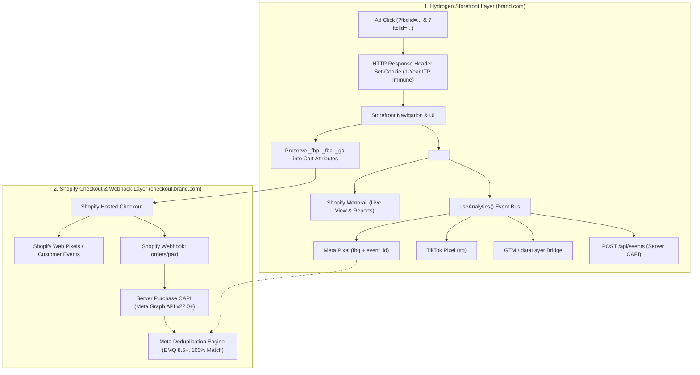

# Hydrogen Headless Tracking & Ads Signal Engine

An enterprise engineering system and architectural standard for implementing, auditing, and troubleshooting conversion tracking, advertising signal engines (Meta Pixel & CAPI, TikTok Pixel & Events API, Google Tag Manager / GA4, and native Shopify Analytics), and **WeTracked.io / Elevar parity** inside Shopify Hydrogen (Remix) storefronts.

---

## 1. The Decoupled Tracking Architecture

In traditional Liquid themes, Shopify Apps inject tracking scripts directly into the DOM. In **Shopify Hydrogen (Headless)**, tracking operates across two distinct execution boundaries:

$$\begin{aligned}
\text{\textbf{Storefront (Hydrogen)}} & \longrightarrow \text{PageView, ViewContent, Category/Collection, Search, AddToCart, CartView} \\
\text{\textbf{Checkout (Shopify Hosted)}} & \longrightarrow \text{InitiateCheckout, PaymentInfo, Webhook-driven Purchase CAPI}
\end{aligned}$$



---

## 2. The 5 Pillars of Enterprise Headless Tracking

### Pillar 1: First-Party HTTP Cookie Engine (Safari ITP Immunity)
Client-side cookies (`document.cookie`) set via JavaScript are capped by Apple Safari ITP to 24 hours when query parameters like `?fbclid=` are present.
- **The Standard:** Extract click IDs in the root loader (`app/root.tsx` / `server.ts`) and emit `Set-Cookie` HTTP response headers.
- **Lifetime:** Server-set HTTP cookies are granted a full 1-year lifetime by Safari.
- Read [WeTracked Parity Architecture](references/wetracked-parity-architecture.md).

### Pillar 2: Dual-Funnel Event Deduplication (`event_id`)
Both the browser pixel and the server-side Conversions API (CAPI) must dispatch paired events using an identical `event_id` string:
- `ViewContent`: `vc_${product.id}_${timestamp}`
- `AddToCart`: `atc_${product.id}_${timestamp}`
- `Purchase`: `order_${order.id}`
- Meta's deduplication engine matches these signals within a 48-hour window, eliminating double counting while maximizing signal redundancy.
- Read [Meta Pixel Connector Blueprint](references/meta-pixel-connector.md) and [Meta CAPI Server Engine](references/meta-capi-server-engine.md).

### Pillar 3: Cross-Domain Attribution Bridge (The Cart Attributes Pattern)
Because buyers transition from `brand.com` (Hydrogen) to `checkout.brand.com` or `brand.myshopify.com` (Shopify Checkout), tracking cookies can drop across subdomains.
- **The Standard:** Capture `_fbp`, `_fbc`, `_ga`, and `ttclid` on the client and attach them to the cart via Storefront API mutation (`cartAttributesUpdate`) before redirecting to `checkoutUrl`.
- **Outcome:** Shopify preserves these attributes into `order.note_attributes`, allowing backend webhooks to read them for 100% accurate Purchase CAPI attribution.
- Read [Cross-Domain Attribution Guide](references/cross-domain-attribution.md).

### Pillar 4: Advanced Matching & EMQ 8.5+ Normalization
To achieve high Event Match Quality (EMQ > 8.0), all customer identifiers must be strictly normalized before SHA-256 hashing:
- **Email:** `trim().toLowerCase()`, then SHA-256.
- **Phone:** Strip all non-digits (`+`, `-`, spaces). Convert local zero prefix (e.g. `08xx`) to international E.164 (e.g. `628xx`). Then SHA-256.
- **Browser State:** Forward raw `_fbp`, `_fbc`, client IP, and User-Agent without hashing.
- Read [Advanced Matching Normalizer](references/advanced-matching-normalizer.md).

### Pillar 5: Server-Authoritative Purchase Webhook Outbox
Never rely exclusively on client-side thank-you page redirects to fire `Purchase`.
- **The Standard:** Subscribe to Shopify `orders/paid` webhooks.
- The webhook endpoint extracts customer data and cart attributes, constructs the CAPI payload, and delivers the conversion to Meta Graph API, bypassing all browser ad blockers.
- Read [Meta CAPI Server Engine](references/meta-capi-server-engine.md).

---

## 3. Environment Variables Contract

| Variable | Scope | Destination | Description |
| :--- | :--- | :--- | :--- |
| `PUBLIC_STOREFRONT_ID` | Public | Client / Context | Shopify Storefront Channel ID for native Monorail telemetry |
| `PUBLIC_CHECKOUT_DOMAIN` | Public | Client / Consent | Primary checkout domain (e.g. `checkout.brand.com`) |
| `PUBLIC_META_PIXEL_ID` | Public | Client Connector | Meta Pixel ID for `fbq('init')` |
| `PUBLIC_TIKTOK_PIXEL_ID` | Public | Client Connector | TikTok Pixel ID for `ttq.load()` |
| `PUBLIC_GTM_ID` | Public | Client Connector | Google Tag Manager ID (`GTM-XXXXXXX`) |
| `META_CAPI_ACCESS_TOKEN` | **Server-Only** | Oxygen / Remix Action | System User Access Token for Meta Graph API CAPI |
| `META_TEST_EVENT_CODE` | **Server-Only** | Development / Staging | Optional test code from Meta Events Manager > Test Events |

---

## 4. Content Security Policy (CSP) Directives

Hydrogen enforces strict CSP in `entry.server.tsx`. Ensure all tracking endpoints are whitelisted:

```typescript
// app/entry.server.tsx
const {nonce, header, NonceProvider} = createContentSecurityPolicy({
  scriptSrc: [
    "'self'",
    'https://connect.facebook.net',
    'https://www.googletagmanager.com',
    'https://analytics.tiktok.com',
  ],
  connectSrc: [
    "'self'",
    'https://monorail-edge.shopifysvc.com', // Shopify Analytics
    'https://www.facebook.com',
    'https://connect.facebook.net',
    'https://*.google-analytics.com',
    'https://analytics.tiktok.com',
  ],
  imgSrc: [
    "'self'",
    'https://www.facebook.com',
    'https://*.google-analytics.com',
  ],
});
```
Read [CSP & Consent Guide](references/csp-and-consent.md).

---

## 5. Skill Reference Manifest

| Task / Blueprint | Reference File |
| :--- | :--- |
| **WeTracked.io / Elevar Parity Architecture** | [WeTracked Parity Architecture](references/wetracked-parity-architecture.md) |
| **Meta Pixel Client Subscriber (`event_id` dedup)** | [Meta Pixel Connector Blueprint](references/meta-pixel-connector.md) |
| **Meta CAPI Server Engine & Webhook Handler** | [Meta CAPI Server Engine](references/meta-capi-server-engine.md) |
| **Advanced Matching & Normalizer (EMQ 8.5+)** | [Advanced Matching Normalizer](references/advanced-matching-normalizer.md) |
| **GTM / GA4 dataLayer Bridge** | [GTM DataLayer Blueprint](references/gtm-datalayer-connector.md) |
| **Cross-Domain Attribution (Cart Attributes)** | [Cross-Domain Attribution Guide](references/cross-domain-attribution.md) |
| **CSP & Customer Privacy API / Consent** | [CSP & Consent Guide](references/csp-and-consent.md) |

---

## 6. Verification & Auditing Checklist

Before deploying Hydrogen tracking to production, verify the 5 evidence gates:

1. **Test Events in Meta Events Manager:**
   - Trigger `PageView`, `ViewContent`, `AddToCart` on the Hydrogen preview URL.
   - Confirm in Events Manager > *Test Events* that events show **Browser and Server** badges with status **Deduplicated**.
2. **EMQ Audit (Event Match Quality):**
   - Confirm EMQ score is **8.0 or higher** on `Purchase` and `AddToCart`.
   - Verify `em`, `ph`, `fbp`, `fbc`, `client_ip_address`, and `client_user_agent` are green.
3. **Cart Attributes Preservation:**
   - Add item to cart and inspect Shopify Admin order: verify `note_attributes` contains valid `_fbp`, `_fbc`, and `_ga`.
4. **Shopify Monorail / Live View:**
   - Browse store in an incognito window: verify active visitor appears immediately on Shopify Admin *Live View*.
5. **Console & CSP Check:**
   - Open browser DevTools console: confirm zero CSP violations and zero `[h2:error:CartAnalytics]` errors.
