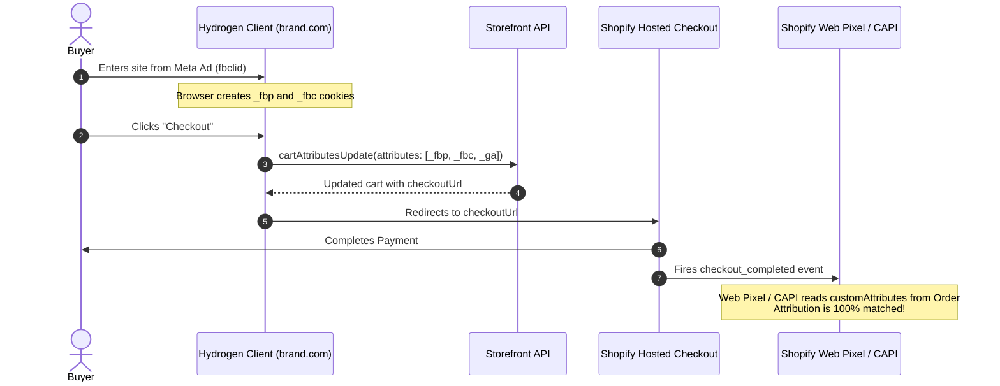

# Cross-Domain Attribution Preservation in Headless Shopify

> **Historical blueprint, not a canonical provider contract.** Cart attributes
> can carry to orders, but they are not a secret store or attribution guarantee.
> Revalidate the event fields, consent, checkout visibility, and provider
> behavior before use; follow [Tracking delivery contract](delivery-contract.md).

When running a headless storefront, visitors browse on the headless domain (`brand.com`) but transition to Shopify's hosted checkout (`checkout.brand.com` or `brand.myshopify.com`).

Without deliberate engineering, ad platforms (Meta, Google, TikTok) experience **broken attribution funnels** because third-party cookies dropped on `brand.com` cannot be read by `brand.myshopify.com`.

---

## The Solution: Cart Attributes Bridge

Shopify Cart supports arbitrary metadata key-value pairs (`attributes`). By attaching attribution cookies to the cart prior to checkout redirect, these values persist into the completed `Order` in Shopify's database.



---

## 1. Cookie Extraction Helper (`app/lib/attribution.ts`)

```typescript
// app/lib/attribution.ts
export function getCookie(name: string): string | null {
  if (typeof document === 'undefined') return null;
  const match = document.cookie.match(new RegExp('(^|;\\s*)(' + name + ')=([^;]*)'));
  return match ? decodeURIComponent(match[3]) : null;
}

export function getAttributionAttributes(): Array<{key: string; value: string}> {
  const attributes: Array<{key: string; value: string}> = [];

  const fbp = getCookie('_fbp');
  const fbc = getCookie('_fbc');
  const ga = getCookie('_ga');
  const ttclid = getCookie('_tt_enable_cookie');

  if (fbp) attributes.push({key: '_fbp', value: fbp});
  if (fbc) attributes.push({key: '_fbc', value: fbc});
  if (ga) attributes.push({key: '_ga', value: ga});
  if (ttclid) attributes.push({key: '_ttclid', value: ttclid});

  return attributes;
}
```

---

## 2. Attaching to Cart Before Checkout Redirect

In your Cart UI / Checkout Button component:

```tsx
// app/components/CartCheckoutButton.tsx
import {useFetcher} from '@remix-run/react';
import {getAttributionAttributes} from '~/lib/attribution';

export function CartCheckoutButton({checkoutUrl, cartId}: {checkoutUrl: string; cartId: string}) {
  const fetcher = useFetcher();

  const handleCheckoutClick = (e: React.MouseEvent<HTMLAnchorElement>) => {
    e.preventDefault();

    const attributes = getAttributionAttributes();

    if (attributes.length > 0) {
      // Sync attribution attributes to Cart via Remix Action / Storefront API
      fetcher.submit(
        {
          action: 'UPDATE_CART_ATTRIBUTES',
          cartId,
          attributes: JSON.stringify(attributes),
        },
        {
          method: 'post',
          action: '/cart',
        },
      );
    }

    // Proceed to Shopify Hosted Checkout
    window.location.href = checkoutUrl;
  };

  return (
    <a href={checkoutUrl} onClick={handleCheckoutClick} className="btn-checkout">
      Proceed to Checkout
    </a>
  );
}
```

---

## 3. Reading Attributes in Shopify Admin Web Pixel (`Settings > Customer Events`)

In your Shopify Admin Custom Web Pixel:

```javascript
// Shopify Admin > Settings > Customer Events > Add custom pixel
analytics.subscribe('checkout_completed', (event) => {
  const customAttributes = event.data?.checkout?.customAttributes || [];
  
  const getAttr = (name) => {
    const attr = customAttributes.find(a => a.key === name);
    return attr ? attr.value : null;
  };

  const fbp = getAttr('_fbp');
  const fbc = getAttr('_fbc');

  // Forward to Meta Conversions API / Client pixel with preserved IDs
  console.log('Attribution recovered from Hydrogen:', { fbp, fbc });
});
```
