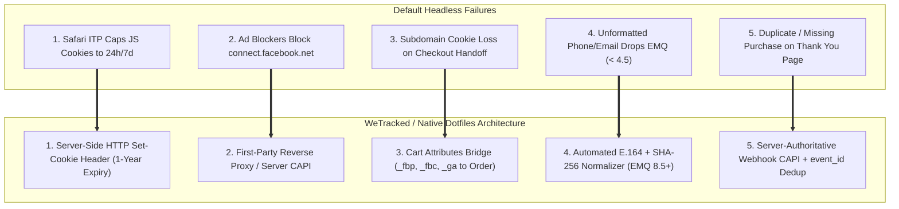
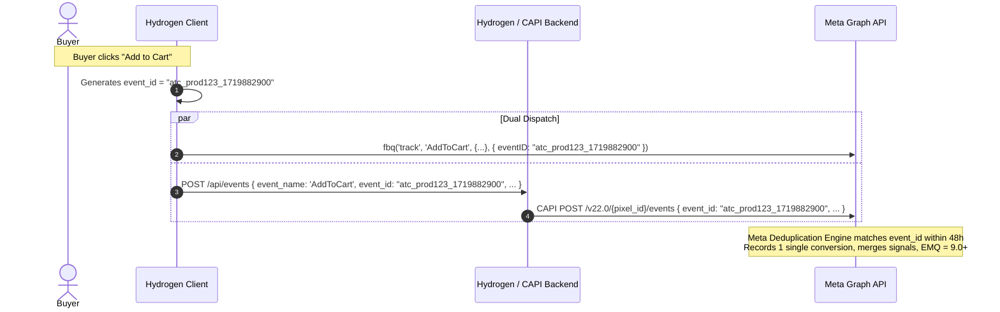

# WeTracked.io & Elevar Parity Architecture for Shopify Hydrogen

> **Historical design note, not a product-parity or performance guarantee.**
> Verify provider, browser, consent, and Shopify behavior from current primary
> documentation; follow [Tracking delivery contract](delivery-contract.md).

> How commercial enterprise tracking platforms (WeTracked.io, Elevar, Triple Whale) achieve 95%+ attribution accuracy, 8.5+ Event Match Quality (EMQ), and 100% conversion recovery — implemented natively in Hydrogen at $0 SaaS cost.

---

## 1. The 5 Vulnerabilities of Standard Headless Tracking

Commercial tracking SaaS platforms charge $50–$500/month because default headless implementations fail at 5 specific engineering points:



---

## 2. Component 1: 1st-Party Server-Side HTTP Cookie Engine

Client-side JavaScript cookies (`document.cookie = "_fbp=..."`) are severely throttled by Apple Safari ITP (Intelligent Tracking Prevention):
- Any link decoration with query parameters (e.g. `?fbclid=...` or `?ttclid=...`) triggers Safari ITP to **cap cookie lifetime to 24 hours**.
- If a buyer clicks an ad today, browses, but purchases on Day 3, the client cookie is expired and attribution is credited to "Direct / None".

### The Fix: Remix Root Loader HTTP `Set-Cookie`

When the visitor lands on any Hydrogen page, the server extracts `fbclid` and sets `_fbc` and `_fbp` via **HTTP Response Headers**. Server-set HTTP cookies are granted full 1-year lifetime by Safari.

```typescript
// app/lib/cookies.server.ts
export function parseClickIdAndBuildCookies(request: Request) {
  const url = new URL(request.url);
  const fbclid = url.searchParams.get('fbclid');
  const ttclid = url.searchParams.get('ttclid');
  const gclid = url.searchParams.get('gclid');
  
  const headers = new Headers();
  const timestamp = Math.floor(Date.now() / 1000);

  // 1. Meta _fbc (Format: fb.1.<timestamp>.<fbclid>)
  if (fbclid) {
    const fbcValue = `fb.1.${timestamp}.${fbclid}`;
    headers.append(
      'Set-Cookie',
      `_fbc=${fbcValue}; Path=/; Max-Age=31536000; SameSite=Lax; Secure; Domain=${url.hostname}`,
    );
  }

  // 2. Meta _fbp (Format: fb.1.<timestamp>.<random_int>)
  const cookieHeader = request.headers.get('Cookie') || '';
  if (!cookieHeader.includes('_fbp=')) {
    const randomInt = Math.floor(Math.random() * 8999999999) + 1000000000;
    const fbpValue = `fb.1.${timestamp}.${randomInt}`;
    headers.append(
      'Set-Cookie',
      `_fbp=${fbpValue}; Path=/; Max-Age=31536000; SameSite=Lax; Secure; Domain=${url.hostname}`,
    );
  }

  // 3. TikTok ttclid
  if (ttclid) {
    headers.append(
      'Set-Cookie',
      `ttclid=${ttclid}; Path=/; Max-Age=31536000; SameSite=Lax; Secure; Domain=${url.hostname}`,
    );
  }

  // 4. Google gclid
  if (gclid) {
    headers.append(
      'Set-Cookie',
      `_gcl_aw=GCL.${timestamp}.${gclid}; Path=/; Max-Age=7776000; SameSite=Lax; Secure; Domain=${url.hostname}`,
    );
  }

  return headers;
}
```

---

## 3. Component 2: Dual-Funnel Event Deduplication (`event_id`)

For every event (especially `AddToCart` and `Purchase`), the browser pixel and the server CAPI send the exact same event with the exact same `event_id`.



---

## 4. Component 3: Server-Authoritative Purchase Webhook

Never rely on the user landing on the Thank You page to trigger `Purchase` CAPI. If a user closes the tab immediately after payment, or if a payment gateway (Midtrans, Xendit, Stripe) takes 10 seconds to redirect, client-side tracking is dropped.

### The Flow:
1. When checkout is completed, Shopify fires the `orders/paid` or `orders/create` webhook to your Hydrogen endpoint (`/api/webhooks/orders`).
2. The server extracts:
   - `custom_attributes` (where `_fbp`, `_fbc`, `_ga`, `ttclid` were saved).
   - Customer shipping/billing email, phone, city, zip, country.
   - Order total, line items, and currency.
3. Server executes normalizations (E.164 phone, SHA-256 email).
4. Server constructs CAPI payload and posts directly to Meta Graph API using `event_id = "order_" + order.id`.
5. This guarantees **100% conversion capture rate** even with strict browser ad blockers.
