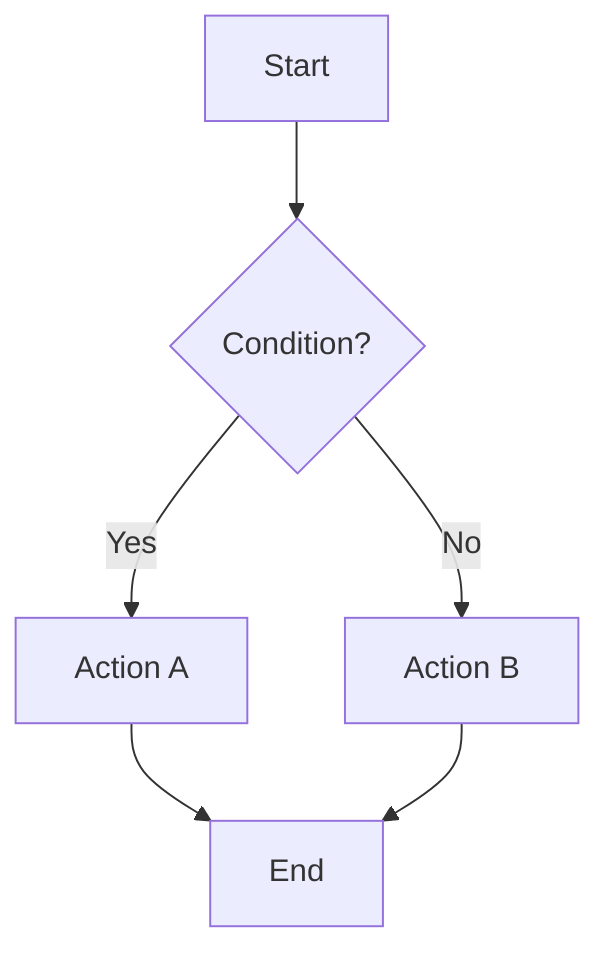
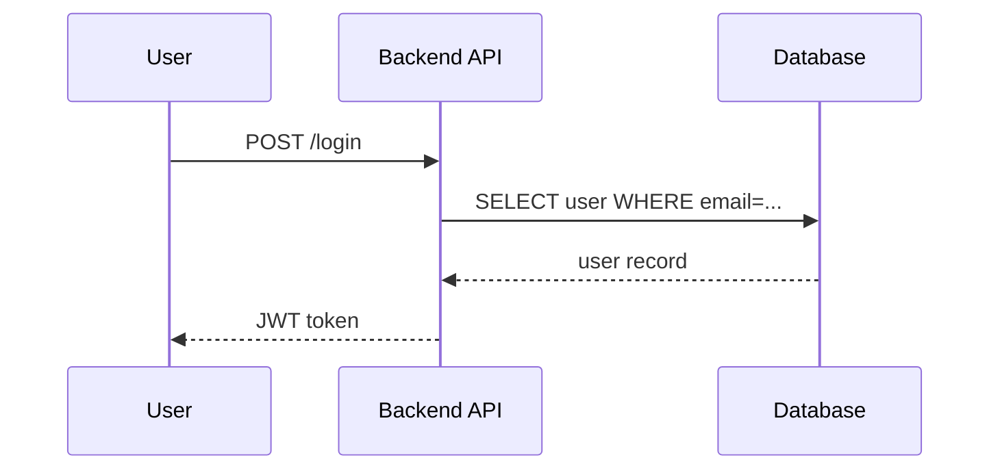
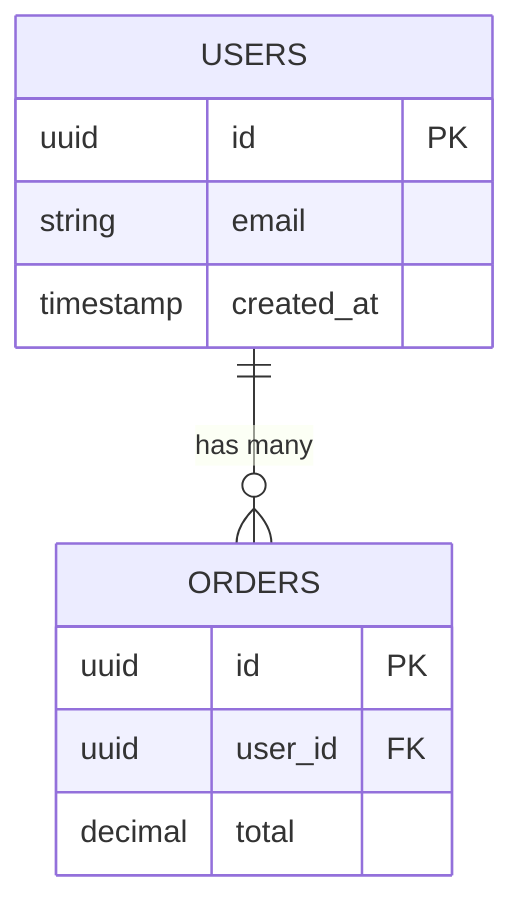
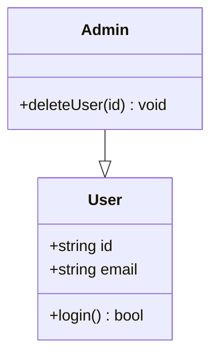
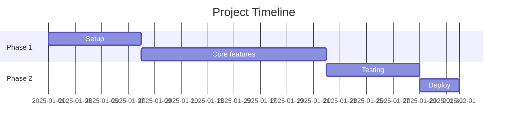

# Mermaid Diagram

Generate technical diagrams as Mermaid blocks — they render directly in GitHub, Claude, Notion, GitLab, and VSCode.

## Diagram Types

### 1. Flowchart — process flow / decision tree


### 2. Sequence Diagram — interaction between systems/components


### 3. ERD — database schema


### 4. Class Diagram — OOP structure / TypeScript interfaces


### 5. C4 Context — high-level system architecture
```mermaid
C4Context
    Person(user, "User", "End user")
    System(app, "App", "Main application")
    SystemExt(email, "Email Service", "Sends notifications")
    Rel(user, app, "Uses")
    Rel(app, email, "Sends via")
```

### 6. Gantt — timeline / milestones


## Workflow

1. Ask the user for the diagram type + context (or infer it from the description)
2. Generate a ```mermaid ... ``` block
3. Briefly explain what it depicts
4. Offer: "Want to add a node? Change the layout? Export to a .md file?"

## Pick the Right Diagram

| Context | Diagram |
|---|---|
| Login, checkout, process flow | Flowchart |
| API request/response, auth flow | Sequence |
| Database schema, table relations | ERD |
| Class structure, TypeScript types | Class |
| Overall system architecture | C4 Context |
| Sprint timeline / milestones | Gantt |

## Output Tips

- Always wrap in a ````mermaid` code block
- Use clear, short labels (max 5 words per node)
- For ERDs, always include PK and FK
- For sequences, use `-->>` for responses (dashed), `->>` for requests (solid)
- For C4, separate internal systems vs external
- Save to a `.md` file in docs/ or the project root if requested

## Validation

Mermaid is valid if:
- No spaces in node IDs (use underscore or camelCase)
- Arrow syntax is correct (`-->`, `->>`, `-->>`, `--|>`)
- Keywords don't clash with node names (avoid `end`, `class`, etc. as IDs)

## Install mmdc (optional, for PNG/SVG export)

```bash
npm i -g @mermaid-js/mermaid-cli
mmdc -i diagram.md -o diagram.png
```

Without mmdc, the Mermaid text output is enough to render on GitHub/Claude.
