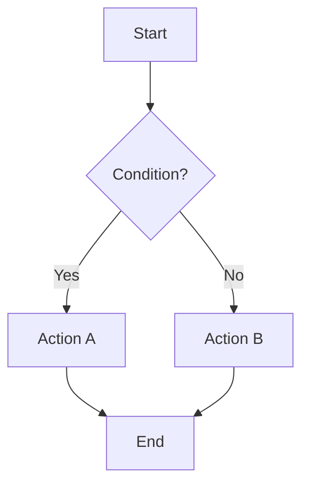
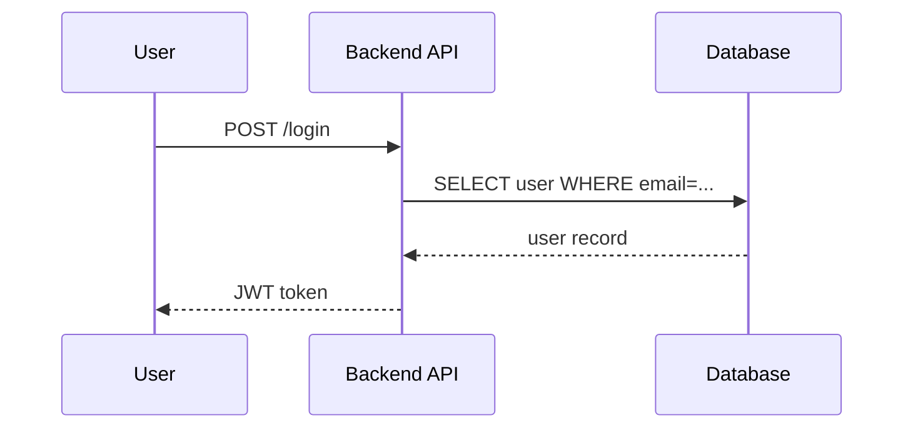
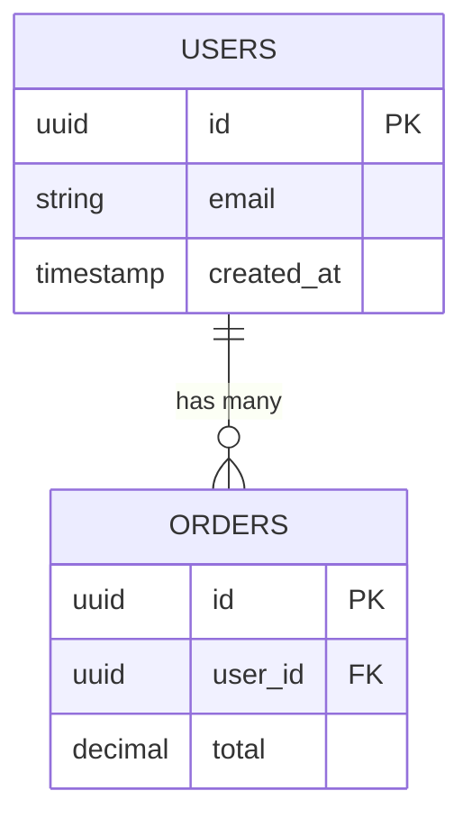
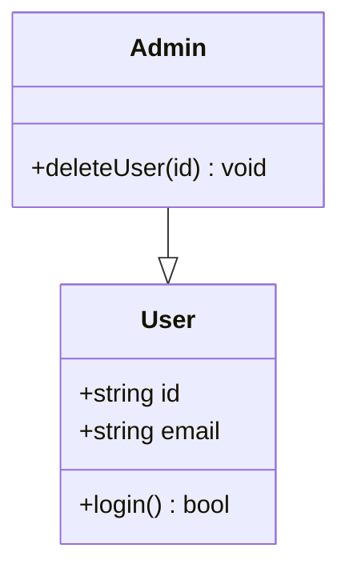
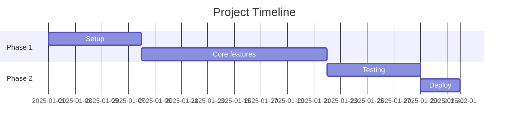

# Mermaid Diagram

Generate diagram teknis sebagai blok Mermaid — langsung render di GitHub, Claude, Notion, GitLab, dan VSCode.

## Jenis Diagram

### 1. Flowchart — alur proses / decision tree


### 2. Sequence Diagram — interaksi antar sistem/komponen


### 3. ERD — schema database


### 4. Class Diagram — struktur OOP / TypeScript interfaces


### 5. C4 Context — arsitektur sistem level tinggi
```mermaid
C4Context
    Person(user, "User", "End user")
    System(app, "App", "Main application")
    SystemExt(email, "Email Service", "Sends notifications")
    Rel(user, app, "Uses")
    Rel(app, email, "Sends via")
```

### 6. Gantt — timeline / milestone


## Workflow

1. Tanya user jenis diagram + konteks (atau infer dari deskripsi)
2. Generate blok ```mermaid ... ```
3. Jelaskan singkat apa yang digambarkan
4. Tawarkan: "Mau tambah node? Ubah layout? Export ke file .md?"

## Pilih Diagram yang Tepat

| Konteks | Diagram |
|---|---|
| Alur login, checkout, proses | Flowchart |
| API request/response, auth flow | Sequence |
| Database schema, relasi tabel | ERD |
| Struktur class, TypeScript types | Class |
| Arsitektur sistem keseluruhan | C4 Context |
| Timeline sprint / milestone | Gantt |

## Tips Output

- Selalu wrap dalam ````mermaid` code block
- Gunakan label yang jelas dan singkat (max 5 kata per node)
- Untuk ERD, selalu cantumkan PK dan FK
- Untuk sequence, gunakan `-->>` untuk response (dashed), `->>` untuk request (solid)
- Untuk C4, pisahkan internal system vs external
- Simpan ke file `.md` di docs/ atau root project kalau diminta

## Validasi

Mermaid valid jika:
- Tidak ada spasi di node ID (pakai underscore atau camelCase)
- Arrow syntax benar (`-->`, `->>`, `-->>`, `--|>`)
- Keyword tidak bentrok dengan node name (hindari `end`, `class`, dll sebagai ID)

## Install mmdc (opsional, untuk export PNG/SVG)

```bash
npm i -g @mermaid-js/mermaid-cli
mmdc -i diagram.md -o diagram.png
```

Tanpa mmdc, output teks Mermaid sudah cukup untuk render di GitHub/Claude.
