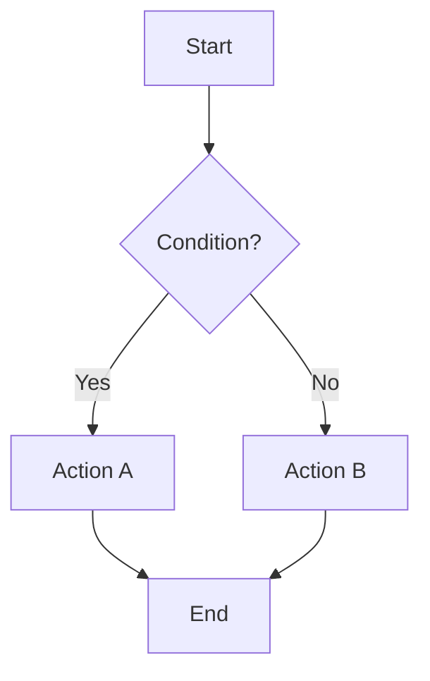
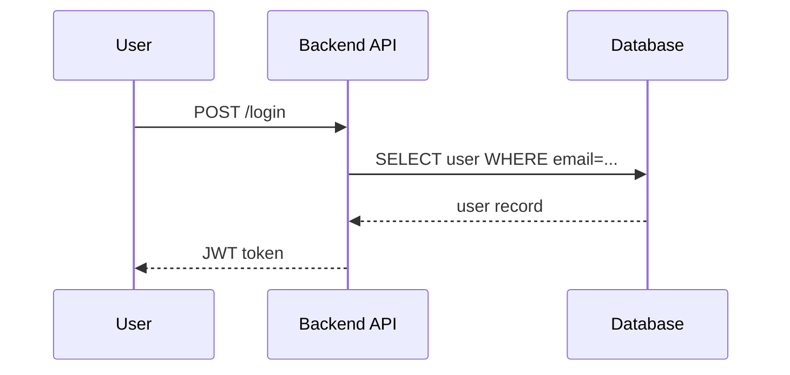
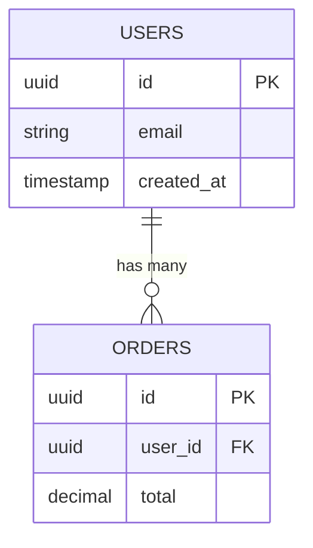
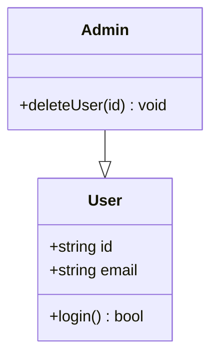
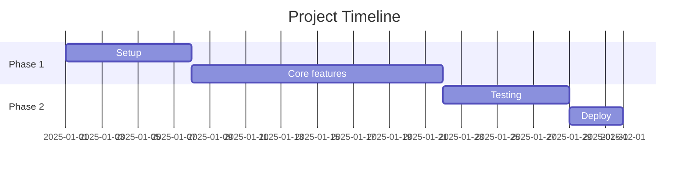
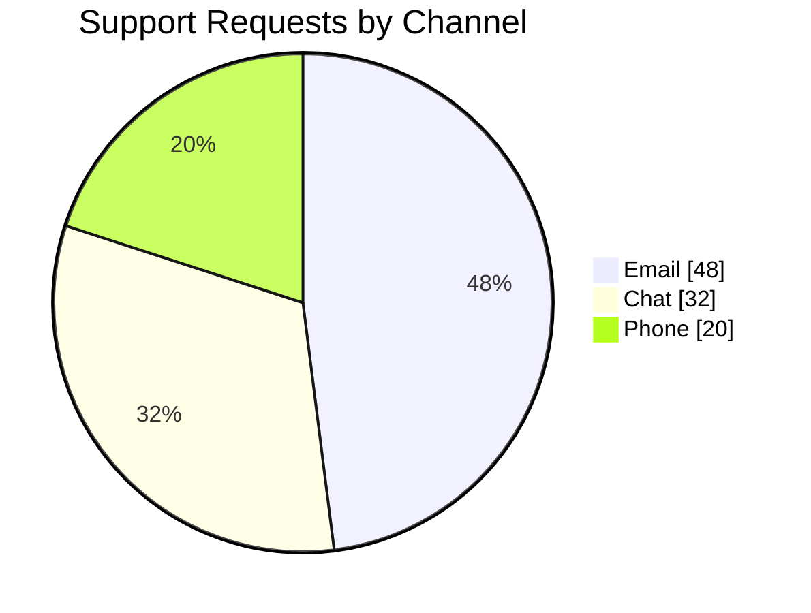
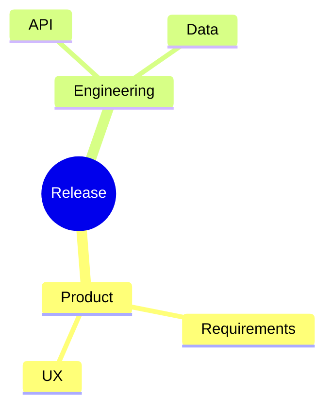
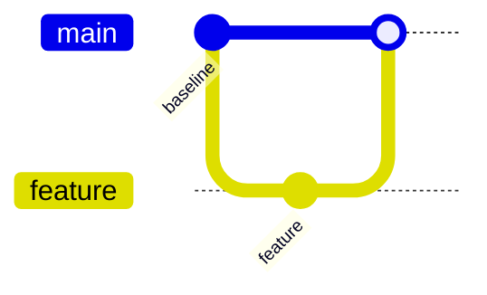
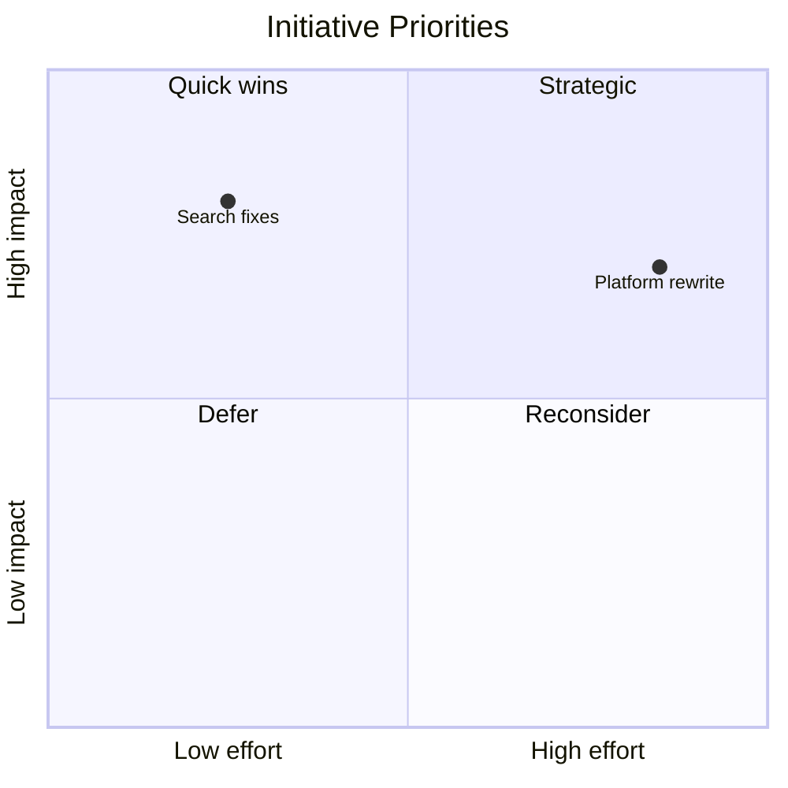
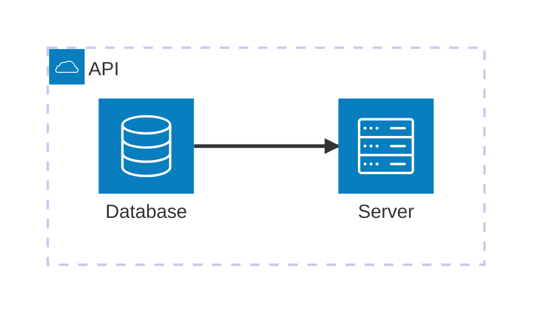

# Mermaid Diagram

Generate technical diagrams as Mermaid blocks — they render directly in GitHub, Claude, Notion, GitLab, and VSCode.

## Syntax Provenance

The examples were reviewed on 2026-10-02 against `mermaid@12.0.0` (npm `latest`, published 2026-09-10) and its diagram detectors. They also parse on v11.x except where marked. This is a baseline, not an evergreen version claim: the target repository's installed Mermaid package or host renderer (GitHub, GitLab, Notion, Obsidian, VS Code preview) wins, and hosts often lag the npm release. Check that renderer before using a recently added diagram type, and do not silently rewrite a project's established syntax for a different major version.

Mermaid 12 notes that change output, not syntax: ELK is now bundled and is the default layout (diagrams without an explicit `layout` may re-render differently than on v11), the `defaultRenderer` config option was removed in favor of top-level `layout`, and the default look is `redux-color` + `neo`. Source: [mermaid 12.0.0 release](https://github.com/mermaid-js/mermaid/releases/tag/mermaid%4012.0.0).

## Ownership Boundary

This skill owns diagram-type selection and valid Mermaid syntax. It does not invent architecture decisions, database relationships, API behavior, task dates, or business facts; derive those from the repository or the owning specification skill. Use `development-spec-suite` or `prd-taskbreaker` for artifact decisions, `openapi-spec` for API contracts, and `adr-record` for full architecture decisions.

## Diagram Types

### 1. Flowchart — process flow / decision tree

```mermaid
flowchart TD
    A[Start] --> B{Condition?}
    B -->|Yes| C[Action A]
    B -->|No| D[Action B]
    C --> E[End]
    D --> E
```

### 2. Sequence Diagram — interaction between systems/components

```mermaid
sequenceDiagram
    participant U as User
    participant API as Backend API
    participant DB as Database
    U->>API: POST /login
    API->>DB: SELECT user WHERE email=...
    DB-->>API: user record
    API-->>U: JWT token
```

### 3. ERD — database schema

```mermaid
erDiagram
    USERS {
        uuid id PK
        string email
        timestamp created_at
    }
    ORDERS {
        uuid id PK
        uuid user_id FK
        decimal total
    }
    USERS ||--o{ ORDERS : "has many"
```

### 4. Class Diagram — OOP structure / TypeScript interfaces

```mermaid
classDiagram
    class User {
        +string id
        +string email
        +login() bool
    }
    class Admin {
        +deleteUser(id) void
    }
    Admin --|> User
```

### 5. C4 Context — high-level system architecture

Mermaid labels C4 "an experimental diagram for now"; syntax may change. Prefer `architecture-beta` or a flowchart with subgraphs when the host renderer is uncertain.

```mermaid
C4Context
    Person(user, "User", "End user")
    System(app, "App", "Main application")
    SystemExt(email, "Email Service", "Sends notifications")
    Rel(user, app, "Uses")
    Rel(app, email, "Sends via")
```

### 6. Gantt — timeline / milestones

```mermaid
gantt
    title Project Timeline
    dateFormat  YYYY-MM-DD
    section Phase 1
    Setup           :2025-01-01, 7d
    Core features   :2025-01-08, 14d
    section Phase 2
    Testing         :2025-01-22, 7d
    Deploy          :2025-01-29, 3d
```

### 7. Pie — category share

```mermaid
pie showData
    title Support Requests by Channel
    "Email" : 48
    "Chat" : 32
    "Phone" : 20
```

### 8. Mindmap — concept or scope breakdown

```mermaid
mindmap
  root((Release))
    Product
      Requirements
      UX
    Engineering
      API
      Data
```

### 9. Git Graph — branch and release history

```mermaid
gitGraph
    commit id: "baseline"
    branch feature
    checkout feature
    commit id: "feature"
    checkout main
    merge feature
```

### 10. Quadrant Chart — prioritization

```mermaid
quadrantChart
    title Initiative Priorities
    x-axis Low effort --> High effort
    y-axis Low impact --> High impact
    quadrant-1 Strategic
    quadrant-2 Quick wins
    quadrant-3 Defer
    quadrant-4 Reconsider
    Search fixes: [0.25, 0.80]
    Platform rewrite: [0.85, 0.70]
```

### 11. Architecture — cloud/service topology (v11.1.0+, `-beta` keyword)

```mermaid
architecture-beta
    group api(cloud)[API]
    service db(database)[Database] in api
    service server(server)[Server] in api
    db:R --> L:server
```
Built-in icons: `cloud`, `database`, `disk`, `internet`, `server`; anything else needs a registered icon pack.

### 12. Newer types — keyword reference

Declare these with the exact keyword below and copy the syntax from the linked official page; do not improvise their grammar.

| Need | Keyword (mermaid 12) | Status |
|---|---|---|
| State machine | `stateDiagram-v2` | stable |
| Chronology | `timeline` | stable |
| User journey | `journey` | stable |
| Requirements traceability | `requirementDiagram` | stable |
| Line/bar chart | `xychart` (`xychart-beta` still accepted) | new |
| Flow volumes | `sankey` (`sankey-beta` accepted) | new |
| Manual block layout | `block` (`block-beta` accepted) | new |
| Network packet / bit layout | `packet` (`packet-beta` accepted) | new |
| Board of work items | `kanban` | new |
| Multi-axis comparison | `radar-beta` | beta |
| Hierarchical proportions | `treemap` | new |
| Use cases | `usecase-beta` | v12, beta |
| Overlap of sets | `venn-beta` | beta |
| Cause and effect | `ishikawa` (`ishikawa-beta` accepted) | new |

Official syntax pages: <https://mermaid.js.org/intro/syntax-reference.html>. Types newer than the host renderer render as a parse error, so for GitHub/GitLab/Notion output fall back to a flowchart unless the user confirms support.

## Workflow

1. Ask the user for the diagram type + context (or infer it from the description)
2. Generate a ```mermaid ... ``` block
3. Briefly explain what it depicts
4. Offer: "Want to add a node? Change the layout? Export to a .md file?"

## Pick the Right Diagram

| Context | Diagram |
|---|---|
| Login, checkout, process flow | Flowchart |
| API request/response, auth flow | Sequence |
| Database schema, table relations | ERD |
| Class structure, TypeScript types | Class |
| Overall system architecture | C4 Context |
| Sprint timeline / milestones | Gantt |
| Category share / composition | Pie |
| Brainstorming / scope hierarchy | Mindmap |
| Branching and merge history | Git Graph |
| Effort-impact prioritization | Quadrant Chart |
| Lifecycle / status transitions | State (`stateDiagram-v2`) |
| Cloud services and their links | Architecture (`architecture-beta`) |
| Numeric trend over time | XY chart (use a real charting library for published data visuals) |

## Output Tips

- Always wrap in a ````mermaid` code block
- Use clear, short labels (max 5 words per node)
- For ERDs, always include PK and FK
- For sequences, use `-->>` for responses (dashed), `->>` for requests (solid)
- For C4, separate internal systems vs external
- Save to a `.md` file in docs/ or the project root if requested

## Validation

Mermaid is valid if:
- No spaces in node IDs (use underscore or camelCase)
- Arrow syntax is correct (`-->`, `->>`, `-->>`, `--|>`)
- Keywords don't clash with node names: a lowercase `end` node breaks a flowchart (write `End` or `[end]`), and a node ID starting with `o` or `x` right after `---` reads as a circle/cross edge (`A---oB`); add a space or capitalize
- Labels containing `()`, `[]`, `{}`, `:` , `#`, or quotes are wrapped in double quotes: `A["POST /orders (v2)"]`
- When the repository has Mermaid tooling, render once with it (`mmdc` below) instead of trusting a visual guess

## Render check / export with mmdc (optional)

Use the project's installed `@mermaid-js/mermaid-cli` first; do not add a global install without asking.

```bash
npx --no-install mmdc -i diagram.mmd -o diagram.svg
```

Without mmdc, the Mermaid text output is enough to render on GitHub/Claude.

## Sources (accessed 2026-10-02)

- mermaid 12.0.0 release notes: <https://github.com/mermaid-js/mermaid/releases/tag/mermaid%4012.0.0>
- npm `mermaid` dist-tags and diagram detector keywords in the published 12.0.0 bundle: <https://registry.npmjs.org/mermaid>
- Syntax reference and diagram list: <https://mermaid.js.org/intro/syntax-reference.html>
- Architecture syntax: <https://mermaid.js.org/syntax/architecture.html>; C4 experimental notice: <https://mermaid.js.org/syntax/c4.html>; XY chart: <https://mermaid.js.org/syntax/xyChart.html>
